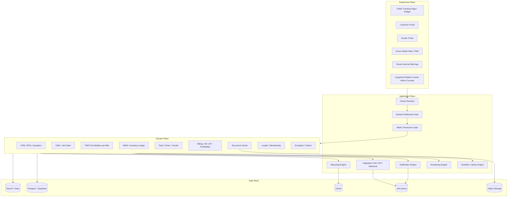
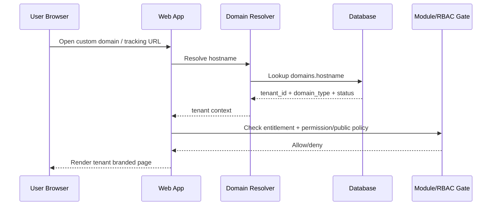
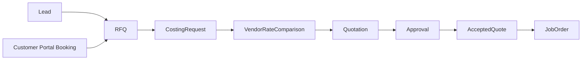
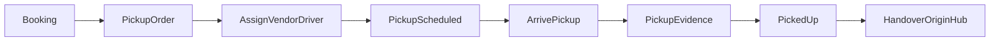
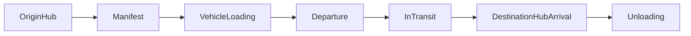
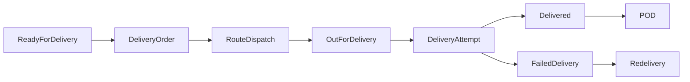
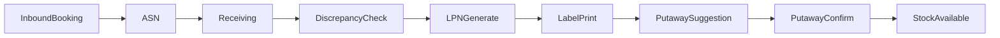
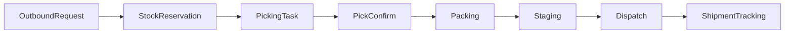
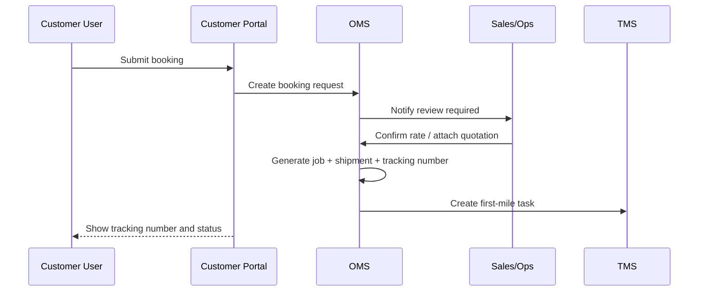

# CargoGrid Complete Blueprint & Build Manual

**Version:** 1.0 consolidated  
**Product name:** CargoGrid  
**Product type:** White-label, multi-tenant, fully configurable web-based logistics ERP  
**Stack:** Supabase + React/Next.js + Vercel  
**Build method:** Codex-driven phased development with strict testing, documentation, security, and regression gates  
**Core principle:** Input once. Reuse everywhere. Audit everything. Configure from Supreme Admin. Never hardcode tenant behavior.

---

## How to use this file

This is the complete master reference for building CargoGrid. It combines:

1. **Complete System Blueprint** — product scope, module architecture, data model, flow, security, SaaS control plane, WMS/TMS/finance/accounting/customer portal/public tracking, and full Supreme Admin configuration.
2. **Connected Module Recheck** — single-source-of-truth rules, anti-duplicate-work logic, data ownership, cross-module dependencies, and end-to-end flow design.
3. **Build Manual** — step-by-step Supabase + React/Next.js + Vercel implementation plan, Codex prompts, testing gates, regression gates, deployment checks, and build documentation rules.

This file must be committed into the repository under:

```txt
/docs/blueprint/cargogrid-complete-blueprint-and-build-manual.md
```

Every Codex task must reference only the relevant section of this document to avoid exceeding GPT Plus context limits.

---

## CargoGrid naming and positioning

**CargoGrid** is the public product name.

Positioning:

> CargoGrid is a configurable logistics ERP that connects booking, RFQ, quotation, job order, shipment tracking, warehouse stock, delivery operation, POD, billing, accounting, customer portal, vendor portal, driver PWA, loyalty, API, and analytics in one white-label web system.

Short sales line:

> From booking to billing, every logistics process stays connected.

No module may be designed as a standalone island. CargoGrid is a connected operating grid.

---

## Non-negotiable architecture rules

1. **No duplicate work.** A user must not retype the same customer, address, shipment, package, stock, POD, billing, or invoice data in multiple modules.
2. **Single source of truth.** Every business object has one authoritative table or event source.
3. **Event-based operations.** Shipment status, tracking, inventory movement, billing readiness, and accounting posting must be traceable through append-only events or immutable ledger rows.
4. **Supreme Admin full customization.** Tenant behavior must be configurable from UI without editing backend code, SQL, or environment variables.
5. **Tenant isolation by default.** Every tenant-scoped table must have `tenant_id`, RLS, indexes, and regression tests.
6. **Server-only privileged logic.** No service role, privileged config resolver, billing rules, or security-critical logic may run in browser/client code.
7. **Document every phase.** Every build phase must update `CARGOGRID_CONTEXT.md` and `docs/build-log/phase-XX.md` before being considered complete.
8. **Every phase must pass quality gates.** Lint, typecheck, tests, build, migration validation, security checks, and regression checks must pass before moving on.

---

# Part A — Complete System Blueprint

# CargoGrid Complete System Blueprint

**Version:** 1.2 expanded blueprint with finance/accounting and Supreme Admin no-code configuration plane  
**Base document:** `technical-spec-multi-tenant-platform.md` v0.1 draft  
**Product type:** White-label, multi-tenant, web-based logistics ERP for 3PL, freight forwarders, trucking operators, warehouse operators, and in-house logistics teams.  
**Primary positioning:** A branded logistics operating system that lets companies manage RFQ, quotation, booking, shipment execution, warehouse stock, public tracking, POD, billing readiness, customer portal, vendor/driver collaboration, and profitability from one platform.

---

## 0. Executive summary

The existing architecture already defines the right control foundation: tenant isolation, plan/module entitlement, RBAC, tenant settings, CargoGrid supreme admin, audit logs, and domain routing. That foundation must remain. The missing part is the complete logistics ERP domain blueprint.

This expanded blueprint defines three planes:

1. **Control Plane** — SaaS tenant, plan, module entitlement, RBAC, domain, billing, admin console, audit, security.
2. **Operations Plane** — commercial, OMS/job order, TMS, WMS, fleet, vendor, document, finance, billing readiness, analytics.
3. **Experience Plane** — public tracking page, embeddable tracking widget, customer portal, vendor portal, driver mobile web/PWA, membership/loyalty.

The system must not be designed as separate CRM, TMS, WMS, and portal apps that only share a login. The core design must be event-driven around **Job Order / Shipment / Inventory Movement / Financial Evidence**. Every transaction should flow from commercial intent to operational execution to billing and profitability.

Core principle:

> One tenant. Many branches. Many warehouses. Many customers. Many shipments. One source of truth for status, stock, documents, cost, revenue, and margin.

---

## 1. Product scope and design principles

### 1.1 Product scope

The product covers:

- Multi-tenant SaaS and white-label platform.
- Tenant-specific branded portal and public tracking.
- Sales CRM, RFQ, quotation, rate/tariff management, contract rate.
- Order Management System (OMS) / Logistics Job Order core.
- First mile, middle mile, last mile, crossdock, and hub execution.
- Warehouse Management System (WMS) with multi-warehouse, branch, area, zone, rack, bin, LPN, QR/barcode label, stock ledger, inbound, putaway, pick-pack, outbound, dispatch.
- Tracking number / resi / shipment number generation.
- Customer portal for booking, tracking, POD, invoice, AR, claims, stock visibility, inbound/outbound request, loyalty.
- Vendor portal and driver mobile web/PWA for assignment, status update, document upload, and POD.
- Procurement and vendor rate management.
- Fleet and driver management.
- Billing readiness, invoicing, AR/AP, accounting ledger, tax, payment allocation, bank/cash, cost accrual, and profitability analytics.
- Notification engine, API, webhook, integration hub.
- Dashboard, reporting, and audit.

### 1.2 Non-goals for early build

Do not build these first unless a paying pilot requires it:

- Deep route optimization engine.
- Deep country-by-country statutory compliance beyond Indonesia in early MVP. The platform may include an accounting module, but statutory features such as e-Faktur/e-Bupot, audited financial statements, and multi-country localization can be phased.
- Native mobile apps.
- 3D warehouse visualization.
- Advanced AI ETA prediction.
- Full customs brokerage system for all countries.
- ERP manufacturing/inventory costing.
- Marketplace of carriers.

These are expansion layers. The first commercial value is: tracking, booking, job order, WMS visibility, POD, billing readiness, and margin control.

### 1.3 Design principles

1. **Tenant isolation is non-negotiable.** Every business table must include `tenant_id` unless it is a global catalog table explicitly designed otherwise.
2. **Branch is operational, not decorative.** Branch controls users, warehouse scope, profit center, shipment origin, billing, and reporting.
3. **Warehouse location is hierarchical.** Warehouse → Area → Zone → Aisle → Rack → Level → Bin/Position.
4. **Inventory must use ledger logic.** Never store only current stock. Current stock is a projection of inbound, transfer, adjustment, reservation, pick, dispatch, return, damage, and hold events.
5. **Tracking must be event-based.** Never overwrite status without keeping event history.
6. **POD and documents drive billing readiness.** Delivered is not enough. Billing requires required documents, final cost, margin approval, and customer rule completion.
7. **Customer portal is a product, not a report page.** Customer users must be able to book, track, view stock, request outbound, download POD, see invoice, and raise claim.
8. **White-label first.** Every tenant must be able to expose their own tracking page/portal under their own brand/domain.
9. **APIs and webhooks are first-class.** Enterprise customers will ask for integration.
10. **Operational simplicity beats feature bloat.** Build the backbone first: job order, tracking, WMS ledger, POD, billing readiness.

---

## 2. Target customer segments

### 2.1 3PL / freight forwarder

Typical needs:

- Lead, RFQ, quotation, vendor costing, job order, tracking, POD, billing, customer portal.
- EXIM optional: customs, AWB/BL, HS code, overseas agent, document checklist.
- Warehouse optional: custody, crossdock, fulfillment, storage billing.

Recommended modules:

- Sales CRM
- RFQ/quotation
- Rate management
- Customer portal
- OMS/job order
- TMS first/middle/last mile
- WMS/crossdock
- Vendor cost management
- Tracking visibility
- Billing/invoicing
- Document management
- Reporting/KPI

### 2.2 Trucking company

Typical needs:

- Booking order, fleet, driver, dispatch, route, status update, POD, billing, customer portal.

Recommended modules:

- Customer portal
- OMS/job order
- First mile / last mile / middle mile
- Fleet management
- Driver management
- Route dispatch
- Tracking visibility
- ePOD
- Billing readiness

### 2.3 Warehouse operator / fulfillment provider

Typical needs:

- Multi warehouse, location/racking, inbound, label, stock, pick-pack, outbound, customer stock portal, storage aging, billing.

Recommended modules:

- Customer portal
- WMS
- Inventory control
- Labeling
- Inbound/outbound request
- Stock visibility
- Billing readiness
- Document management
- Reporting

### 2.4 In-house logistics team

Typical needs:

- Internal shipment request, warehouse stock, fleet/vendor assignment, delivery status, POD, cost allocation, SLA.

Recommended modules:

- OMS/job order
- TMS
- WMS
- Fleet/vendor
- Tracking
- Internal requester portal
- Cost allocation
- Analytics

Commercial CRM/rate selling may be disabled for this segment.

---

## 3. High-level architecture

### 3.1 Logical architecture



### 3.2 Recommended technology architecture

The blueprint is technology-agnostic, but the practical stack can be:

- **Frontend:** Next.js / React, Tailwind, shadcn/ui, TanStack Query, React Hook Form.
- **Backend:** Next.js API routes / server actions for MVP; later split critical services if scale demands.
- **Database:** PostgreSQL with RLS, preferably Supabase Postgres for speed.
- **Auth:** Supabase Auth or external identity provider; tenant membership resolved in app DB.
- **Storage:** Supabase Storage / S3-compatible storage for POD, labels, documents, photos.
- **Queue:** Inngest, Trigger.dev, Supabase Edge Functions, pg-boss, or another job queue.
- **Notifications:** Email provider, WhatsApp gateway, optional SMS.
- **Search:** Postgres full-text for MVP; Meilisearch/Typesense later for high-volume tracking/search.
- **Observability:** Sentry, structured logs, audit logs, uptime checks.
- **Deployment:** Vercel for frontend/app; Supabase managed DB; separate worker service if queue grows.

### 3.3 Environments

Minimum environments:

- `local` — developer machine.
- `dev` — shared development.
- `staging` — tenant simulation, test migration, preview release.
- `production` — live tenants.

Rules:

- Production data must never be copied to dev without anonymization.
- Staging must support test tenants and test domains.
- Database migrations must run through CI/CD, not manual SQL paste in production.

---

## 4. Control Plane: tenancy, subscription, entitlement, RBAC

This section keeps the existing architecture direction and expands it.

### 4.1 Actor hierarchy

| Actor | Scope | Responsibility |
|---|---|---|
| CargoGrid supreme admin | Global | Tenant creation, plan, module entitlement, billing, domain, support override, audit. |
| CargoGrid Platform Owner support | Global limited | View tenant status, assist support, cannot change billing/module unless allowed. |
| CargoGrid Platform Owner billing | Global limited | Subscription, invoice status, plan change, suspend/reactivate. |
| Tenant owner | One tenant | Business owner/admin of customer company. |
| Tenant admin | One tenant | User, role, branch, warehouse, settings within allowed modules. |
| Tenant internal user | One tenant | Sales, ops, warehouse, finance, procurement, manager. |
| Customer account admin | One customer account under a tenant | Manage customer-side users, booking, stock, document, invoice visibility. |
| Customer user | One customer account under a tenant | Booking, tracking, POD, stock, request, ticket based on role. |
| Vendor admin | Vendor account under tenant | Accept job, assign driver, upload docs. |
| Driver | Job/assignment scope | Update pickup/delivery/POD from mobile web. |

### 4.2 Core control entities

Keep the existing core entities:

- `plans`
- `modules`
- `plan_modules`
- `tenants`
- `tenant_modules`
- `tenant_settings`
- `permissions`
- `roles`
- `role_permissions`
- `users`
- `tenant_users`
- `saiki_staff`
- `domains`
- `audit_logs`

Add these entities:

| Table | Purpose |
|---|---|
| `tenant_branches` | Operational branches / profit centers. |
| `tenant_features` | Feature flags finer than module level. |
| `tenant_limits` | Limits by plan: users, shipments/month, warehouses, API calls, storage. |
| `tenant_subscriptions` | Active subscription contract and billing period. |
| `tenant_invoices` | SaaS billing invoice to tenant. |
| `tenant_usage_metrics` | Usage metering: shipments, users, API calls, storage. |
| `tenant_numbering_rules` | Numbering format per tenant for shipment, resi, invoice, manifest, inbound, outbound, LPN. |
| `tenant_api_keys` | API credentials for tenant integration. |
| `tenant_webhook_endpoints` | Webhook target URL and event subscriptions. |
| `tenant_data_retention_policies` | Retention setting by document/event type. |

### 4.3 Subscription entitlement model

Module entitlement resolution:

1. Load tenant plan.
2. Load included modules from `plan_modules`.
3. Load overrides from `tenant_modules`.
4. Apply `tenant_features` for sub-module feature flags.
5. Apply `tenant_limits` for usage ceilings.
6. Return final entitlement object.

Final entitlement object example:

```json
{
  "tenant_id": "uuid",
  "plan": "growth",
  "modules": {
    "customer_portal": true,
    "tracking_visibility": true,
    "warehousing": true,
    "fleet_management": false
  },
  "features": {
    "tracking.custom_domain": true,
    "wms.multi_warehouse": true,
    "wms.label_printing": true,
    "api.webhooks": true
  },
  "limits": {
    "users": 30,
    "warehouses": 5,
    "shipments_per_month": 5000,
    "api_calls_per_month": 100000
  }
}
```

### 4.4 RBAC rules

Access must pass these gates:

1. Tenant is active.
2. Domain/subdomain resolves to tenant.
3. User is authenticated.
4. User has active membership in tenant, customer account, vendor account, or driver assignment.
5. Module is active for tenant.
6. Feature flag is active if action requires it.
7. Role has permission.
8. Row ownership/scope allows access.
9. RLS validates `tenant_id` at database level.

### 4.5 Permission naming convention

Format:

`{module}.{resource}.{action}`

Examples:

- `sales_crm.leads.view`
- `sales_crm.leads.create`
- `rate_management.rates.approve`
- `order_management.jobs.create`
- `tracking_visibility.shipments.view_public`
- `warehousing.inventory.adjust`
- `warehousing.labels.print`
- `billing_invoicing.invoices.create`
- `tenant_admin.users.invite`
- `saiki_admin.tenants.override_modules`

Reserved permissions must never be assigned to tenant roles:

- `saiki_admin.*`
- `tenant_entitlement.*`
- `billing_platform.*`
- `impersonation.*`

---

## 5. White-label domain and portal architecture

### 5.1 Domain types

| Domain type | Example | Purpose |
|---|---|---|
| CargoGrid Platform Owner app domain | `app.apicklogistics.com` | Internal tenant app login. |
| Tenant subdomain | `tenant.apicklogistics.com` | Default branded tenant portal. |
| Custom tenant domain | `portal.customerlogistics.co.id` | Premium white-label portal. |
| Tracking subdomain | `tracking.customerlogistics.co.id` | Public tracking page. |
| Embed widget | `customerlogistics.co.id/tracking` via iframe/script | Tracking inside company website. |

### 5.2 Domain resolution

Request flow:



### 5.3 Domain table

```sql
create table domains (
  id uuid primary key default gen_random_uuid(),
  tenant_id uuid references tenants(id) on delete cascade,
  hostname text unique not null,
  domain_type text not null, -- 'app' | 'portal' | 'tracking' | 'api'
  status text default 'pending', -- pending | active | failed | disabled
  ssl_status text default 'pending',
  verification_token text,
  verified_at timestamptz,
  created_at timestamptz default now()
);
```

### 5.4 White-label settings

`tenant_settings.branding` should support:

```json
{
  "product_name": "ABC Logistics Portal",
  "logo_url": "...",
  "favicon_url": "...",
  "primary_color": "#FF4600",
  "secondary_color": "#111827",
  "support_email": "support@abclogistics.co.id",
  "support_whatsapp": "+628xxxx",
  "footer_text": "Powered by ABC Logistics",
  "hide_powered_by": false,
  "tracking_page_title": "Track Your Shipment"
}
```

---

## 6. Business module catalog

### 6.1 Module groups

| Group | Module key | Module name | Description | Tenant segment |
|---|---|---|---|---|
| Platform | `tenant_admin` | Tenant Administration | Branch, users, roles, settings, audit. | All |
| Platform | `notification_engine` | Notification Engine | Email, WhatsApp, SMS, internal notification. | All |
| Platform | `integration_hub` | Integration Hub | API, webhook, external integrations. | All |
| Commercial | `sales_crm` | Sales CRM | Lead, account, contact, pipeline, activity. | 3PL/forwarder |
| Commercial | `rfq_quotation` | RFQ & Quotation | RFQ, costing request, quote, approval, PDF. | 3PL/forwarder |
| Commercial | `rate_management` | Rate & Tariff Management | Sell rates, vendor rates, surcharge, contract rates. | 3PL/forwarder/in-house optional |
| Commercial | `contract_management` | Customer Contract | Customer-specific rate, SLA, terms, validity. | 3PL/forwarder |
| Experience | `customer_portal` | Customer Portal | Booking, tracking, POD, invoice, stock, claim. | 3PL/warehouse/trucking |
| Experience | `public_tracking` | Public Tracking | Public page/widget, resi tracking, data masking. | All |
| Experience | `membership_loyalty` | Membership & Loyalty | Tier, points, cashback, benefit, margin guardrail. | 3PL/forwarder |
| Operations | `order_management` | OMS / Job Order | Central shipment/job record. | All |
| Operations | `firstmile` | First Mile | Pickup planning and evidence. | All |
| Operations | `middlemile` | Middle Mile | Linehaul, hub, inter-city, inter-branch, EXIM leg. | All |
| Operations | `lastmile` | Last Mile | Delivery, route, POD, failed delivery, redelivery. | All |
| Operations | `crossdock_hub` | Crossdock / Hub | Transit, scan, sort, staging, handover. | All |
| Warehousing | `warehousing` | WMS | Multi warehouse, location, inbound, putaway, outbound. | All |
| Warehousing | `inventory_control` | Inventory Control | Stock ledger, reservation, cycle count, adjustment, aging. | All |
| Warehousing | `labeling_barcode` | Labeling & Barcode | LPN, shipment label, bin label, print queue. | All with WMS/TMS |
| Fleet | `fleet_management` | Fleet Management | Vehicle master, documents, maintenance. | Trucking/in-house |
| Fleet | `driver_management` | Driver Management | Driver master, assignment, license, mobile web. | Trucking/in-house |
| Fleet | `route_dispatch` | Route & Dispatch | Route planning, manifest, driver assignment. | Trucking/in-house/3PL |
| Procurement | `vendor_management` | Vendor Management | Vendor master, coverage, contract, compliance. | 3PL/forwarder |
| Procurement | `vendor_cost_management` | Vendor Cost | Vendor rate request, comparison, AP support. | 3PL/forwarder |
| Finance | `billing_invoicing` | Billing & Invoicing | Billing readiness, invoice, unbilled, AR. | All |
| Finance | `profitability_control` | Profitability Control | GP, margin, job/customer/vendor profitability. | All |
| Finance | `customer_invoicing` | Customer Invoicing | Invoice draft, invoice approval, invoice posting, credit note, billing schedule. | All |
| Finance | `accounts_receivable` | Accounts Receivable | AR aging, payment receipt, payment allocation, credit limit, collection. | All |
| Finance | `vendor_payable` | Vendor Payable | Vendor invoice, cost accrual, payable readiness. | 3PL/trucking |
| Finance | `accounts_payable` | Accounts Payable | Vendor bill, AP aging, payment batch, withholding tax, payment allocation. | All |
| Finance | `general_ledger` | General Ledger | Chart of accounts, journal entries, posting rules, fiscal period, trial balance. | Optional / Enterprise |
| Finance | `tax_management` | Tax Management | VAT/PPN, withholding, tax code, tax invoice references. | Optional / Enterprise |
| Compliance | `document_management` | Document Center | POD, BAST, SJ, AWB/BL, invoice, claim docs. | All |
| Compliance | `customs_compliance` | Customs & EXIM Compliance | HS code, customs status, PIB/PEB, SPPB, agent docs. | EXIM forwarder |
| Service | `exception_claims` | Exception & Claims | Delay, damage, lost, hold, dispute, RCA. | All |
| Analytics | `kpi_dashboard` | KPI Dashboard | Sales, ops, WMS, finance, SLA dashboards. | All |
| Analytics | `reporting_bi` | Reporting & BI | Custom report, export, scheduled report. | All |

### 6.2 Feature flags under modules

Some features should not become separate modules, but feature flags:

| Feature key | Parent module | Description |
|---|---|---|
| `wms.multi_warehouse` | warehousing | Multiple warehouses per tenant. |
| `wms.location_mapping` | warehousing | Area/zone/rack/bin mapping. |
| `wms.label_printing` | labeling_barcode | QR/barcode label print. |
| `tracking.public_page` | public_tracking | Public tracking page. |
| `tracking.embed_widget` | public_tracking | Website embed. |
| `portal.stock_visibility` | customer_portal | Customer can view stock. |
| `portal.booking` | customer_portal | Customer shipment booking. |
| `portal.invoice_view` | customer_portal | Customer invoice/AR view. |
| `loyalty.points` | membership_loyalty | Point ledger. |
| `loyalty.cashback` | membership_loyalty | Cashback ledger. |
| `api.webhook` | integration_hub | Outgoing webhook. |
| `api.external_tracking` | integration_hub | Public/external tracking API. |
| `finance.vendor_payable` | vendor_payable | AP workflow. |
| `exim.customs` | customs_compliance | Customs workflow. |

---

## 7. Master data architecture

### 7.1 Tenant, branch, organization

```sql
create table tenant_branches (
  id uuid primary key default gen_random_uuid(),
  tenant_id uuid not null references tenants(id) on delete cascade,
  code text not null,
  name text not null,
  branch_type text default 'operational', -- head_office | operational | warehouse | sales_office | hub
  address text,
  province_id uuid,
  city_id uuid,
  timezone text default 'Asia/Jakarta',
  is_profit_center boolean default true,
  status text default 'active',
  created_at timestamptz default now(),
  unique (tenant_id, code)
);
```

Branch must be available on:

- users/membership scope,
- warehouses,
- shipments,
- job order ownership,
- revenue/cost/profit reporting,
- invoice numbering,
- operational SLA.

### 7.2 Customer and shipper/consignee master

```sql
create table customer_accounts (
  id uuid primary key default gen_random_uuid(),
  tenant_id uuid not null references tenants(id),
  branch_id uuid references tenant_branches(id),
  code text not null,
  name text not null,
  customer_type text default 'shipper', -- shipper | consignee | both | internal_department
  industry text,
  tax_id text,
  billing_address text,
  payment_term_days int default 14,
  credit_limit numeric,
  status text default 'active',
  created_at timestamptz default now(),
  unique (tenant_id, code)
);

create table customer_contacts (
  id uuid primary key default gen_random_uuid(),
  tenant_id uuid not null references tenants(id),
  customer_id uuid not null references customer_accounts(id) on delete cascade,
  name text not null,
  email text,
  phone text,
  position text,
  role text, -- ops | finance | owner | warehouse | other
  is_primary boolean default false,
  created_at timestamptz default now()
);
```

Customer portal users must link to `customer_accounts`, not only tenant.

```sql
create table customer_users (
  id uuid primary key default gen_random_uuid(),
  tenant_id uuid not null references tenants(id),
  customer_id uuid not null references customer_accounts(id),
  user_id uuid not null references users(id),
  role text default 'viewer', -- admin | ops | finance | viewer
  status text default 'active',
  created_at timestamptz default now(),
  unique (tenant_id, customer_id, user_id)
);
```

### 7.3 Address and area master

```sql
create table geo_provinces (
  id uuid primary key default gen_random_uuid(),
  country_code text default 'ID',
  name text not null
);

create table geo_cities (
  id uuid primary key default gen_random_uuid(),
  province_id uuid references geo_provinces(id),
  name text not null,
  city_type text -- kota | kabupaten
);

create table geo_districts (
  id uuid primary key default gen_random_uuid(),
  city_id uuid references geo_cities(id),
  name text not null
);

create table geo_postal_codes (
  id uuid primary key default gen_random_uuid(),
  district_id uuid references geo_districts(id),
  postal_code text not null
);

create table tenant_service_areas (
  id uuid primary key default gen_random_uuid(),
  tenant_id uuid not null references tenants(id),
  branch_id uuid references tenant_branches(id),
  area_code text not null,
  name text not null,
  province_id uuid,
  city_id uuid,
  district_id uuid,
  postal_code text,
  serviceable boolean default true,
  lead_time_days int,
  rate_zone text,
  remote_area_surcharge numeric default 0,
  created_at timestamptz default now(),
  unique (tenant_id, area_code)
);
```

Area mapping is required for:

- rate zone,
- SLA,
- branch assignment,
- vendor coverage,
- pickup/delivery route,
- remote area surcharge,
- customer portal validation.

### 7.4 Vendor master

```sql
create table vendors (
  id uuid primary key default gen_random_uuid(),
  tenant_id uuid not null references tenants(id),
  code text not null,
  name text not null,
  vendor_type text not null, -- trucking | airline | shipping_line | warehouse | courier | customs | labor | other
  status text default 'active',
  payment_term_days int,
  tax_id text,
  address text,
  created_at timestamptz default now(),
  unique (tenant_id, code)
);

create table vendor_contacts (
  id uuid primary key default gen_random_uuid(),
  tenant_id uuid not null references tenants(id),
  vendor_id uuid not null references vendors(id) on delete cascade,
  name text,
  email text,
  phone text,
  position text,
  is_primary boolean default false
);

create table vendor_service_coverage (
  id uuid primary key default gen_random_uuid(),
  tenant_id uuid not null references tenants(id),
  vendor_id uuid not null references vendors(id) on delete cascade,
  service_type text,
  origin_area_id uuid,
  destination_area_id uuid,
  vehicle_type text,
  mode text, -- trucking | air | sea | rail | multimodal
  is_active boolean default true
);
```

### 7.5 Product/SKU master

```sql
create table item_masters (
  id uuid primary key default gen_random_uuid(),
  tenant_id uuid not null references tenants(id),
  customer_id uuid references customer_accounts(id),
  sku text not null,
  name text not null,
  description text,
  uom text default 'pcs',
  weight_kg numeric,
  length_cm numeric,
  width_cm numeric,
  height_cm numeric,
  cbm numeric,
  barcode text,
  shelf_life_days int,
  serial_tracked boolean default false,
  lot_tracked boolean default false,
  expiry_tracked boolean default false,
  status text default 'active',
  created_at timestamptz default now(),
  unique (tenant_id, customer_id, sku)
);
```

---

## 8. Numbering and resi generation

### 8.1 Required numbering objects

The platform must generate numbers for:

| Object | Example format | Notes |
|---|---|---|
| Tenant code | `ABC` | Used in numbering prefix. |
| Customer code | `CUST-0001` | Per tenant. |
| Lead code | `LEAD-260706-0001` | Commercial. |
| RFQ code | `RFQ-260706-0001` | Commercial. |
| Quotation number | `QUO-260706-0001` | Existing commercial layer. |
| Booking number | `BKG-260706-0001` | Customer portal booking. |
| Job order number | `JOB-260706-0001` | Internal operations. |
| Shipment number | `SHP-260706-0001` | Shipment object. |
| Tracking/resi number | `ABC260706000001` | Public tracking. |
| Manifest number | `MNF-260706-0001` | Dispatch/linehaul. |
| Trip number | `TRP-260706-0001` | Fleet/driver trip. |
| Inbound number | `INB-260706-0001` | WMS inbound. |
| Outbound number | `OUT-260706-0001` | WMS outbound. |
| LPN number | `LPN-260706-000001` | Pallet/carton license plate. |
| Bin/location code | `JKT-WH01-ZA-A03-R02-L04-B08` | WMS location. |
| POD number | `POD-260706-0001` | Proof of delivery. |
| Invoice number | `INV-260706-0001` | Optional if platform creates invoice. |
| Claim number | `CLM-260706-0001` | Exception/claim. |

### 8.2 Numbering table

```sql
create table tenant_numbering_rules (
  id uuid primary key default gen_random_uuid(),
  tenant_id uuid not null references tenants(id),
  object_type text not null,
  prefix text,
  format_template text not null, -- e.g. '{PREFIX}{YY}{MM}{DD}{SEQ6}'
  reset_cycle text default 'daily', -- never | yearly | monthly | daily
  current_sequence bigint default 0,
  last_reset_at timestamptz,
  is_active boolean default true,
  unique (tenant_id, object_type)
);
```

### 8.3 Rules

- Tracking/resi number must be immutable after creation.
- Internal job number and public tracking number may be different.
- Tenant may use customer reference, but customer reference must not replace generated tracking number.
- Numbering must be concurrency-safe. Use database transaction or sequence lock.
- Reused numbers are forbidden.
- Voided/cancelled objects retain their numbers.

---

## 9. Commercial architecture

### 9.1 Commercial entities

Core entities:

- `leads`
- `opportunities`
- `sales_activities`
- `rfqs`
- `rfq_lines`
- `quotations`
- `quotation_lines`
- `quotation_costs`
- `quotation_approvals`
- `customer_contracts`
- `contract_rates`
- `rate_cards`
- `rate_surcharges`
- `vendor_rate_cards`

### 9.2 RFQ to quotation to job flow



### 9.3 Quotation acceptance

Acceptance methods:

- Internal sales marks accepted after customer confirmation.
- Customer accepts via portal.
- Customer accepts via public quote link with verification.
- API creates accepted booking from customer system.

Acceptance must capture:

- accepted by,
- accepted timestamp,
- accepted amount,
- version number,
- terms and conditions version,
- uploaded PO/email proof if any.

---

## 10. OMS / Job Order core

### 10.1 Why OMS is the backbone

Job Order is the operational spine. It connects quotation, customer booking, shipment, warehouse movement, vendor assignment, document, billing, AR/AP, tracking, and profitability.

Without a strong Job Order object, the system becomes a collection of disconnected modules.

### 10.2 Main entities

```sql
create table logistics_jobs (
  id uuid primary key default gen_random_uuid(),
  tenant_id uuid not null references tenants(id),
  branch_id uuid references tenant_branches(id),
  job_number text not null,
  job_type text not null, -- shipment | warehouse | fulfillment | project | exim | domestic
  customer_id uuid references customer_accounts(id),
  quotation_id uuid,
  booking_id uuid,
  service_type text,
  mode text, -- land | sea | air | multimodal | warehouse
  status text default 'draft', -- draft | confirmed | in_progress | completed | cancelled | exception | closed
  sales_owner_id uuid references users(id),
  ops_owner_id uuid references users(id),
  finance_owner_id uuid references users(id),
  planned_start_at timestamptz,
  planned_end_at timestamptz,
  actual_start_at timestamptz,
  actual_end_at timestamptz,
  total_sell_amount numeric default 0,
  total_buy_cost numeric default 0,
  gross_margin_amount numeric default 0,
  gross_margin_pct numeric default 0,
  billing_status text default 'not_ready', -- not_ready | ready | invoiced | paid | blocked
  created_at timestamptz default now(),
  unique (tenant_id, job_number)
);
```

### 10.3 Job child objects

| Object | Purpose |
|---|---|
| `shipments` | One job can have one or many shipments. |
| `shipment_packages` | Koli/carton/pallet details. |
| `shipment_legs` | First/middle/last/warehousing leg. |
| `shipment_events` | Tracking events. |
| `job_charges` | Selling charges to customer. |
| `job_costs` | Buying costs/vendor/internal costs. |
| `job_documents` | Documents attached to job. |
| `job_tasks` | Operational tasks/checklist. |
| `job_exceptions` | Delay, damage, dispute, missing docs. |
| `job_approvals` | Margin, rate, billing, exception approval. |

### 10.4 Job status model

| Status | Meaning |
|---|---|
| `draft` | Created but not confirmed. |
| `confirmed` | Accepted and ready for operation. |
| `planned` | Operation plan created. |
| `in_progress` | At least one leg is active. |
| `on_hold` | Blocked due to document/payment/customs/other issue. |
| `exception` | Active issue requiring action. |
| `completed` | Operationally completed. |
| `billing_ready` | Required documents/costs validated. |
| `invoiced` | Customer invoice created. |
| `paid` | Customer paid. |
| `closed` | Financially closed. |
| `cancelled` | Cancelled and no longer active. |

---

## 11. Shipment, tracking, and public resi architecture

### 11.1 Shipment entity

```sql
create table shipments (
  id uuid primary key default gen_random_uuid(),
  tenant_id uuid not null references tenants(id),
  job_id uuid references logistics_jobs(id) on delete cascade,
  shipment_number text not null,
  tracking_number text not null,
  customer_ref text,
  shipper_customer_id uuid references customer_accounts(id),
  consignee_name text,
  consignee_phone text,
  consignee_email text,
  origin_address text,
  destination_address text,
  origin_area_id uuid references tenant_service_areas(id),
  destination_area_id uuid references tenant_service_areas(id),
  service_type text,
  mode text,
  status text default 'created',
  current_leg_id uuid,
  eta_at timestamptz,
  delivered_at timestamptz,
  pod_status text default 'pending',
  created_at timestamptz default now(),
  unique (tenant_id, shipment_number),
  unique (tenant_id, tracking_number)
);
```

### 11.2 Shipment package entity

```sql
create table shipment_packages (
  id uuid primary key default gen_random_uuid(),
  tenant_id uuid not null references tenants(id),
  shipment_id uuid not null references shipments(id) on delete cascade,
  package_number text not null,
  lpn_id uuid,
  package_type text, -- carton | pallet | crate | envelope | loose | container
  description text,
  qty numeric default 1,
  weight_kg numeric,
  length_cm numeric,
  width_cm numeric,
  height_cm numeric,
  cbm numeric,
  status text default 'created',
  created_at timestamptz default now(),
  unique (tenant_id, package_number)
);
```

### 11.3 Shipment leg entity

```sql
create table shipment_legs (
  id uuid primary key default gen_random_uuid(),
  tenant_id uuid not null references tenants(id),
  shipment_id uuid not null references shipments(id) on delete cascade,
  sequence int not null,
  leg_type text not null, -- firstmile | middlemile | lastmile | warehousing | crossdock | customs
  status text default 'pending',
  origin_location_type text, -- address | warehouse | hub | port | airport | branch
  origin_location_id uuid,
  origin_address text,
  destination_location_type text,
  destination_location_id uuid,
  destination_address text,
  branch_id uuid references tenant_branches(id),
  warehouse_id uuid,
  vendor_id uuid references vendors(id),
  vehicle_id uuid,
  driver_id uuid,
  planned_start_at timestamptz,
  planned_end_at timestamptz,
  actual_start_at timestamptz,
  actual_end_at timestamptz,
  created_at timestamptz default now(),
  unique (shipment_id, sequence)
);
```

### 11.4 Tracking event entity

```sql
create table shipment_events (
  id uuid primary key default gen_random_uuid(),
  tenant_id uuid not null references tenants(id),
  shipment_id uuid not null references shipments(id) on delete cascade,
  leg_id uuid references shipment_legs(id),
  event_code text not null, -- booked | picked_up | received_at_hub | in_transit | out_for_delivery | delivered | failed_delivery
  event_label text not null,
  event_description text,
  visibility text default 'customer_visible', -- internal_only | customer_visible | public_visible
  event_location text,
  latitude numeric,
  longitude numeric,
  event_at timestamptz not null default now(),
  created_by uuid references users(id),
  source text default 'manual', -- manual | driver_pwa | api | webhook | system | import
  metadata jsonb default '{}',
  created_at timestamptz default now()
);
```

### 11.5 Standard milestone catalog

| Event code | Public label | Visibility |
|---|---|---|
| `shipment_created` | Shipment created | Public/customer |
| `booking_confirmed` | Booking confirmed | Public/customer |
| `pickup_scheduled` | Pickup scheduled | Customer |
| `picked_up` | Picked up | Public/customer |
| `received_at_origin_hub` | Received at origin hub | Public/customer |
| `in_transit` | In transit | Public/customer |
| `arrived_at_destination_hub` | Arrived at destination hub | Public/customer |
| `out_for_delivery` | Out for delivery | Public/customer |
| `delivery_attempted` | Delivery attempted | Customer |
| `delivered` | Delivered | Public/customer |
| `pod_uploaded` | POD uploaded | Customer |
| `on_hold` | On hold | Customer/internal |
| `exception_reported` | Exception reported | Customer/internal |
| `cancelled` | Cancelled | Customer/internal |

### 11.6 Public tracking policy

Public tracking must show:

- tracking number,
- current status,
- public milestone timeline,
- origin/destination city-level data,
- ETA if allowed,
- delivered timestamp,
- POD availability indicator.

Public tracking must not show by default:

- customer commercial rate,
- vendor cost,
- internal notes,
- vendor identity,
- driver phone,
- full consignee address,
- invoice/AR,
- claim details.

POD download should be:

- login-only by default,
- public with secure token only if tenant enables it,
- time-limited if shared by link.

### 11.7 Tracking widget

Widget types:

1. **Hosted page:** `https://tracking.tenantdomain.com/{tracking_number}`
2. **Search page:** `https://tracking.tenantdomain.com` with input field.
3. **Embed iframe:** iframe tracking form inside tenant website.
4. **JavaScript widget:** configurable script for advanced embed.

Widget config:

```json
{
  "theme": "light",
  "primary_color": "#FF4600",
  "show_logo": true,
  "allow_customer_ref_search": true,
  "require_phone_last4": false,
  "show_eta": true,
  "show_pod_button": false
}
```

---

## 12. TMS architecture: first mile, middle mile, last mile

### 12.1 First mile

Core flow:



Required tables:

- `pickup_orders`
- `pickup_assignments`
- `pickup_checklists`
- `pickup_evidence`
- `pickup_attempts`

Required features:

- pickup schedule,
- pickup address and contact,
- assigned vendor/driver/vehicle,
- cargo checklist,
- photo evidence,
- failed pickup reason,
- pickup cost,
- pickup SLA.

### 12.2 Middle mile

Core flow:



Required tables:

- `manifests`
- `manifest_shipments`
- `linehaul_trips`
- `trip_expenses`
- `hub_scans`
- `handover_records`

Required features:

- manifest generation,
- consolidation,
- vehicle/container assignment,
- seal number,
- departure/arrival scan,
- hub handover,
- inter-branch transfer,
- linehaul cost,
- exception handling.

### 12.3 Last mile

Core flow:



Required tables:

- `delivery_orders`
- `delivery_assignments`
- `delivery_attempts`
- `proof_of_delivery`
- `redelivery_requests`

Required features:

- route/area assignment,
- driver/vendor assignment,
- out for delivery,
- successful delivery,
- failed delivery reason,
- redelivery,
- partial delivery,
- POD photo/signature/name/ID,
- delivery SLA.

### 12.4 Exception handling

Exception must be linked to shipment, leg, job, package, inventory, or invoice.

```sql
create table exceptions (
  id uuid primary key default gen_random_uuid(),
  tenant_id uuid not null references tenants(id),
  job_id uuid references logistics_jobs(id),
  shipment_id uuid references shipments(id),
  leg_id uuid references shipment_legs(id),
  warehouse_id uuid,
  exception_number text not null,
  category text not null, -- delay | damage | lost | shortage | overage | hold | document | billing | customer_dispute
  severity text default 'medium', -- low | medium | high | critical
  status text default 'open', -- open | investigating | resolved | rejected | closed
  description text,
  root_cause text,
  resolution text,
  opened_at timestamptz default now(),
  resolved_at timestamptz,
  created_by uuid references users(id),
  unique (tenant_id, exception_number)
);
```

---

## 13. WMS architecture

### 13.1 WMS scope

WMS must support:

- multi-branch warehouse,
- multi-warehouse,
- multi-customer inventory,
- warehouse area/zone/rack/bin mapping,
- LPN/license plate inventory,
- QR/barcode labeling,
- inbound receiving,
- putaway,
- inventory ledger,
- transfer,
- adjustment,
- cycle count,
- stock aging,
- outbound request,
- reservation,
- picking,
- packing,
- staging,
- dispatch,
- customer stock visibility.

### 13.2 Warehouse master

```sql
create table warehouses (
  id uuid primary key default gen_random_uuid(),
  tenant_id uuid not null references tenants(id),
  branch_id uuid references tenant_branches(id),
  code text not null,
  name text not null,
  warehouse_type text default 'storage', -- storage | transit | crossdock | fulfillment | bonded | cold_storage | staging
  address text,
  area_sqm numeric,
  capacity_cbm numeric,
  operating_hours jsonb default '{}',
  status text default 'active',
  created_at timestamptz default now(),
  unique (tenant_id, code)
);
```

### 13.3 Location hierarchy

```sql
create table warehouse_areas (
  id uuid primary key default gen_random_uuid(),
  tenant_id uuid not null references tenants(id),
  warehouse_id uuid not null references warehouses(id) on delete cascade,
  code text not null,
  name text not null,
  area_type text default 'storage', -- receiving | storage | staging | dispatch | quarantine | damaged | returns | cold | bonded
  status text default 'active',
  unique (warehouse_id, code)
);

create table warehouse_zones (
  id uuid primary key default gen_random_uuid(),
  tenant_id uuid not null references tenants(id),
  area_id uuid not null references warehouse_areas(id) on delete cascade,
  code text not null,
  name text not null,
  status text default 'active',
  unique (area_id, code)
);

create table warehouse_locations (
  id uuid primary key default gen_random_uuid(),
  tenant_id uuid not null references tenants(id),
  warehouse_id uuid not null references warehouses(id) on delete cascade,
  area_id uuid references warehouse_areas(id),
  zone_id uuid references warehouse_zones(id),
  location_code text not null,
  aisle text,
  rack text,
  level text,
  bin text,
  location_type text default 'bin', -- floor | rack | bin | staging | receiving | dispatch | quarantine
  capacity_qty numeric,
  capacity_weight_kg numeric,
  capacity_cbm numeric,
  is_pickable boolean default true,
  is_receivable boolean default true,
  is_blocked boolean default false,
  status text default 'active',
  created_at timestamptz default now(),
  unique (tenant_id, location_code)
);
```

Location code format example:

`JKT-WH01-STG-ZA-A03-R02-L04-B08`

Meaning:

- `JKT`: branch,
- `WH01`: warehouse,
- `STG`: area,
- `ZA`: zone,
- `A03`: aisle,
- `R02`: rack,
- `L04`: level,
- `B08`: bin.

### 13.4 LPN / license plate number

```sql
create table lpns (
  id uuid primary key default gen_random_uuid(),
  tenant_id uuid not null references tenants(id),
  lpn_number text not null,
  warehouse_id uuid references warehouses(id),
  current_location_id uuid references warehouse_locations(id),
  customer_id uuid references customer_accounts(id),
  parent_lpn_id uuid references lpns(id), -- carton on pallet, etc.
  lpn_type text default 'carton', -- pallet | carton | crate | container | loose
  status text default 'active', -- active | picked | dispatched | consumed | damaged | void
  created_at timestamptz default now(),
  unique (tenant_id, lpn_number)
);
```

### 13.5 Inventory ledger

Never rely only on a current stock table. Use `inventory_ledger` as source of truth.

```sql
create table inventory_ledger (
  id uuid primary key default gen_random_uuid(),
  tenant_id uuid not null references tenants(id),
  warehouse_id uuid not null references warehouses(id),
  location_id uuid references warehouse_locations(id),
  customer_id uuid references customer_accounts(id),
  item_id uuid references item_masters(id),
  lpn_id uuid references lpns(id),
  movement_type text not null, -- inbound | putaway | transfer | reserve | unreserve | pick | pack | dispatch | adjust | cycle_count | return | damage | hold | release
  reference_type text, -- inbound | outbound | shipment | adjustment | cycle_count
  reference_id uuid,
  qty_delta numeric not null,
  uom text default 'pcs',
  stock_status text default 'available', -- available | reserved | hold | quarantine | damaged | dispatched
  lot_number text,
  serial_number text,
  expiry_date date,
  movement_at timestamptz default now(),
  created_by uuid references users(id),
  metadata jsonb default '{}'
);
```

Current inventory can be a materialized view or summary table:

```sql
create table inventory_balances (
  tenant_id uuid not null references tenants(id),
  warehouse_id uuid not null references warehouses(id),
  location_id uuid,
  customer_id uuid,
  item_id uuid,
  lpn_id uuid,
  lot_number text,
  expiry_date date,
  stock_status text,
  qty_on_hand numeric default 0,
  qty_reserved numeric default 0,
  qty_available numeric default 0,
  updated_at timestamptz default now(),
  primary key (tenant_id, warehouse_id, customer_id, item_id, coalesce(lpn_id, '00000000-0000-0000-0000-000000000000'::uuid), coalesce(location_id, '00000000-0000-0000-0000-000000000000'::uuid), coalesce(lot_number, ''), coalesce(stock_status, ''))
);
```

If PostgreSQL rejects expressions in primary key, use a generated surrogate key or unique index with `coalesce`.

### 13.6 Inbound flow



Required entities:

- `inbound_orders`
- `inbound_order_lines`
- `receiving_sessions`
- `receiving_lines`
- `receiving_discrepancies`
- `putaway_tasks`
- `putaway_confirmations`

### 13.7 Outbound flow



Required entities:

- `outbound_orders`
- `outbound_order_lines`
- `stock_reservations`
- `picking_tasks`
- `packing_sessions`
- `staging_records`
- `dispatch_orders`

### 13.8 Cycle count and stock opname

Required features:

- cycle count plan,
- location-based count,
- SKU-based count,
- blind count option,
- variance calculation,
- approval before adjustment,
- audit trail,
- customer-facing stock report.

### 13.9 Warehouse map

MVP warehouse map can be table/grid-based:

- warehouse selection,
- area/zone filter,
- location list,
- occupancy percentage,
- stock count,
- blocked status,
- QR label print,
- drill-down to LPN/items.

Do not build 3D warehouse first.

---

## 14. Labeling, barcode, and QR architecture

### 14.1 Label types

| Label type | Used for | Minimum fields |
|---|---|---|
| Shipment/resi label | Cargo/package tracking | Tracking number, barcode/QR, origin, destination, package number, service type. |
| LPN label | Warehouse pallet/carton | LPN number, customer, SKU summary, warehouse, location, received date, QR. |
| SKU label | Item identification | SKU, item name, barcode, customer. |
| Location/bin label | Warehouse location | Location code, warehouse, area/zone/rack/bin, QR. |
| Manifest label | Consolidated dispatch | Manifest number, route, vehicle, seal, QR. |
| Return label | Reverse logistics | Return number, origin, destination, reason, QR. |

### 14.2 Label template table

```sql
create table label_templates (
  id uuid primary key default gen_random_uuid(),
  tenant_id uuid not null references tenants(id),
  template_key text not null,
  name text not null,
  label_type text not null,
  paper_size text default '100x150mm',
  template_json jsonb not null,
  is_default boolean default false,
  status text default 'active',
  created_at timestamptz default now(),
  unique (tenant_id, template_key)
);

create table label_print_jobs (
  id uuid primary key default gen_random_uuid(),
  tenant_id uuid not null references tenants(id),
  label_type text not null,
  template_id uuid references label_templates(id),
  reference_type text not null,
  reference_id uuid not null,
  printer_name text,
  copies int default 1,
  status text default 'queued', -- queued | printed | failed | cancelled
  printed_by uuid references users(id),
  printed_at timestamptz,
  reprint_reason text,
  created_at timestamptz default now()
);
```

### 14.3 Barcode standard

Recommended:

- Code 128 for shipment/tracking number and LPN number.
- QR code for URL/deep link scanning.
- Human-readable number below barcode.
- Every reprint must be logged with reason.

---

## 15. Customer portal architecture

### 15.1 Portal capabilities

Customer portal must support:

- customer login,
- multi-user per customer account,
- booking shipment,
- request quotation,
- shipment dashboard,
- public/private tracking,
- POD/document download,
- warehouse stock visibility,
- inbound booking,
- outbound request,
- delivery order from stock,
- claim/complaint ticket,
- invoice and AR view,
- monthly report download,
- membership/loyalty dashboard,
- API credential request.

### 15.2 Customer portal data scope

Customer users can access only:

- their customer account,
- child accounts if parent-child customer relation is enabled,
- shipments where `customer_id = their customer_id`,
- inventory where `customer_id = their customer_id`,
- invoices where `customer_id = their customer_id`,
- documents marked customer-visible.

They cannot access:

- other customer data,
- vendor cost,
- internal comments,
- margin,
- other tenants.

### 15.3 Booking shipment flow



### 15.4 Portal pages

| Page | Purpose |
|---|---|
| `/portal/login` | Customer login. |
| `/portal/dashboard` | Active shipments, stock, invoice, SLA. |
| `/portal/bookings/new` | Create booking. |
| `/portal/bookings` | Booking list. |
| `/portal/shipments` | Shipment dashboard. |
| `/portal/track/:tracking_number` | Authenticated tracking view. |
| `/portal/warehouse/stock` | Stock visibility. |
| `/portal/warehouse/inbound/new` | Inbound booking. |
| `/portal/warehouse/outbound/new` | Outbound request. |
| `/portal/documents` | POD, invoice, BAST, SJ, etc. |
| `/portal/invoices` | Invoice and AR view. |
| `/portal/claims` | Claim/ticket list. |
| `/portal/loyalty` | Tier, points, cashback, benefits. |
| `/portal/users` | Customer admin manages users. |

---

## 16. Vendor portal and driver PWA

### 16.1 Vendor portal capabilities

- receive assignment,
- accept/reject assignment,
- submit rate/cost response,
- upload vehicle/driver info,
- update status,
- upload POD or handover docs,
- view assigned jobs,
- vendor invoice support,
- performance score.

### 16.2 Driver mobile web/PWA capabilities

- open assignment link,
- login or token-based access,
- view pickup/delivery detail,
- update status,
- upload photos,
- capture signature/name/ID,
- geotag event,
- add remarks,
- submit expense,
- offline draft if possible.

Do not require native mobile app for MVP. Mobile web is enough.

### 16.3 Assignment table

```sql
create table operational_assignments (
  id uuid primary key default gen_random_uuid(),
  tenant_id uuid not null references tenants(id),
  assignment_number text not null,
  assignment_type text not null, -- pickup | delivery | linehaul | warehouse_task | customs | other
  job_id uuid references logistics_jobs(id),
  shipment_id uuid references shipments(id),
  leg_id uuid references shipment_legs(id),
  vendor_id uuid references vendors(id),
  driver_id uuid,
  vehicle_id uuid,
  status text default 'assigned', -- assigned | accepted | rejected | in_progress | completed | failed | cancelled
  assigned_at timestamptz default now(),
  accepted_at timestamptz,
  completed_at timestamptz,
  created_by uuid references users(id),
  unique (tenant_id, assignment_number)
);
```

---

## 17. Fleet and driver management

### 17.1 Vehicle master

```sql
create table vehicles (
  id uuid primary key default gen_random_uuid(),
  tenant_id uuid not null references tenants(id),
  branch_id uuid references tenant_branches(id),
  vendor_id uuid references vendors(id), -- null if owned fleet
  plate_number text not null,
  vehicle_type text not null, -- motor | blindvan | cde | cdd | fuso | tronton | trailer | container20 | container40
  ownership_type text default 'owned', -- owned | leased | vendor
  capacity_kg numeric,
  capacity_cbm numeric,
  status text default 'active',
  stnk_expiry date,
  kir_expiry date,
  insurance_expiry date,
  created_at timestamptz default now(),
  unique (tenant_id, plate_number)
);
```

### 17.2 Driver master

```sql
create table drivers (
  id uuid primary key default gen_random_uuid(),
  tenant_id uuid not null references tenants(id),
  vendor_id uuid references vendors(id),
  user_id uuid references users(id),
  name text not null,
  phone text,
  license_number text,
  license_type text,
  license_expiry date,
  status text default 'active',
  created_at timestamptz default now()
);
```

### 17.3 Fleet features

MVP:

- vehicle master,
- driver master,
- assignment,
- trip record,
- expense capture,
- document expiry alert.

Later:

- maintenance,
- fuel,
- GPS integration,
- route optimization,
- telematics,
- utilization analytics.

---

## 18. Procurement, vendor rate, and cost management

### 18.1 Vendor rate architecture

Rate entities:

- `vendor_rate_cards`
- `vendor_rate_lines`
- `vendor_surcharges`
- `vendor_rate_validity`
- `vendor_rate_requests`
- `vendor_rate_responses`
- `rate_comparisons`

### 18.2 Vendor rate line fields

Minimum fields:

- tenant,
- vendor,
- service type,
- mode,
- origin area,
- destination area,
- vehicle type/container type,
- charge basis: per trip, per kg, per cbm, per shipment, per day,
- minimum charge,
- base cost,
- surcharge,
- validity start/end,
- lead time,
- remarks,
- status.

### 18.3 Cost capture

```sql
create table job_costs (
  id uuid primary key default gen_random_uuid(),
  tenant_id uuid not null references tenants(id),
  job_id uuid not null references logistics_jobs(id) on delete cascade,
  shipment_id uuid references shipments(id),
  vendor_id uuid references vendors(id),
  cost_type text not null, -- trucking | linehaul | warehouse | labor | customs | handling | toll | parking | accessorial | other
  description text,
  quantity numeric default 1,
  unit_cost numeric not null,
  total_cost numeric generated always as (quantity * unit_cost) stored,
  currency text default 'IDR',
  status text default 'estimated', -- estimated | confirmed | accrued | vendor_invoiced | paid | rejected
  source text default 'manual', -- manual | rate_card | vendor_quote | import | api
  created_at timestamptz default now()
);
```

Rules:

- Estimated cost may be created during quotation.
- Confirmed cost should be locked before billing readiness.
- Vendor invoice may differ from estimated cost; variance must be tracked.
- Profitability dashboard must show estimated GP and actual GP.

---

## 19. Finance, billing readiness, AR/AP, profitability

### 19.1 Billing readiness logic

A job/shipment can be billing-ready only when all required conditions are met.

Example conditions:

- shipment status delivered/completed,
- POD uploaded,
- required documents complete,
- final vendor cost confirmed or accrual approved,
- customer rate confirmed,
- no blocking exception,
- margin approval passed if below threshold,
- invoice entity/NPWP/payment term available.

### 19.2 Billing readiness table

```sql
create table billing_readiness_checks (
  id uuid primary key default gen_random_uuid(),
  tenant_id uuid not null references tenants(id),
  job_id uuid not null references logistics_jobs(id),
  check_key text not null,
  check_label text not null,
  status text default 'pending', -- pending | passed | failed | waived
  required boolean default true,
  failure_reason text,
  checked_at timestamptz,
  waived_by uuid references users(id),
  waived_reason text,
  created_at timestamptz default now(),
  unique (job_id, check_key)
);
```

### 19.3 Billing rules

```sql
create table customer_billing_rules (
  id uuid primary key default gen_random_uuid(),
  tenant_id uuid not null references tenants(id),
  customer_id uuid references customer_accounts(id),
  service_type text,
  require_pod boolean default true,
  require_bast boolean default false,
  require_customer_po boolean default false,
  allow_partial_billing boolean default false,
  payment_term_days int default 14,
  invoice_grouping text default 'per_job', -- per_job | per_shipment | weekly | monthly | by_customer_ref
  created_at timestamptz default now()
);
```

### 19.4 Job charges / selling side

```sql
create table job_charges (
  id uuid primary key default gen_random_uuid(),
  tenant_id uuid not null references tenants(id),
  job_id uuid not null references logistics_jobs(id) on delete cascade,
  shipment_id uuid references shipments(id),
  charge_type text not null, -- freight | pickup | delivery | warehouse | handling | storage | surcharge | customs | insurance | other
  description text,
  quantity numeric default 1,
  unit_price numeric not null,
  total_price numeric generated always as (quantity * unit_price) stored,
  currency text default 'IDR',
  tax_rate numeric default 0,
  source text default 'manual', -- quotation | contract_rate | rate_card | manual | api
  created_at timestamptz default now()
);
```

### 19.5 Profitability views

Required dashboards:

- margin per job,
- margin per shipment,
- margin per customer,
- margin per route,
- margin per vendor,
- margin per branch,
- margin per service type,
- estimated vs actual GP,
- cost variance,
- unbilled completed shipment,
- POD pending value,
- AR aging and DSO.


### 19.6 Finance module scope decision

The system must support two deployment modes:

1. **Operational finance mode** — the platform manages billing readiness, invoice drafts, invoice evidence, AR/AP status, payment tracking, and profitability, then exports or syncs to external accounting software.
2. **Accounting-enabled mode** — the platform also posts accounting journals, maintains a chart of accounts, handles AR/AP sub-ledgers, bank/cash, tax codes, fiscal periods, and generates management-level financial statements.

Do not mix operational status and accounting status into one field. Logistics completion, billing readiness, invoice issuance, journal posting, and payment settlement are different events.

Required accounting principle:

> Operational ledger explains what happened in logistics. Accounting ledger explains how it is recognized financially.

### 19.7 Legal entity, branch, cost center, and profit center

A tenant may operate one or more legal entities. A legal entity may have many branches. A branch may be used as a profit center, cost center, warehouse owner, or billing origin.

```sql
create table legal_entities (
  id uuid primary key default gen_random_uuid(),
  tenant_id uuid not null references tenants(id),
  name text not null,
  legal_name text,
  tax_id text, -- NPWP / local tax id
  address text,
  default_currency text default 'IDR',
  is_active boolean default true,
  created_at timestamptz default now()
);

create table branches (
  id uuid primary key default gen_random_uuid(),
  tenant_id uuid not null references tenants(id),
  legal_entity_id uuid references legal_entities(id),
  code text not null,
  name text not null,
  type text default 'branch', -- branch | hub | warehouse | office | virtual
  address text,
  is_profit_center boolean default true,
  is_cost_center boolean default true,
  is_active boolean default true,
  unique (tenant_id, code)
);

create table cost_centers (
  id uuid primary key default gen_random_uuid(),
  tenant_id uuid not null references tenants(id),
  legal_entity_id uuid references legal_entities(id),
  branch_id uuid references branches(id),
  code text not null,
  name text not null,
  is_active boolean default true,
  unique (tenant_id, code)
);
```

Every job, shipment, warehouse movement, invoice, vendor bill, journal, and payment must be traceable to `tenant_id`; where relevant, also to `legal_entity_id`, `branch_id`, and `cost_center_id`.

### 19.8 Chart of accounts and fiscal period

```sql
create table fiscal_years (
  id uuid primary key default gen_random_uuid(),
  tenant_id uuid not null references tenants(id),
  legal_entity_id uuid references legal_entities(id),
  year int not null,
  start_date date not null,
  end_date date not null,
  status text default 'open', -- open | closing | closed
  unique (tenant_id, legal_entity_id, year)
);

create table fiscal_periods (
  id uuid primary key default gen_random_uuid(),
  tenant_id uuid not null references tenants(id),
  fiscal_year_id uuid references fiscal_years(id),
  period_no int not null,
  start_date date not null,
  end_date date not null,
  status text default 'open', -- open | locked | closed
  unique (fiscal_year_id, period_no)
);

create table chart_of_accounts (
  id uuid primary key default gen_random_uuid(),
  tenant_id uuid not null references tenants(id),
  legal_entity_id uuid references legal_entities(id),
  code text not null,
  name text not null,
  account_type text not null, -- asset | liability | equity | revenue | cogs | expense | other_income | other_expense
  parent_id uuid references chart_of_accounts(id),
  is_postable boolean default true,
  is_active boolean default true,
  unique (tenant_id, legal_entity_id, code)
);
```

Minimum COA groups:

- Cash and bank
- Accounts receivable
- Unbilled revenue / accrued revenue
- Accounts payable
- Accrued cost
- Output VAT / PPN keluaran
- Input VAT / PPN masukan
- Withholding tax receivable/payable
- Freight revenue
- Warehouse revenue
- Handling revenue
- Customs/admin revenue
- Freight COGS
- Trucking COGS
- Warehouse COGS
- Vendor subcontractor cost
- Claim expense
- Sales discount / rebate / loyalty cost
- Operating expenses

### 19.9 Journal entry and accounting ledger

```sql
create table journal_entries (
  id uuid primary key default gen_random_uuid(),
  tenant_id uuid not null references tenants(id),
  legal_entity_id uuid references legal_entities(id),
  branch_id uuid references branches(id),
  fiscal_period_id uuid references fiscal_periods(id),
  journal_number text not null,
  journal_date date not null,
  source_module text not null, -- invoicing | ar | ap | payment | accrual | manual | adjustment
  source_id uuid,
  status text default 'draft', -- draft | posted | reversed | cancelled
  description text,
  posted_by uuid references users(id),
  posted_at timestamptz,
  reversed_journal_id uuid references journal_entries(id),
  created_at timestamptz default now(),
  unique (tenant_id, journal_number)
);

create table journal_lines (
  id uuid primary key default gen_random_uuid(),
  tenant_id uuid not null references tenants(id),
  journal_entry_id uuid not null references journal_entries(id) on delete cascade,
  account_id uuid not null references chart_of_accounts(id),
  customer_id uuid references customer_accounts(id),
  vendor_id uuid references vendors(id),
  job_id uuid references logistics_jobs(id),
  shipment_id uuid references shipments(id),
  branch_id uuid references branches(id),
  cost_center_id uuid references cost_centers(id),
  description text,
  debit numeric default 0,
  credit numeric default 0,
  currency text default 'IDR',
  exchange_rate numeric default 1,
  base_debit numeric default 0,
  base_credit numeric default 0,
  created_at timestamptz default now()
);
```

Hard validation:

- Posted journal must be balanced: total debit = total credit.
- Journal date must fall into an open fiscal period.
- Posted journals cannot be edited. Use reversal and new journal.
- Source-generated journals must keep immutable link to source invoice, vendor bill, payment, accrual, or adjustment.

### 19.10 Tax management

```sql
create table tax_codes (
  id uuid primary key default gen_random_uuid(),
  tenant_id uuid not null references tenants(id),
  code text not null,
  name text not null,
  tax_type text not null, -- vat_output | vat_input | withholding | non_taxable
  rate numeric default 0,
  account_id uuid references chart_of_accounts(id),
  is_active boolean default true,
  unique (tenant_id, code)
);
```

Indonesia-oriented tax support should include:

- VAT/PPN output on customer invoice.
- VAT/PPN input on vendor bill.
- Withholding tax such as PPh 23 where applicable.
- Tax invoice number reference.
- Customer/vendor NPWP fields.
- Tax-inclusive and tax-exclusive pricing.
- Tax report export.
- Optional later integration to e-Faktur/e-Bupot, not required in first build unless a paying tenant requires it.

### 19.11 Customer invoicing

```sql
create table customer_invoices (
  id uuid primary key default gen_random_uuid(),
  tenant_id uuid not null references tenants(id),
  legal_entity_id uuid references legal_entities(id),
  branch_id uuid references branches(id),
  customer_id uuid not null references customer_accounts(id),
  invoice_number text not null,
  invoice_date date not null,
  due_date date,
  currency text default 'IDR',
  exchange_rate numeric default 1,
  subtotal numeric default 0,
  tax_total numeric default 0,
  discount_total numeric default 0,
  grand_total numeric default 0,
  paid_total numeric default 0,
  outstanding_total numeric generated always as (grand_total - paid_total) stored,
  status text default 'draft', -- draft | approved | posted | sent | partially_paid | paid | overdue | cancelled | credited
  journal_entry_id uuid references journal_entries(id),
  created_at timestamptz default now(),
  unique (tenant_id, invoice_number)
);

create table customer_invoice_lines (
  id uuid primary key default gen_random_uuid(),
  tenant_id uuid not null references tenants(id),
  invoice_id uuid not null references customer_invoices(id) on delete cascade,
  job_id uuid references logistics_jobs(id),
  shipment_id uuid references shipments(id),
  charge_id uuid references job_charges(id),
  description text not null,
  quantity numeric default 1,
  unit_price numeric not null,
  tax_code_id uuid references tax_codes(id),
  account_id uuid references chart_of_accounts(id),
  line_total numeric generated always as (quantity * unit_price) stored,
  created_at timestamptz default now()
);
```

Customer invoice flow:

1. Billing readiness passes.
2. System creates invoice draft based on billing rule: per job, per shipment, weekly, monthly, or customer reference.
3. Finance reviews draft invoice.
4. Invoice approved.
5. Invoice posted to accounting ledger if `general_ledger` is enabled.
6. Invoice sent to customer portal/email.
7. Payment received and allocated.
8. AR aging and DSO updated.

Accounting posting for posted invoice:

| Event | Debit | Credit |
|---|---|---|
| Customer invoice posted | Accounts Receivable | Revenue |
| VAT/PPN output | Accounts Receivable | Output VAT |
| Discount/rebate | Sales Discount | Accounts Receivable / Revenue adjustment |

### 19.12 Credit note and invoice adjustment

```sql
create table credit_notes (
  id uuid primary key default gen_random_uuid(),
  tenant_id uuid not null references tenants(id),
  invoice_id uuid references customer_invoices(id),
  credit_note_number text not null,
  credit_note_date date not null,
  reason text,
  subtotal numeric default 0,
  tax_total numeric default 0,
  grand_total numeric default 0,
  status text default 'draft', -- draft | approved | posted | cancelled
  journal_entry_id uuid references journal_entries(id),
  created_at timestamptz default now(),
  unique (tenant_id, credit_note_number)
);
```

Credit note must create reversal or adjustment journal when posted. It must also affect loyalty eligibility if the credited invoice previously generated points/cashback.

### 19.13 Accounts receivable and payment allocation

```sql
create table customer_payments (
  id uuid primary key default gen_random_uuid(),
  tenant_id uuid not null references tenants(id),
  legal_entity_id uuid references legal_entities(id),
  customer_id uuid references customer_accounts(id),
  payment_number text not null,
  payment_date date not null,
  bank_account_id uuid,
  amount numeric not null,
  currency text default 'IDR',
  exchange_rate numeric default 1,
  status text default 'draft', -- draft | confirmed | allocated | reversed
  journal_entry_id uuid references journal_entries(id),
  created_at timestamptz default now(),
  unique (tenant_id, payment_number)
);

create table customer_payment_allocations (
  id uuid primary key default gen_random_uuid(),
  tenant_id uuid not null references tenants(id),
  payment_id uuid not null references customer_payments(id) on delete cascade,
  invoice_id uuid not null references customer_invoices(id),
  allocated_amount numeric not null,
  created_at timestamptz default now(),
  unique (payment_id, invoice_id)
);
```

Required AR features:

- AR aging by customer, branch, sales, legal entity.
- Credit limit and overdue blocking rule.
- Partial payment.
- Overpayment and unapplied cash.
- Payment allocation to multiple invoices.
- Collection notes and promised payment date.
- Invoice dispute status.
- DSO dashboard.

Accounting posting for payment:

| Event | Debit | Credit |
|---|---|---|
| Payment received | Bank/Cash | Accounts Receivable |

### 19.14 Vendor bill, AP, and cost accrual

```sql
create table vendor_bills (
  id uuid primary key default gen_random_uuid(),
  tenant_id uuid not null references tenants(id),
  legal_entity_id uuid references legal_entities(id),
  branch_id uuid references branches(id),
  vendor_id uuid not null references vendors(id),
  vendor_bill_number text,
  internal_bill_number text not null,
  bill_date date not null,
  due_date date,
  currency text default 'IDR',
  exchange_rate numeric default 1,
  subtotal numeric default 0,
  tax_total numeric default 0,
  grand_total numeric default 0,
  paid_total numeric default 0,
  outstanding_total numeric generated always as (grand_total - paid_total) stored,
  status text default 'draft', -- draft | matched | approved | posted | partially_paid | paid | rejected | disputed | cancelled
  journal_entry_id uuid references journal_entries(id),
  created_at timestamptz default now(),
  unique (tenant_id, internal_bill_number)
);

create table vendor_bill_lines (
  id uuid primary key default gen_random_uuid(),
  tenant_id uuid not null references tenants(id),
  vendor_bill_id uuid not null references vendor_bills(id) on delete cascade,
  job_id uuid references logistics_jobs(id),
  shipment_id uuid references shipments(id),
  job_cost_id uuid references job_costs(id),
  description text,
  quantity numeric default 1,
  unit_cost numeric not null,
  tax_code_id uuid references tax_codes(id),
  account_id uuid references chart_of_accounts(id),
  line_total numeric generated always as (quantity * unit_cost) stored,
  created_at timestamptz default now()
);
```

AP flow:

1. Operations/procurement records estimated vendor cost in `job_costs`.
2. Cost is confirmed or accrued when job reaches required milestone.
3. Vendor bill is received.
4. System matches vendor bill line against job cost, shipment, vendor assignment, and POD/document evidence.
5. Variance is flagged if vendor bill differs from expected cost.
6. AP approves bill.
7. Bill posts to accounting ledger if enabled.
8. Payment is scheduled and allocated.

Accounting posting:

| Event | Debit | Credit |
|---|---|---|
| Cost accrued | COGS / Direct Cost | Accrued Cost |
| Vendor bill posted, no accrual | COGS / Direct Cost | Accounts Payable |
| Vendor bill posted against accrual | Accrued Cost | Accounts Payable |
| Input VAT | Input VAT | Accounts Payable |
| Vendor paid | Accounts Payable | Bank/Cash |

### 19.15 Vendor payment and payment batch

```sql
create table vendor_payments (
  id uuid primary key default gen_random_uuid(),
  tenant_id uuid not null references tenants(id),
  legal_entity_id uuid references legal_entities(id),
  vendor_id uuid references vendors(id),
  payment_number text not null,
  payment_date date not null,
  bank_account_id uuid,
  amount numeric not null,
  currency text default 'IDR',
  status text default 'draft', -- draft | approved | paid | allocated | reversed
  journal_entry_id uuid references journal_entries(id),
  created_at timestamptz default now(),
  unique (tenant_id, payment_number)
);

create table vendor_payment_allocations (
  id uuid primary key default gen_random_uuid(),
  tenant_id uuid not null references tenants(id),
  payment_id uuid not null references vendor_payments(id) on delete cascade,
  vendor_bill_id uuid not null references vendor_bills(id),
  allocated_amount numeric not null,
  created_at timestamptz default now(),
  unique (payment_id, vendor_bill_id)
);
```

Required AP features:

- AP aging by vendor, branch, legal entity.
- Bill matching to job cost.
- Cost variance approval.
- Vendor payment term.
- Payment batch approval.
- Partial payment.
- Withholding tax support.
- Disputed vendor bill status.

### 19.16 Bank, cash, and reconciliation

```sql
create table bank_accounts (
  id uuid primary key default gen_random_uuid(),
  tenant_id uuid not null references tenants(id),
  legal_entity_id uuid references legal_entities(id),
  account_name text not null,
  bank_name text,
  account_number text,
  currency text default 'IDR',
  gl_account_id uuid references chart_of_accounts(id),
  is_active boolean default true
);

create table bank_transactions (
  id uuid primary key default gen_random_uuid(),
  tenant_id uuid not null references tenants(id),
  bank_account_id uuid references bank_accounts(id),
  transaction_date date not null,
  description text,
  debit_amount numeric default 0,
  credit_amount numeric default 0,
  reference_number text,
  matched_source_type text, -- customer_payment | vendor_payment | journal | other
  matched_source_id uuid,
  status text default 'unmatched', -- unmatched | matched | ignored
  created_at timestamptz default now()
);
```

Required features:

- Import bank statement by Excel/CSV.
- Match bank transaction to customer payment or vendor payment.
- Detect overpayment, short payment, duplicate payment.
- Bank reconciliation status.

### 19.17 Accounting posting rules

```sql
create table accounting_posting_rules (
  id uuid primary key default gen_random_uuid(),
  tenant_id uuid not null references tenants(id),
  source_module text not null, -- customer_invoice | vendor_bill | payment | accrual | loyalty | adjustment
  service_type text,
  charge_type text,
  tax_code_id uuid references tax_codes(id),
  debit_account_id uuid references chart_of_accounts(id),
  credit_account_id uuid references chart_of_accounts(id),
  is_active boolean default true,
  created_at timestamptz default now()
);
```

Posting rules let each tenant map logistics charge types into their own COA. Example:

- `freight` charge → Freight Revenue.
- `warehouse_storage` charge → Warehouse Revenue.
- `trucking_vendor_cost` → Trucking COGS.
- `loyalty_cashback` → Sales Rebate / Loyalty Cost.

### 19.18 Financial statements and management reports

Minimum accounting reports:

- Trial balance.
- General ledger report.
- Profit and loss by legal entity, branch, customer, route, service type.
- Balance sheet, if full GL is enabled.
- Cash/bank book.
- AR aging.
- AP aging.
- Tax summary.
- Unbilled revenue.
- Accrued cost.
- Job profitability reconciliation.

### 19.19 Period closing and lock rules

```sql
create table period_close_logs (
  id uuid primary key default gen_random_uuid(),
  tenant_id uuid not null references tenants(id),
  fiscal_period_id uuid references fiscal_periods(id),
  status text not null, -- locked | reopened | closed
  action_by uuid references users(id),
  reason text,
  created_at timestamptz default now()
);
```

Rules:

- Closed period cannot accept new posted journals.
- Operational corrections after close must create current-period financial adjustment, not edit historical posted journal.
- Invoice cancellation after close must create credit note/reversal in an open period.
- Warehouse stock movement correction after close must create adjustment event with audit trail.

### 19.20 Finance/accounting permissions

Required permissions:

- `billing_readiness.view`
- `billing_readiness.override`
- `invoice.create`
- `invoice.approve`
- `invoice.post`
- `invoice.cancel`
- `ar.view`
- `ar.payment_record`
- `ar.payment_allocate`
- `ap.vendor_bill_create`
- `ap.vendor_bill_approve`
- `ap.vendor_payment_create`
- `ap.vendor_payment_approve`
- `gl.coa_manage`
- `gl.journal_create`
- `gl.journal_post`
- `gl.period_close`
- `tax.manage`
- `bank.reconcile`

### 19.21 External accounting integration option

Some tenants will not want the platform to replace their accounting system. For those tenants, enable operational finance mode and integrate with external accounting.

Export/integration targets:

- Customer invoice export.
- Vendor bill export.
- Payment import.
- COA mapping.
- Tax report export.
- AR/AP aging import/export.
- Journal export.

Integration can be done through API, webhook, CSV/Excel, or middleware such as n8n.

Recommended product packaging:

| Mode | Included | Best for |
|---|---|---|
| Finance Lite | Billing readiness, invoice draft, AR status, AP status, profitability | Starter/Growth |
| Finance Pro | Invoice posting, payment allocation, AR/AP aging, tax codes, bank import | Business |
| Accounting Enterprise | COA, GL, journal, period close, financial statements, posting rules | Enterprise |


---

## 20. Document center

### 20.1 Document architecture

```sql
create table documents (
  id uuid primary key default gen_random_uuid(),
  tenant_id uuid not null references tenants(id),
  document_number text,
  document_type text not null, -- pod | surat_jalan | bast | awb | bl | invoice | packing_list | insurance | customs | claim | photo | other
  title text,
  file_url text,
  storage_path text,
  mime_type text,
  file_size bigint,
  visibility text default 'internal', -- internal | customer | public_token | vendor
  uploaded_by uuid references users(id),
  uploaded_at timestamptz default now(),
  checksum text,
  metadata jsonb default '{}'
);

create table document_links (
  id uuid primary key default gen_random_uuid(),
  tenant_id uuid not null references tenants(id),
  document_id uuid not null references documents(id) on delete cascade,
  reference_type text not null, -- job | shipment | leg | invoice | inventory | inbound | outbound | claim | vendor
  reference_id uuid not null,
  created_at timestamptz default now()
);
```

### 20.2 Document checklist

```sql
create table document_checklist_templates (
  id uuid primary key default gen_random_uuid(),
  tenant_id uuid not null references tenants(id),
  service_type text,
  mode text,
  document_type text not null,
  required boolean default true,
  required_for_billing boolean default false,
  customer_visible boolean default false
);
```

Examples:

- Domestic trucking: surat jalan, POD, BAST optional.
- Warehouse inbound: GRN, photo, discrepancy report.
- EXIM import: invoice, packing list, BL/AWB, PIB, SPPB, DO.
- EXIM export: invoice, packing list, PEB, NPE, AWB/BL.

---

## 21. Membership and loyalty architecture

### 21.1 Loyalty principles

B2B logistics loyalty must be margin-safe.

Rules:

- Points/cashback are calculated only from **paid invoice**, not booking.
- Reward eligibility must respect minimum gross margin.
- Rewards belong to customer account, not individual PIC by default.
- Individual PIC reward is optional and must follow compliance rules.
- Reward approval must be auditable.

### 21.2 Loyalty entities

```sql
create table loyalty_programs (
  id uuid primary key default gen_random_uuid(),
  tenant_id uuid not null references tenants(id),
  name text not null,
  status text default 'active',
  config jsonb default '{}',
  created_at timestamptz default now()
);

create table loyalty_tiers (
  id uuid primary key default gen_random_uuid(),
  tenant_id uuid not null references tenants(id),
  program_id uuid references loyalty_programs(id),
  tier_key text not null, -- silver | gold | platinum
  name text not null,
  revenue_threshold numeric default 0,
  min_margin_pct numeric default 0,
  benefit_config jsonb default '{}',
  unique (tenant_id, program_id, tier_key)
);

create table loyalty_ledger (
  id uuid primary key default gen_random_uuid(),
  tenant_id uuid not null references tenants(id),
  customer_id uuid not null references customer_accounts(id),
  transaction_type text not null, -- earn | redeem | expire | adjust | cashback
  points_delta numeric default 0,
  amount_delta numeric default 0,
  reference_type text,
  reference_id uuid,
  status text default 'posted', -- pending | posted | reversed | expired
  created_at timestamptz default now()
);
```

### 21.3 Loyalty examples

- Silver: monthly paid revenue ≥ Rp25 million.
- Gold: monthly paid revenue ≥ Rp75 million.
- Platinum: monthly paid revenue ≥ Rp150 million.

Benefits:

- special rate,
- storage discount,
- free pickup quota,
- priority support,
- cashback,
- reward points,
- free monthly report.

Guardrails:

- no reward if job margin below minimum,
- no reward on cancelled/refunded job,
- reward reversal if invoice cancelled/credited,
- reward approval for large redemption.

---

## 22. API, webhook, and integration hub

### 22.1 API principles

- Every external API request must include tenant API key or OAuth token.
- API access must respect tenant entitlement and rate limits.
- API must never expose internal-only fields.
- API payloads must be versioned.
- Webhooks must be signed.

### 22.2 Public API examples

| Method | Endpoint | Purpose |
|---|---|---|
| `POST` | `/api/v1/bookings` | Create booking. |
| `GET` | `/api/v1/shipments/{tracking_number}` | Get shipment status. |
| `GET` | `/api/v1/shipments/{tracking_number}/events` | Get tracking events. |
| `POST` | `/api/v1/shipments/{id}/events` | Push status update. |
| `GET` | `/api/v1/inventory` | Customer inventory query. |
| `POST` | `/api/v1/warehouse/inbounds` | Create inbound booking. |
| `POST` | `/api/v1/warehouse/outbounds` | Create outbound request. |
| `GET` | `/api/v1/documents/{id}` | Download authorized document. |
| `GET` | `/api/v1/invoices` | Customer invoice list. |

### 22.3 Webhook events

| Event | Trigger |
|---|---|
| `booking.created` | Customer/API creates booking. |
| `quotation.accepted` | Quote accepted. |
| `shipment.created` | Shipment generated. |
| `shipment.status_updated` | Tracking event created. |
| `shipment.delivered` | Delivered event posted. |
| `pod.uploaded` | POD uploaded. |
| `warehouse.inbound_received` | Inbound completed. |
| `warehouse.stock_adjusted` | Inventory adjusted. |
| `warehouse.outbound_dispatched` | Outbound dispatched. |
| `invoice.created` | Invoice generated. |
| `invoice.paid` | Payment recorded/imported. |
| `claim.created` | Claim submitted. |

### 22.4 Webhook delivery table

```sql
create table webhook_deliveries (
  id uuid primary key default gen_random_uuid(),
  tenant_id uuid not null references tenants(id),
  endpoint_id uuid not null,
  event_type text not null,
  payload jsonb not null,
  status text default 'pending', -- pending | success | failed | retrying | disabled
  attempts int default 0,
  last_attempt_at timestamptz,
  next_retry_at timestamptz,
  response_status int,
  response_body text,
  created_at timestamptz default now()
);
```

---

## 23. Notification architecture

### 23.1 Notification channels

- In-app notification.
- Email.
- WhatsApp.
- SMS optional.
- Webhook.

### 23.2 Notification triggers

- booking created,
- quote ready,
- shipment created,
- pickup scheduled,
- picked up,
- in transit,
- out for delivery,
- delivered,
- POD uploaded,
- exception created,
- claim update,
- invoice issued,
- invoice overdue,
- stock below threshold,
- inbound/outbound status.

### 23.3 Notification table

```sql
create table notification_events (
  id uuid primary key default gen_random_uuid(),
  tenant_id uuid not null references tenants(id),
  event_type text not null,
  reference_type text,
  reference_id uuid,
  recipient_type text, -- internal_user | customer_user | vendor_user | driver | external_contact
  recipient_id uuid,
  channel text not null, -- in_app | email | whatsapp | sms | webhook
  status text default 'queued', -- queued | sent | failed | skipped
  payload jsonb default '{}',
  error_message text,
  created_at timestamptz default now(),
  sent_at timestamptz
);
```

### 23.4 Template variables

Templates should support variables:

- `{tracking_number}`
- `{shipment_status}`
- `{customer_name}`
- `{origin}`
- `{destination}`
- `{eta}`
- `{pod_link}`
- `{portal_link}`
- `{invoice_number}`
- `{amount_due}`

---

## 24. Analytics and reporting

### 24.1 Dashboard groups

| Dashboard | Metrics |
|---|---|
| Executive | Revenue, GP, margin %, active jobs, completed jobs, SLA, AR, unbilled. |
| Sales | Leads, RFQ, quotation, win rate, revenue, margin, pipeline. |
| Operations | Active shipments, delay, exception, POD pending, completed today. |
| TMS | Pickup SLA, linehaul performance, delivery success, failed delivery, redelivery. |
| WMS | Stock, inbound, outbound, occupancy, aging, discrepancy, cycle count accuracy. |
| Finance | Billing readiness, unbilled value, AR aging, DSO, vendor payable. |
| Procurement | Vendor response time, rate competitiveness, vendor performance, cost variance. |
| Customer Portal | Booking volume, active customers, portal usage, document downloads. |
| Loyalty | Tier movement, points issued, cashback liability, margin-safe reward. |
| Branch | Revenue, cost, margin, shipment volume, warehouse utilization. |

### 24.2 Report engine

Features:

- filter by date, branch, customer, service, mode, warehouse, vendor,
- export Excel/PDF,
- scheduled email report,
- saved report view,
- customer-facing report templates,
- data dictionary.

### 24.3 Data mart recommendation

For MVP, views/materialized views are enough. Later create reporting schema:

- `fact_shipments`
- `fact_jobs`
- `fact_inventory_movements`
- `fact_billing`
- `fact_costs`
- `dim_customer`
- `dim_branch`
- `dim_warehouse`
- `dim_vendor`
- `dim_date`

---

## 25. Security, audit, and compliance

### 25.1 Security rules

- Every business table has `tenant_id`.
- RLS enabled on every tenant-scoped table.
- App sets tenant context per request.
- Service role only used in server-only admin routes and background jobs.
- CargoGrid Platform Owner impersonation must be logged.
- Public tracking uses data masking.
- Document download uses signed URL with expiry.
- API keys must be hashed at rest.
- Webhooks must be HMAC-signed.
- Sensitive fields must not be sent to client unless needed.
- Vendor/driver link access must expire or be assignment-scoped.

### 25.2 Audit events

Audit these events:

- tenant created/updated/suspended,
- module entitlement changed,
- plan changed,
- role/permission changed,
- user invited/suspended,
- impersonation started/stopped,
- rate approved/changed,
- quotation approved,
- job cancelled,
- shipment status manually changed,
- POD deleted/replaced,
- inventory adjusted,
- billing readiness waived,
- invoice generated/cancelled,
- loyalty points adjusted,
- document downloaded if sensitive.

### 25.3 RLS pattern

All tenant tables:

```sql
alter table <table_name> enable row level security;

create policy tenant_isolation_select on <table_name>
  for select using (tenant_id = current_setting('app.current_tenant_id', true)::uuid);

create policy tenant_isolation_insert on <table_name>
  for insert with check (tenant_id = current_setting('app.current_tenant_id', true)::uuid);

create policy tenant_isolation_update on <table_name>
  for update using (tenant_id = current_setting('app.current_tenant_id', true)::uuid)
  with check (tenant_id = current_setting('app.current_tenant_id', true)::uuid);
```

### 25.4 Data retention

Default retention:

- Audit logs: minimum 7 years for enterprise, 2 years for standard.
- Shipment events: minimum 5 years.
- Documents: configurable, default 5 years.
- Public tracking data: visible for 90–365 days depending tenant setting.
- Inactive customer portal users: deactivate after tenant-defined period.

---

## 26. Workflow engine and status governance

### 26.1 Why status governance matters

Logistics systems become messy when each module invents its own status. Use workflow templates and status transition rules.

### 26.2 Workflow template

```sql
create table workflow_templates (
  id uuid primary key default gen_random_uuid(),
  tenant_id uuid references tenants(id), -- null for global template
  workflow_key text not null,
  name text not null,
  object_type text not null, -- job | shipment | leg | inbound | outbound | claim | invoice
  status text default 'active',
  created_at timestamptz default now()
);

create table workflow_statuses (
  id uuid primary key default gen_random_uuid(),
  workflow_id uuid references workflow_templates(id) on delete cascade,
  status_key text not null,
  label text not null,
  sequence int,
  is_terminal boolean default false,
  is_exception boolean default false,
  public_visible boolean default false,
  unique (workflow_id, status_key)
);

create table workflow_transitions (
  id uuid primary key default gen_random_uuid(),
  workflow_id uuid references workflow_templates(id) on delete cascade,
  from_status text not null,
  to_status text not null,
  required_permission text,
  requires_reason boolean default false,
  requires_document_type text,
  auto_create_event boolean default true
);
```

### 26.3 Rules

- Status transitions must be validated.
- Manual status override must require permission and reason.
- Public milestone can be mapped from internal status.
- Billing status must not be manually forced without audit.

---

## 27. UX / page architecture

### 27.1 CargoGrid console

Routes:

- `/saiki/tenants`
- `/saiki/tenants/:id`
- `/saiki/tenants/:id/modules`
- `/saiki/tenants/:id/subscription`
- `/saiki/tenants/:id/domains`
- `/saiki/tenants/:id/usage`
- `/saiki/plans`
- `/saiki/modules`
- `/saiki/staff`
- `/saiki/audit-logs`
- `/saiki/impersonation`

### 27.2 Tenant internal app

Routes:

- `/dashboard`
- `/settings/company`
- `/settings/branches`
- `/settings/users`
- `/settings/roles`
- `/settings/modules` read-only
- `/crm/leads`
- `/crm/accounts`
- `/rfq`
- `/quotations`
- `/rates`
- `/bookings`
- `/jobs`
- `/shipments`
- `/tracking`
- `/pickup`
- `/linehaul`
- `/delivery`
- `/warehouse/warehouses`
- `/warehouse/map`
- `/warehouse/inbound`
- `/warehouse/inventory`
- `/warehouse/outbound`
- `/warehouse/labels`
- `/manifests`
- `/vendors`
- `/fleet/vehicles`
- `/fleet/drivers`
- `/finance/billing-readiness`
- `/finance/invoices`
- `/finance/ar`
- `/finance/vendor-payable`
- `/documents`
- `/claims`
- `/loyalty`
- `/reports`
- `/integrations/api-keys`
- `/integrations/webhooks`

### 27.3 Public and portal routes

Routes:

- `/track`
- `/track/:tracking_number`
- `/portal/login`
- `/portal/dashboard`
- `/portal/bookings`
- `/portal/shipments`
- `/portal/warehouse/stock`
- `/portal/warehouse/inbound`
- `/portal/warehouse/outbound`
- `/portal/documents`
- `/portal/invoices`
- `/portal/claims`
- `/portal/loyalty`
- `/vendor/login`
- `/vendor/assignments`
- `/driver/:assignment_token`

---

## 28. Import, migration, and onboarding

### 28.1 Tenant onboarding checklist

1. Create tenant.
2. Select plan.
3. Enable modules.
4. Configure domain/subdomain.
5. Configure branding.
6. Create branches.
7. Create users and roles.
8. Import customer master.
9. Import vendor master.
10. Import rate cards.
11. Configure numbering rules.
12. Configure service area.
13. Configure warehouse/racking if WMS enabled.
14. Configure document checklist.
15. Configure billing rules.
16. Configure customer portal access.
17. Run test shipment.
18. Run test tracking.
19. Run test POD and billing readiness.
20. Go live.

### 28.2 Import templates

Required Excel import templates:

- customers,
- customer contacts,
- vendors,
- vendor contacts,
- service areas,
- rate cards,
- warehouses,
- warehouse locations,
- SKU/items,
- opening stock,
- users,
- vehicles,
- drivers.

### 28.3 Migration safeguards

- Validate tenant_id on every import.
- Dry-run preview before commit.
- Import error report.
- Duplicate detection.
- Rollback batch if critical failure.
- Import audit log.

---

## 29. Non-functional requirements

### 29.1 Performance

Minimum target:

- Tracking page response: < 1.5 seconds p95.
- Internal list page: < 2 seconds p95 for filtered queries.
- Event update: < 1 second p95.
- Document upload: resilient with progress and retry.
- Label generation: < 2 seconds per label batch page.
- Dashboard: cached/materialized where needed.

### 29.2 Scalability

Design for:

- 100+ tenants early.
- 1 million+ shipment events.
- 10 million+ inventory ledger rows.
- 100k+ public tracking requests/month.
- large tenants moved to dedicated schema/instance when needed.

### 29.3 Database index recommendations

Mandatory indexes:

- `(tenant_id, created_at)` on all transaction tables.
- `(tenant_id, status)` on jobs, shipments, invoices, tasks.
- `(tenant_id, tracking_number)` unique on shipments.
- `(tenant_id, shipment_number)` unique on shipments.
- `(tenant_id, customer_id, created_at)` on shipments, invoices, inventory.
- `(tenant_id, warehouse_id, item_id)` on inventory ledger/balance.
- `(tenant_id, reference_type, reference_id)` on documents and audit.
- `(tenant_id, event_at)` on shipment events.

### 29.4 Backup and disaster recovery

- Daily automated database backup minimum.
- Point-in-time recovery if supported.
- Object storage backup/replication for documents.
- Recovery runbook.
- Quarterly restore test.
- Tenant export for enterprise contract.

### 29.5 Availability

- MVP target: 99.5%.
- Business plan target: 99.9% after architecture matures.
- Tracking page should degrade gracefully if portal app is under maintenance.

---

## 30. Implementation phases

### Phase 0 — Foundation hardening

Build/complete:

- multi-tenant architecture,
- tenant resolver,
- RLS policies,
- module entitlement,
- RBAC,
- CargoGrid admin console minimal,
- domain routing,
- audit logs,
- tenant settings,
- branch management,
- numbering engine,
- object storage policy,
- baseline CI/CD and migration workflow.

Exit criteria:

- one production tenant can be created without manual code changes,
- user access is tenant-isolated,
- modules can be enabled/disabled per tenant,
- branch-aware user scope works,
- basic audit logs are recorded.

### Phase 1 — OMS + tracking MVP

Build:

- customer master,
- booking request,
- job order,
- shipment,
- tracking/resi number,
- shipment events,
- public tracking page,
- POD upload,
- document center basic,
- basic billing readiness,
- customer portal login and shipment view.

Exit criteria:

- customer can book shipment,
- internal user can convert to job/shipment,
- tracking number generated,
- public tracking works,
- POD uploaded,
- job can become billing-ready.

### Phase 2 — Customer portal + commercial integration

Build:

- RFQ to quotation to booking/job,
- customer portal booking,
- quote request,
- POD/document download,
- invoice/AR view,
- notification email/WA,
- tracking widget embed,
- customer user management.

Exit criteria:

- tenant can offer branded portal to customer,
- customer can submit booking/request quote,
- customer can track and download docs,
- tenant can embed tracking on website.

### Phase 3 — TMS execution

Build:

- first mile pickup,
- middle mile manifest/linehaul,
- last mile delivery,
- driver PWA,
- vendor assignment,
- ePOD,
- failed delivery/redelivery,
- exception management.

Exit criteria:

- shipment can move through first/middle/last mile,
- vendor/driver can update status,
- events reflect tracking timeline,
- exceptions are auditable.

### Phase 4 — WMS core

Build:

- multi warehouse,
- warehouse area/zone/rack/bin,
- location label,
- item master,
- inbound,
- LPN generation,
- label print,
- putaway,
- inventory ledger,
- stock balance,
- outbound request,
- reservation,
- picking,
- dispatch,
- customer stock visibility.

Exit criteria:

- customer-owned stock can be received and tracked,
- warehouse location is mapped,
- labels can be printed,
- stock ledger works,
- customer can view stock,
- outbound can dispatch into shipment.

### Phase 5 — Finance, invoicing, AR/AP, and profitability

Build:

- job charges,
- job costs,
- billing readiness rules,
- customer billing rules,
- invoice draft and invoice approval,
- invoice posting or invoice export,
- credit note,
- AR aging,
- customer payment receipt,
- payment allocation,
- vendor bill matching,
- AP aging,
- vendor payment allocation,
- tax codes,
- bank/cash import,
- profitability dashboard,
- cost variance.

Exit criteria:

- completed job cannot be forgotten for billing,
- invoice can be generated from billing-ready jobs,
- invoice can be posted/exported,
- AR aging is visible,
- payment can be allocated to invoice,
- AP/vendor cost can be matched against job cost,
- margin leakage is visible,
- finance can reconcile job-level profit against invoice and vendor bill.

### Phase 5B — Accounting enterprise layer

Build if the tenant wants the platform to act as an accounting system, not only an operational billing system:

- legal entity,
- chart of accounts,
- fiscal year and fiscal period,
- journal entry,
- journal posting rules,
- tax management,
- bank reconciliation,
- period closing,
- trial balance,
- P&L,
- balance sheet,
- GL report.

Exit criteria:

- every posted invoice creates balanced journal,
- every posted vendor bill/payment creates balanced journal,
- closed periods cannot be edited,
- finance can export or view GL, trial balance, AR/AP, and P&L.

### Phase 6 — Loyalty, advanced reporting, integrations

Build:

- membership tier,
- points/cashback ledger,
- paid invoice eligibility,
- margin guardrail,
- advanced reports,
- API keys,
- webhooks,
- scheduled reports.

Exit criteria:

- tenant can run B2B loyalty safely,
- enterprise customer can integrate via API/webhook,
- recurring reports can be sent automatically.

### Phase 7 — Advanced operations

Build later:

- GPS integration,
- route optimization,
- AI ETA,
- OCR documents,
- customs advanced,
- accounting integrations or native GL rollout,
- dedicated schema/instance for enterprise.

---

## 31. MVP definition

The most sellable MVP is not the full ERP. The MVP should be:

**White-label Tracking + Customer Portal + Job Order + POD + Billing Readiness.**

MVP modules:

- tenant management,
- white-label branding,
- customer master,
- booking request,
- job order,
- shipment,
- tracking number generation,
- shipment events,
- public tracking page,
- customer portal shipment dashboard,
- POD upload/download,
- document center,
- billing readiness basic,
- WhatsApp/email notification basic,
- audit logs.

Do not put full WMS and route optimization in MVP. Put WMS in phase 4 after the spine is stable.

---

## 32. Critical acceptance criteria

### 32.1 Tenant isolation

- User from tenant A cannot access tenant B data through UI, API, direct ID guessing, or document URL.
- RLS policies exist on all tenant tables.
- Public tracking only exposes safe fields.

### 32.2 Tracking

- Every shipment has immutable tracking number.
- Every status update creates event record.
- Public tracking renders tenant branding.
- Tracking works from custom domain and default subdomain.

### 32.3 Customer portal

- Customer user can only see their account data.
- Customer can book shipment.
- Customer can view shipment status.
- Customer can download allowed POD/documents.
- Customer can view stock if module enabled.

### 32.4 WMS

- Warehouse supports multi branch and multi warehouse.
- Location code maps to area/zone/rack/level/bin.
- LPN can be generated and printed.
- Inbound creates inventory ledger.
- Outbound reserves and reduces inventory through ledger.
- Stock balance reconciles with ledger.

### 32.5 Billing readiness

- Job cannot become billing-ready if required documents missing.
- Waiver requires permission and reason.
- Job profitability calculates sell minus buy cost.
- Completed but unbilled jobs appear in dashboard.

---

## 33. Risk register

| Risk | Impact | Mitigation |
|---|---|---|
| Building too many modules at once | Product never reaches sellable MVP | Start with tracking + portal + job order. |
| Weak tenant isolation | Data breach | RLS, tests, audit, server-only service role. |
| WMS complexity | Long development cycle | Build WMS core ledger first, not advanced optimization. |
| Public tracking leaks data | Customer/vendor confidentiality issue | Data masking policy and visibility flags. |
| Billing readiness too flexible | Invoice leakage remains | Required checks and waiver audit. |
| Loyalty creates loss | Margin leakage | Paid invoice + margin guardrail. |
| Driver app adoption low | Ops still manual WA | Mobile web link, no app install, simple flow. |
| Custom domain setup complexity | Slow onboarding | Default subdomain first, custom domain for premium. |
| Reporting slow | Bad UX | Materialized views/cache. |
| Data import messy | Bad onboarding | Import templates, dry-run, validation. |

---

## 34. Open questions before build

1. Product brand: CargoGrid Logistics OS, CargoGrid TrackPortal, CargoGrid Platform Owner Logistics Cloud, or another name?
2. Will the first production pilot be UGC internal or external tenant?
3. Is the first target buyer forwarder, trucking, warehouse operator, or distributor?
4. Which features are included in Starter/Growth/Business/Enterprise?
5. Which finance mode is enabled for first pilot: Finance Lite, Finance Pro, or Accounting Enterprise?
6. Will WhatsApp use official BSP or unofficial gateway for MVP?
7. Will customer portal expose invoice value or only shipment/POD at first?
8. Will WMS support serial/lot/expiry in MVP or later?
9. Will driver use login or secure assignment link?
10. Will public tracking require phone/customer ref verification for sensitive tenants?

---

## 35. Final feature checklist

### Platform / SaaS

- [ ] Multi-tenant
- [ ] Tenant isolation
- [ ] RLS
- [ ] Plans
- [ ] Modules
- [ ] Module entitlement
- [ ] Feature flags
- [ ] Tenant limits
- [ ] RBAC
- [ ] Supreme admin
- [ ] Tenant admin
- [ ] Audit log
- [ ] Domain routing
- [ ] White-label branding
- [ ] Custom domain
- [ ] API keys
- [ ] Webhooks
- [ ] Subscription billing

### Commercial

- [ ] CRM
- [ ] Customer master
- [ ] Contact master
- [ ] Lead
- [ ] RFQ
- [ ] Quotation
- [ ] Rate card
- [ ] Contract rate
- [ ] Surcharge
- [ ] Approval
- [ ] Quote PDF/link
- [ ] Accepted quote to job

### OMS / Tracking

- [ ] Booking
- [ ] Job order
- [ ] Shipment
- [ ] Shipment package
- [ ] Shipment leg
- [ ] Resi/tracking generated
- [ ] Shipment event
- [ ] Public tracking
- [ ] Tracking widget
- [ ] ETA
- [ ] POD
- [ ] Status masking

### TMS

- [ ] First mile pickup
- [ ] Pickup evidence
- [ ] Middle mile
- [ ] Manifest
- [ ] Linehaul trip
- [ ] Hub scan
- [ ] Last mile
- [ ] Delivery order
- [ ] Driver assignment
- [ ] ePOD
- [ ] Failed delivery
- [ ] Redelivery
- [ ] Exception

### WMS

- [ ] Multi branch warehouse
- [ ] Multi warehouse
- [ ] Warehouse type
- [ ] Area
- [ ] Zone
- [ ] Aisle
- [ ] Rack
- [ ] Level
- [ ] Bin
- [ ] Location code generated
- [ ] Location QR label
- [ ] Item/SKU master
- [ ] LPN generated
- [ ] LPN QR/barcode label
- [ ] Inbound booking
- [ ] Receiving
- [ ] Discrepancy
- [ ] Putaway
- [ ] Inventory ledger
- [ ] Stock balance
- [ ] Stock aging
- [ ] Reservation
- [ ] Picking
- [ ] Packing
- [ ] Staging
- [ ] Dispatch
- [ ] Cycle count
- [ ] Stock opname
- [ ] Customer stock visibility

### Customer portal

- [ ] Customer login
- [ ] Multi user per customer
- [ ] Booking shipment
- [ ] Request quote
- [ ] Shipment dashboard
- [ ] Tracking
- [ ] POD download
- [ ] Document center
- [ ] Invoice/AR view
- [ ] Warehouse stock
- [ ] Inbound request
- [ ] Outbound request
- [ ] Claim/ticket
- [ ] Loyalty

### Vendor / Driver

- [ ] Vendor portal
- [ ] Vendor assignment
- [ ] Vendor rate response
- [ ] Driver PWA
- [ ] Status update
- [ ] Photo upload
- [ ] Signature capture
- [ ] Expense capture

### Finance

- [ ] Job charges
- [ ] Job costs
- [ ] Billing readiness
- [ ] Invoice
- [ ] AR
- [ ] AP/vendor payable
- [ ] Cost accrual
- [ ] Profitability
- [ ] Margin approval
- [ ] Unbilled dashboard

### Loyalty

- [ ] Tier
- [ ] Point ledger
- [ ] Cashback ledger
- [ ] Paid invoice eligibility
- [ ] Margin guardrail
- [ ] Redemption approval

### Reporting

- [ ] Executive dashboard
- [ ] Sales dashboard
- [ ] Ops dashboard
- [ ] WMS dashboard
- [ ] Finance dashboard
- [ ] Procurement dashboard
- [ ] Customer dashboard
- [ ] Branch dashboard
- [ ] Export Excel/PDF
- [ ] Scheduled report

---


---

## 37. Supreme Admin No-Code Configuration Plane

This section is mandatory for the public SaaS product. The system must not require code changes, database edits, backend deployments, or developer intervention every time CargoGrid Platform Owner wants to configure a tenant, module, workflow, form, numbering format, approval path, tracking page, billing rule, or portal behavior.

The product must be built as a **metadata-driven logistics ERP**. Core domain tables remain stable, but behavior is controlled through configuration tables and the CargoGrid Supreme Admin UI.

Core rule:

> If a setting affects how a tenant uses the product, it must be configurable from the Supreme Admin UI. Backend code should define the engine. Supreme Admin should define the rules.

### 37.1 Configuration hierarchy

Configuration must resolve in this order:

1. **Global default** — baseline CargoGrid Platform Owner configuration for all tenants.
2. **Plan default** — configuration inherited from subscription plan.
3. **Tenant override** — tenant-specific configuration controlled by Supreme Admin.
4. **Branch override** — optional branch-level override.
5. **Warehouse override** — optional warehouse-level override.
6. **Customer/account override** — optional rule for specific shipper/customer.
7. **Service override** — optional rule for service type, e.g. trucking, air freight, sea freight, warehousing.

Most configuration should follow this model:

```text
global default → plan default → tenant override → branch/warehouse/customer/service override
```

Override behavior must be explicit. Every configuration record must store source, owner, effective date, expiry date, version, created_by, approved_by, and audit metadata.

### 37.2 New configuration tables

The current spec already has `plans`, `modules`, `plan_modules`, `tenant_modules`, `tenant_settings`, RBAC, and audit. Add these configuration tables.

```sql
create table config_scopes (
  id uuid primary key default gen_random_uuid(),
  scope_key text unique not null, -- global | plan | tenant | branch | warehouse | customer | service
  name text not null,
  priority int not null
);

create table config_registry (
  id uuid primary key default gen_random_uuid(),
  key text unique not null,
  category text not null,
  name text not null,
  description text,
  value_type text not null, -- string | number | boolean | json | enum | array | expression
  default_value jsonb,
  validation_schema jsonb default '{}',
  is_sensitive boolean default false,
  is_runtime_editable boolean default true,
  requires_approval boolean default false,
  created_at timestamptz default now()
);

create table config_values (
  id uuid primary key default gen_random_uuid(),
  config_key text references config_registry(key),
  scope_key text not null, -- global | plan | tenant | branch | warehouse | customer | service
  scope_id uuid,
  value jsonb not null,
  effective_from timestamptz default now(),
  effective_until timestamptz,
  status text default 'active', -- draft | active | inactive | archived
  version int default 1,
  created_by uuid references users(id),
  approved_by uuid references users(id),
  created_at timestamptz default now(),
  updated_at timestamptz default now()
);

create table config_change_requests (
  id uuid primary key default gen_random_uuid(),
  config_value_id uuid references config_values(id),
  requested_by uuid references users(id),
  reviewed_by uuid references users(id),
  status text default 'pending', -- pending | approved | rejected | applied | rolled_back
  reason text,
  diff jsonb default '{}',
  created_at timestamptz default now(),
  reviewed_at timestamptz
);
```

The configuration engine must expose a single runtime resolver:

```ts
resolveConfig({
  tenantId,
  planId,
  branchId,
  warehouseId,
  customerId,
  serviceType,
  configKey
})
```

The application must call this resolver instead of hardcoding business behavior.

### 37.3 Supreme Admin Console modules

The Supreme Admin UI must include these configuration areas.

| Supreme Admin area | Purpose |
|---|---|
| Tenant Control Center | Create tenant, suspend tenant, plan, modules, limits, isolation tier |
| Plan & Package Builder | Create plan, module bundle, usage cap, pricing, trial rule |
| Module Catalog Manager | Create/activate/deactivate modules, feature keys, dependencies |
| Feature Flag Manager | Turn specific features on/off per tenant/plan/module |
| Role & Permission Template Manager | Create default roles and permission presets |
| Tenant Role Override | Configure role templates available to each tenant |
| Workflow Builder | Define workflow stage, transition, required data, SLA, automation |
| Form Builder | Configure forms, fields, field types, required rules, visibility |
| Table/List View Builder | Configure columns, filters, saved views, export rules |
| Numbering Rule Builder | Configure resi, shipment number, invoice number, warehouse document number |
| Document Template Builder | Configure quotation, invoice, POD, BAST, manifest, label, email template |
| Label Template Builder | Configure LPN, carton, pallet, shipment, location/bin label |
| Approval Rule Builder | Configure approval matrix by module, amount, margin, role, customer |
| Pricing & Tariff Rule Builder | Configure surcharge, minimum charge, rate zone, margin floor |
| SLA & Exception Rule Builder | Configure SLA clock, delay threshold, escalation, exception type |
| Notification Rule Builder | Configure WA/email/SMS trigger, template, recipient, timing |
| Portal Branding Builder | Configure logo, color, domain, portal menu, tracking page visibility |
| Customer Portal Feature Control | Configure customer-facing menus and access per tenant/customer |
| WMS Configuration Center | Configure warehouse hierarchy, location rule, putaway, picking, stock status |
| TMS Configuration Center | Configure milestone, leg type, vehicle type, delivery flow, proof rule |
| Finance Configuration Center | Configure COA mapping, tax, invoice rule, payment term, posting rule |
| Loyalty Rule Builder | Configure tier, points, cashback, expiry, redemption, margin guardrail |
| Integration Hub Config | Configure API key, webhook endpoint, mapping, retry, auth, connector |
| Report Builder | Configure dashboard, report, scheduled export, KPI definition |
| Data Import Mapping | Configure Excel/CSV import template per tenant/module |
| Audit & Version History | View configuration changes, compare versions, rollback |
| Sandbox/Test Mode | Test config before enabling in production |

### 37.4 Feature flags and module dependencies

Module entitlement is not enough. A module can contain multiple features. Supreme Admin must control both module-level and feature-level access.

```sql
create table features (
  id uuid primary key default gen_random_uuid(),
  module_id uuid references modules(id),
  key text unique not null, -- tracking.public_page | wms.location_map | finance.gl
  name text not null,
  description text,
  is_active boolean default true,
  dependency_keys text[] default '{}'
);

create table plan_features (
  plan_id uuid references plans(id) on delete cascade,
  feature_id uuid references features(id) on delete cascade,
  enabled boolean default true,
  primary key (plan_id, feature_id)
);

create table tenant_features (
  tenant_id uuid references tenants(id) on delete cascade,
  feature_id uuid references features(id) on delete cascade,
  enabled boolean default true,
  source text default 'plan', -- plan | override | trial | enterprise_contract
  effective_from timestamptz default now(),
  effective_until timestamptz,
  note text,
  updated_by uuid references users(id),
  updated_at timestamptz default now(),
  primary key (tenant_id, feature_id)
);
```

Examples:

- `tracking.public_page`
- `tracking.embedded_widget`
- `tracking.pod_download_public`
- `customer_portal.booking`
- `customer_portal.stock_visibility`
- `wms.multi_warehouse`
- `wms.location_hierarchy`
- `wms.label_printing`
- `finance.invoice_generation`
- `finance.ap_management`
- `finance.gl_accounting`
- `loyalty.cashback`
- `loyalty.points`

Feature dependencies must be enforced. Example: `wms.label_printing` cannot be enabled if `wms.location_hierarchy` and `wms.lpn` are disabled. `finance.gl_accounting` cannot be enabled if `finance.invoice_generation` is disabled.

### 37.5 Workflow Builder

All logistics workflows must be configurable from Supreme Admin. The backend should provide workflow engine primitives; Supreme Admin defines the actual workflow per tenant/service.

```sql
create table workflow_definitions (
  id uuid primary key default gen_random_uuid(),
  tenant_id uuid references tenants(id),
  module_key text not null,
  workflow_key text not null,
  name text not null,
  applies_to jsonb default '{}', -- service_type, customer_id, branch_id, warehouse_id
  status text default 'draft',
  version int default 1,
  created_by uuid references users(id),
  created_at timestamptz default now()
);

create table workflow_steps (
  id uuid primary key default gen_random_uuid(),
  workflow_id uuid references workflow_definitions(id) on delete cascade,
  step_key text not null,
  name text not null,
  sequence int not null,
  step_type text not null, -- status | task | approval | document | scan | system_event
  required boolean default false,
  sla_minutes int,
  config jsonb default '{}'
);

create table workflow_transitions (
  id uuid primary key default gen_random_uuid(),
  workflow_id uuid references workflow_definitions(id) on delete cascade,
  from_step_key text,
  to_step_key text not null,
  condition_expression text,
  allowed_role_keys text[] default '{}',
  automation_action jsonb default '{}'
);
```

Configurable examples:

| Workflow | Configurable by Supreme Admin |
|---|---|
| Shipment status flow | Created → pickup scheduled → picked up → in transit → arrived → out for delivery → delivered |
| EXIM flow | SI received → booking → document check → customs → release → delivery → billing ready |
| WMS inbound | ASN → receiving → QC → LPN label → putaway → available stock |
| WMS outbound | Outbound request → reserve → pick → pack → stage → dispatch |
| Billing readiness | Delivered + POD complete + cost finalized + margin approved → invoice draft |
| Claims | Customer claim → investigation → evidence → approval → settlement |

Every workflow step must support required documents, required fields, SLA, notification, permission, and approval rule.

### 37.6 Form Builder and dynamic fields

Supreme Admin must be able to add fields per tenant/module/form without backend changes.

```sql
create table form_definitions (
  id uuid primary key default gen_random_uuid(),
  tenant_id uuid references tenants(id),
  module_key text not null,
  form_key text not null,
  name text not null,
  description text,
  status text default 'active',
  version int default 1,
  created_at timestamptz default now()
);

create table form_fields (
  id uuid primary key default gen_random_uuid(),
  form_id uuid references form_definitions(id) on delete cascade,
  field_key text not null,
  label text not null,
  field_type text not null, -- text | textarea | number | currency | date | datetime | select | multi_select | checkbox | file | signature | gps | qr_scan | relation
  required boolean default false,
  visible_expression text,
  required_expression text,
  validation_schema jsonb default '{}',
  options jsonb default '[]',
  default_value jsonb,
  sequence int not null,
  is_searchable boolean default false,
  is_exportable boolean default true
);

create table entity_custom_fields (
  id uuid primary key default gen_random_uuid(),
  tenant_id uuid references tenants(id),
  entity_type text not null, -- shipment | job | customer | vendor | warehouse_item | invoice
  entity_id uuid not null,
  field_key text not null,
  value jsonb,
  created_at timestamptz default now(),
  updated_at timestamptz default now()
);
```

Use dynamic fields for tenant-specific data, but do not abuse JSON for core fields. Core operational fields remain typed columns. Custom fields are for variation.

Examples of configurable fields:

- Shipment: commodity, HS code, temperature requirement, dangerous goods flag, COD amount.
- Warehouse item: batch, lot, serial, expiry, halal certificate, BPOM number.
- Customer: credit limit, contract number, billing cycle, PIC escalation.
- POD: receiver name, receiver ID, stamp required, geotag required, signature required.

### 37.7 Dynamic table view and dashboard builder

Supreme Admin must configure which columns and filters appear by default for each tenant/module/role.

```sql
create table view_definitions (
  id uuid primary key default gen_random_uuid(),
  tenant_id uuid references tenants(id),
  module_key text not null,
  view_key text not null,
  name text not null,
  entity_type text not null,
  scope text default 'tenant', -- tenant | role | user
  role_id uuid references roles(id),
  config jsonb not null,
  created_at timestamptz default now()
);
```

Configurable items:

- Visible columns.
- Column order.
- Default filters.
- Saved views.
- Exportable columns.
- Sensitive fields masked by role.
- Default sort order.
- Row action buttons.

### 37.8 Numbering rule builder

All numbering must be configurable from Supreme Admin.

```sql
create table numbering_sequences (
  id uuid primary key default gen_random_uuid(),
  tenant_id uuid references tenants(id),
  entity_type text not null, -- shipment | job | invoice | quotation | manifest | lpn | warehouse_location | payment | journal
  prefix_template text not null,
  sequence_scope text not null, -- global | tenant | branch | warehouse | customer | service | year | month | day
  current_number bigint default 0,
  reset_rule text default 'yearly', -- never | yearly | monthly | daily
  padding int default 6,
  suffix_template text,
  sample_output text,
  is_active boolean default true,
  created_at timestamptz default now()
);
```

Examples:

- Shipment/resi: `{TENANT}-{YYMMDD}-{SEQ6}` → `ABC-260706-000001`
- Invoice: `INV/{BRANCH}/{YYYY}/{MM}/{SEQ5}`
- LPN: `LPN-{WH}-{YYMM}-{SEQ6}`
- Bin: `{WH}-{AREA}-{AISLE}-{RACK}-{LEVEL}-{BIN}`
- Manifest: `MF-{BRANCH}-{YYYYMMDD}-{SEQ4}`

Number generation must be transactional and concurrency-safe.

### 37.9 Document template builder

Supreme Admin must configure templates for operational and finance documents.

```sql
create table document_templates (
  id uuid primary key default gen_random_uuid(),
  tenant_id uuid references tenants(id),
  template_key text not null,
  name text not null,
  module_key text not null,
  document_type text not null,
  format text default 'html', -- html | pdf | docx | label
  template_body text not null,
  data_schema jsonb default '{}',
  page_setup jsonb default '{}',
  is_active boolean default true,
  version int default 1,
  created_at timestamptz default now()
);
```

Documents that must be template-configurable:

- Quotation.
- Sales order / job order.
- Pickup order.
- Delivery order.
- Surat jalan.
- Manifest.
- POD/ePOD.
- BAST.
- Goods received note.
- Putaway sheet.
- Picking list.
- Packing list.
- Shipment label/resi label.
- LPN label.
- Location/bin label.
- Invoice.
- Credit note.
- Debit note.
- Vendor bill support.
- Statement of account.
- Claim report.
- Email and WhatsApp message template.

### 37.10 Label template and print configuration

Labeling must be fully configurable.

```sql
create table label_templates (
  id uuid primary key default gen_random_uuid(),
  tenant_id uuid references tenants(id),
  label_key text not null,
  name text not null,
  label_type text not null, -- shipment | lpn | sku | carton | pallet | location
  printer_type text default 'thermal', -- thermal | a4 | custom
  width_mm numeric,
  height_mm numeric,
  dpi int default 203,
  template_body text not null,
  barcode_type text default 'qr', -- qr | code128 | ean13
  is_active boolean default true,
  version int default 1,
  created_at timestamptz default now()
);

create table print_profiles (
  id uuid primary key default gen_random_uuid(),
  tenant_id uuid references tenants(id),
  warehouse_id uuid references warehouses(id),
  name text not null,
  printer_name text,
  printer_type text,
  default_label_template_id uuid references label_templates(id),
  config jsonb default '{}'
);
```

Print actions must support preview, batch print, reprint reason, print audit, and role-based restrictions.

### 37.11 Approval rule builder

Approval must be configurable without code.

```sql
create table approval_rules (
  id uuid primary key default gen_random_uuid(),
  tenant_id uuid references tenants(id),
  module_key text not null,
  entity_type text not null,
  rule_name text not null,
  condition_expression text not null,
  approver_strategy text not null, -- role | user | manager_chain | amount_matrix
  approver_config jsonb not null,
  sla_minutes int,
  escalation_config jsonb default '{}',
  is_active boolean default true,
  version int default 1,
  created_at timestamptz default now()
);
```

Approval examples:

- Quotation margin below 15% requires Commercial Manager approval.
- Vendor cost above approved quote requires Ops Manager approval.
- Credit limit exceeded requires Finance approval.
- Invoice discount requires Finance Manager approval.
- Stock adjustment above threshold requires Warehouse Manager approval.
- POD missing but invoice forced requires Admin approval.
- Loyalty cashback above amount requires Supreme Admin or tenant finance approval.

### 37.12 Pricing, tariff, surcharge, and margin rule builder

Pricing must be configurable from UI.

```sql
create table pricing_rules (
  id uuid primary key default gen_random_uuid(),
  tenant_id uuid references tenants(id),
  rule_name text not null,
  service_type text,
  customer_id uuid,
  branch_id uuid,
  origin_zone text,
  destination_zone text,
  charge_type text not null, -- base_rate | minimum_charge | surcharge | discount | margin_floor
  calculation_type text not null, -- flat | per_kg | per_cbm | per_km | percentage | tiered | formula
  formula_expression text,
  value jsonb,
  effective_from timestamptz default now(),
  effective_until timestamptz,
  priority int default 100,
  is_active boolean default true,
  created_at timestamptz default now()
);
```

Configurable pricing rules:

- Minimum charge.
- Weight break.
- Cubic/volumetric divisor.
- Remote area surcharge.
- Fuel surcharge.
- Handling surcharge.
- Storage charge.
- Free storage days.
- Demurrage/detention rule.
- Margin floor by service/customer/sales/branch.
- Discount cap by role.
- Loyalty special rate.
- Contract rate validity.

### 37.13 SLA, exception, and escalation rule builder

SLA and exception should not be hardcoded.

```sql
create table sla_rules (
  id uuid primary key default gen_random_uuid(),
  tenant_id uuid references tenants(id),
  rule_name text not null,
  entity_type text not null, -- shipment | pickup | delivery | inbound | outbound | claim | invoice
  applies_to jsonb default '{}',
  start_event text not null,
  stop_event text not null,
  target_minutes int not null,
  calendar_key text default 'business_hours',
  escalation_config jsonb default '{}',
  is_active boolean default true
);

create table exception_types (
  id uuid primary key default gen_random_uuid(),
  tenant_id uuid references tenants(id),
  key text not null,
  name text not null,
  severity text default 'medium', -- low | medium | high | critical
  default_owner_role text,
  resolution_sla_minutes int,
  required_documents jsonb default '[]',
  is_active boolean default true
);
```

Examples:

- Pickup must happen within 4 hours after pickup scheduled.
- POD must be uploaded within 24 hours after delivery.
- Billing readiness must be completed within 1 day after POD complete.
- Claim must be acknowledged within 2 hours.
- Delayed shipment automatically creates exception after SLA breach.

### 37.14 Notification rule builder

All notifications must be controlled from UI.

```sql
create table notification_templates (
  id uuid primary key default gen_random_uuid(),
  tenant_id uuid references tenants(id),
  channel text not null, -- email | whatsapp | sms | in_app | webhook
  template_key text not null,
  name text not null,
  subject_template text,
  body_template text not null,
  variable_schema jsonb default '{}',
  is_active boolean default true,
  version int default 1
);

create table notification_rules (
  id uuid primary key default gen_random_uuid(),
  tenant_id uuid references tenants(id),
  rule_name text not null,
  trigger_event text not null,
  condition_expression text,
  recipient_strategy text not null, -- customer_pic | internal_role | vendor | driver | custom
  recipient_config jsonb default '{}',
  template_id uuid references notification_templates(id),
  throttle_config jsonb default '{}',
  is_active boolean default true
);
```

Configurable triggers:

- Booking received.
- Quote approved.
- Pickup scheduled.
- Picked up.
- Arrived warehouse.
- Out for delivery.
- Delivered.
- POD uploaded.
- Invoice issued.
- Payment received.
- SLA breach.
- Exception created.
- Stock low.
- Stock aging threshold reached.
- Loyalty tier upgraded.

### 37.15 Customer portal and public tracking configuration

Supreme Admin must control exactly what each tenant/customer can expose.

Configurable items:

| Area | Configurable setting |
|---|---|
| Branding | logo, favicon, color, product name, footer, terms link |
| Domain | subdomain, custom domain, SSL status |
| Public tracking | enabled/disabled, fields visible, data masking, POD public or login-only |
| Tracking widget | allowed domain, embed key, theme, result columns |
| Customer portal menu | booking, quote request, tracking, stock, invoice, claim, loyalty |
| Customer user role | customer admin, customer ops, customer finance, viewer |
| Stock visibility | hide cost, show batch, show expiry, show location or only warehouse |
| Invoice visibility | show invoice, show paid status, show aging, allow download |
| Booking rule | allow self-booking, require approval, allowed service type |
| Document access | which documents customer can upload/download |
| Loyalty visibility | show tier, points, cashback, rewards, special rate |

Public tracking must always use a safe public view, not direct access to internal shipment tables.

### 37.16 WMS configuration center

WMS must be configurable without backend edits.

Configurable items:

- Warehouse type: storage, transit, fulfillment, crossdock, bonded, cold storage.
- Location hierarchy depth: area only, area-zone-rack-bin, full aisle-rack-level-bin.
- Location code format.
- Bin capacity logic.
- Putaway strategy: manual, fixed location, random, zone-based, FIFO, FEFO.
- Picking strategy: manual, FIFO, FEFO, batch pick, wave pick.
- Stock status: available, reserved, hold, damaged, quarantine, expired, returned.
- Required inbound documents.
- Required outbound documents.
- QC checklist.
- Cycle count frequency.
- Stock adjustment approval rule.
- Label template by warehouse/customer/service.
- Scanner mode: QR, barcode, manual input.
- Customer stock visibility rule.

### 37.17 TMS configuration center

TMS must be configurable without backend edits.

Configurable items:

- Service types.
- Shipment types.
- Leg types.
- Milestone templates.
- Vehicle types.
- Cargo types.
- Packaging types.
- Pickup rule.
- Delivery rule.
- POD requirement.
- Failed delivery reason.
- Redelivery rule.
- Manifest rule.
- Consolidation rule.
- Hub routing rule.
- Vendor assignment rule.
- Driver proof requirement.
- Geotag requirement.
- Photo requirement.
- Signature requirement.

### 37.18 Finance and accounting configuration center

Finance configuration must be split into operational finance and accounting-grade controls.

Configurable items:

| Area | Configurable setting |
|---|---|
| Invoice | invoice number, invoice template, billing cycle, invoice trigger |
| Billing readiness | required POD, required cost finalization, required approval |
| Payment term | tenant default, customer override, service override |
| Tax | tax code, VAT/PPN rule, withholding rule, tax-inclusive/exclusive |
| COA | chart of accounts, account type, parent account |
| Posting rule | revenue, COGS, AR, AP, tax, discount, loyalty liability |
| Journal approval | who can post/reverse journals |
| AR | credit limit, overdue lock, dunning rule |
| AP | vendor bill matching, payment approval, cost accrual |
| Bank/cash | bank account, payment method, reconciliation rule |
| Period close | fiscal year, fiscal period, lock date, close checklist |
| Report | P&L format, balance sheet format, branch P&L, customer profitability |

Accounting module must support two deployment modes:

1. **Integrated operational finance** — invoice/AR/AP/profitability only, with export to external accounting.
2. **Full accounting mode** — COA, GL, journal, tax, period close, financial statements.

Supreme Admin must be able to enable either mode per tenant.

### 37.19 Loyalty and membership configuration center

Loyalty must be fully rule-based.

Configurable items:

- Loyalty enabled/disabled.
- Tier names.
- Revenue threshold.
- Paid invoice eligibility.
- Margin guardrail.
- Point conversion.
- Cashback percentage.
- Expiry rule.
- Redemption catalog.
- Approval rule.
- Customer eligibility.
- Service eligibility.
- Excluded surcharge/cost type.
- Promo campaign.
- Manual adjustment approval.

Important guardrail:

> Loyalty benefit must be calculated from paid invoice and must pass margin floor. Booking alone must never generate redeemable benefit.

### 37.20 Integration hub configuration center

Supreme Admin must configure integrations without code where possible.

Configurable items:

- API key per tenant/customer.
- Webhook endpoint.
- Webhook event selection.
- Signing secret.
- Retry policy.
- Rate limit.
- Field mapping.
- Payload template.
- Import/export mapping.
- Connector credentials.
- Allowed IP/domain.
- Integration log retention.

Webhook examples:

- `shipment.created`
- `shipment.status_changed`
- `shipment.delivered`
- `pod.uploaded`
- `invoice.issued`
- `payment.received`
- `inventory.stock_changed`
- `claim.created`

### 37.21 Report and KPI builder

Supreme Admin must configure reports and KPIs.

```sql
create table kpi_definitions (
  id uuid primary key default gen_random_uuid(),
  tenant_id uuid references tenants(id),
  kpi_key text not null,
  name text not null,
  module_key text not null,
  formula_expression text not null,
  target_config jsonb default '{}',
  dimension_config jsonb default '{}',
  is_active boolean default true,
  created_at timestamptz default now()
);

create table report_definitions (
  id uuid primary key default gen_random_uuid(),
  tenant_id uuid references tenants(id),
  report_key text not null,
  name text not null,
  data_source text not null,
  filters jsonb default '{}',
  columns jsonb default '[]',
  schedule_config jsonb default '{}',
  recipients jsonb default '[]',
  export_format text default 'xlsx',
  is_active boolean default true
);
```

Configurable KPI examples:

- Revenue.
- Gross margin.
- Jobs completed.
- POD completion rate.
- Billing readiness lead time.
- DSO.
- On-time pickup.
- On-time delivery.
- Warehouse occupancy.
- Inventory accuracy.
- Claim rate.
- Vendor SLA.
- Customer profitability.
- Branch profitability.

### 37.22 Data import and migration mapping

Because logistics users will keep using Excel, import mapping must be configurable.

```sql
create table import_templates (
  id uuid primary key default gen_random_uuid(),
  tenant_id uuid references tenants(id),
  module_key text not null,
  entity_type text not null,
  name text not null,
  mapping_config jsonb not null,
  validation_rules jsonb default '{}',
  duplicate_rule jsonb default '{}',
  is_active boolean default true,
  created_at timestamptz default now()
);
```

Use cases:

- Customer master import.
- Vendor master import.
- Rate card import.
- Shipment bulk upload.
- Warehouse stock opening balance.
- Invoice/AR import.
- AP/vendor bill import.
- COA import.

### 37.23 Configuration audit, versioning, rollback

Every configuration update must be auditable and reversible.

Requirements:

- Version every workflow, template, pricing rule, approval rule, numbering rule, and portal setting.
- Show before/after diff.
- Require approval for high-risk configuration.
- Support rollback to previous version.
- Support draft/publish state.
- Support effective date and expiry date.
- Log actor, timestamp, tenant, IP, user agent.
- Show impacted modules/entities before publishing.

High-risk changes:

- Module entitlement.
- Feature enable/disable.
- Finance posting rule.
- Tax rule.
- COA mapping.
- Pricing formula.
- Loyalty cashback rule.
- Public tracking data visibility.
- RLS/security setting.
- Domain/custom domain.
- Webhook credential.

### 37.24 Sandbox / test mode for configuration

Supreme Admin must be able to test configuration before going live.

Minimum features:

- Preview workflow.
- Test form validation.
- Generate sample resi/invoice/LPN number.
- Preview document and label template.
- Simulate pricing calculation.
- Simulate billing readiness.
- Simulate loyalty calculation.
- Test webhook payload.
- Preview customer portal menu.
- Validate role/permission access.
- Run configuration health check.

No high-risk configuration should go live without preview capability.

### 37.25 Configuration as product architecture, not hidden admin hack

This is not a nice-to-have. This is the product architecture.

Bad design:

```text
Customer asks for different workflow → developer edits backend → deploy → risk bug.
```

Correct design:

```text
Customer asks for different workflow → Supreme Admin updates workflow config → preview → publish → audit log saved.
```

### 37.26 What can be fully configurable vs what must remain coded

Not everything should be no-code. Some items must stay as engineered platform capabilities.

| Fully configurable from Supreme Admin | Must remain coded platform capability |
|---|---|
| Module/feature entitlement | Authentication engine |
| Role/permission template | RLS enforcement |
| Workflow stage and transition | Database schema integrity |
| Form fields and validation | Core transaction handling |
| Numbering format | Concurrency-safe sequence generator |
| Document and label template | PDF/rendering engine |
| Pricing/surcharge/margin rule | Calculation runtime engine |
| Approval matrix | Approval execution engine |
| SLA and escalation | Scheduler/worker engine |
| Notification trigger/template | Notification delivery engine |
| Portal menu/visibility | Portal application shell |
| WMS location hierarchy setup | Inventory ledger engine |
| Putaway/picking strategy selection | Stock movement integrity |
| Finance posting rule | GL posting engine |
| Loyalty formula | Loyalty ledger engine |
| Report/KPI definition | Reporting query engine |
| API/webhook settings | API gateway/security layer |

Supreme Admin controls the rules. Code controls the engine.

### 37.27 Mandatory additional admin permissions

Add these reserved permissions for CargoGrid Platform Owner only:

- `supreme.tenants.manage`
- `supreme.plans.manage`
- `supreme.modules.manage`
- `supreme.features.manage`
- `supreme.entitlements.manage`
- `supreme.config.manage`
- `supreme.workflow.manage`
- `supreme.forms.manage`
- `supreme.templates.manage`
- `supreme.numbering.manage`
- `supreme.approvals.manage`
- `supreme.pricing_rules.manage`
- `supreme.sla_rules.manage`
- `supreme.notifications.manage`
- `supreme.portal.manage`
- `supreme.wms_config.manage`
- `supreme.tms_config.manage`
- `supreme.finance_config.manage`
- `supreme.loyalty_config.manage`
- `supreme.integrations.manage`
- `supreme.reports.manage`
- `supreme.audit.view_all`
- `supreme.impersonate`
- `supreme.rollback_config`

Tenant roles must never receive these permissions.

### 37.28 Supreme Admin UI information architecture

Recommended menu:

```text
Supreme Admin
├── Dashboard
├── Tenants
│   ├── Tenant List
│   ├── Tenant Profile
│   ├── Subscription & Entitlement
│   ├── Branches
│   ├── Warehouses
│   ├── Users & Roles
│   └── Tenant Health
├── Plans & Billing
│   ├── Plans
│   ├── Modules
│   ├── Features
│   ├── Usage Limits
│   └── Invoices / Subscription Billing
├── Configuration Studio
│   ├── Workflow Builder
│   ├── Form Builder
│   ├── View Builder
│   ├── Numbering Rules
│   ├── Document Templates
│   ├── Label Templates
│   ├── Approval Rules
│   ├── Pricing Rules
│   ├── SLA & Exception Rules
│   ├── Notification Rules
│   ├── Import Mapping
│   └── Report/KPI Builder
├── Logistics Setup
│   ├── TMS Config
│   ├── WMS Config
│   ├── Fleet Config
│   ├── Coverage Area
│   └── Service Catalog
├── Finance Setup
│   ├── Invoice Rules
│   ├── Tax Rules
│   ├── COA
│   ├── Posting Rules
│   ├── Payment Terms
│   └── Period Closing
├── Portal & Branding
│   ├── Branding
│   ├── Public Tracking
│   ├── Customer Portal
│   ├── Vendor Portal
│   ├── Driver PWA
│   └── Custom Domain
├── Integration Hub
│   ├── API Keys
│   ├── Webhooks
│   ├── Connectors
│   ├── Field Mapping
│   └── Integration Logs
├── Audit & Security
│   ├── Audit Logs
│   ├── Config Versions
│   ├── Rollback Center
│   ├── Impersonation Logs
│   └── Security Settings
└── Sandbox / Test Mode
```

### 37.29 Build implication

The system must be built with a configuration-first pattern:

1. Create stable engines: auth, tenant, RBAC, workflow, form, numbering, document rendering, pricing, WMS ledger, finance posting, notification, webhook.
2. Store rules in configuration tables.
3. Build Supreme Admin UI to manage those rules.
4. Tenant-facing apps read resolved configuration at runtime.
5. Cache configuration safely, invalidate cache after publish.
6. Audit every configuration change.
7. Allow rollback.

This means the MVP must not only include tenant/RBAC. It must include at least the basic version of:

- Module/feature entitlement UI.
- Numbering rule UI.
- Workflow status UI.
- Public tracking config UI.
- Document/POD template UI.
- Basic notification rule UI.
- Branch/warehouse/service setup UI.

Without this, the product will still depend on backend edits and will fail the no-code customization requirement.

---

## 38. Updated build priority with Supreme Admin configuration

Build this first:

1. Tenant/RBAC/module entitlement.
2. Feature flag engine.
3. Configuration registry and resolver.
4. Supreme Admin tenant control center.
5. Plan/package/module/feature UI.
6. Branch/customer/warehouse/service master.
7. Numbering rule engine and UI.
8. Job order.
9. Shipment/resi/tracking event.
10. Workflow status configuration for shipment.
11. Public tracking page/widget with configurable field visibility.
12. Customer portal booking and shipment dashboard.
13. POD/document center with template configuration.
14. Billing readiness with configurable rule checklist.

Then build:

15. TMS first/middle/last mile.
16. WMS multi warehouse/location/LPN/label/inventory ledger.
17. WMS config center.
18. Vendor/driver portal.
19. Finance profitability.
20. Finance config center.
21. Loyalty rule builder.
22. API/webhook config.
23. Report/KPI builder.
24. Advanced route/GPS/AI.

Do not build operational modules without their configuration surfaces. Every module must ship with its Supreme Admin configuration screen, otherwise the product becomes developer-dependent.


## 39. Recommended build priority, blunt version

Build this first:

1. Tenant/RBAC/module entitlement.
2. Branch/customer/master data.
3. Job order.
4. Shipment/resi/tracking event.
5. Public tracking page/widget.
6. Customer portal booking and shipment dashboard.
7. POD/document center.
8. Billing readiness.

Then build:

9. TMS first/middle/last mile.
10. WMS multi warehouse/location/LPN/label/inventory ledger.
11. Vendor/driver portal.
12. Finance profitability.
13. Loyalty.
14. API/webhook.
15. Advanced route/GPS/AI.

Do not start with full WMS, full fleet, and AI. That is too heavy. The first sellable wedge is tracking + portal + job order + POD + billing readiness. WMS becomes the expansion module after trust is built.


---

# Part B — Connected Module Recheck & Codex Build Manual

The following section is the implementation playbook. It defines anti-duplicate-work flows, single-source-of-truth mapping, phased build plan, Codex prompts, testing gates, regression gates, security checks, build documentation, and deployment readiness.

## CargoGrid Master Build Playbook v1.0

**Product name:** CargoGrid  
**Product type:** White-label, multi-tenant, configurable web-based logistics ERP  
**Stack:** Supabase + React/Next.js + Vercel  
**Build method:** Codex-driven phased development with strict regression gates  
**Core rule:** No duplicate work. One input must flow into every relevant module automatically.

---

## 0. Executive Decision

CargoGrid is the public product name.

The system is not just CRM, TMS, WMS, tracking, customer portal, finance, or accounting. It is a connected logistics ERP where every module reads and writes to a shared source of truth.

The product positioning:

> CargoGrid is a configurable logistics ERP that connects booking, RFQ, quotation, job order, shipment tracking, warehouse stock, delivery operation, POD, billing, accounting, customer portal, vendor portal, driver PWA, loyalty, API, and analytics in one white-label web system.

The architecture must follow this principle:

> Input once. Reuse everywhere. Audit everything. Configure from Supreme Admin. Never hardcode tenant behavior.

---

## 1. Comprehensive Recheck Result

### 1.1 What the existing blueprint already covers

The existing technical blueprint already has a strong SaaS control foundation:

- tenant isolation,
- plan and module entitlement,
- RBAC,
- tenant settings,
- Supreme Admin,
- audit logs,
- domain routing,
- module gate,
- permission gate,
- RLS defense layer.

The expanded blueprint already covers:

- Control Plane,
- Operations Plane,
- Experience Plane,
- OMS/job order,
- TMS,
- WMS,
- public tracking,
- customer portal,
- vendor portal,
- driver PWA,
- billing readiness,
- invoicing,
- AR/AP,
- accounting ledger,
- tax,
- payment allocation,
- loyalty,
- integration hub,
- analytics.

The remaining thing that must be made explicit before build:

> module relationship, data ownership, single-source-of-truth rules, anti-duplicate-work flows, documentation handoff, regression gates, and Codex task protocol.

This file adds that missing implementation layer.

---

## 2. Non-Negotiable Product Principles

### 2.1 No duplicate work

A user must never input the same business data twice.

Bad example:

- Sales inputs customer and cargo in quotation.
- Ops retypes customer and cargo into shipment.
- Warehouse retypes customer and item into inbound.
- Finance retypes shipment details into invoice.

This is exactly what CargoGrid must eliminate.

Correct design:

- Customer data comes from `customer_accounts`.
- Addresses come from `addresses`.
- Cargo/package data comes from RFQ, booking, job, shipment, or warehouse transaction.
- Accepted quote becomes job order.
- Job order creates shipment.
- Shipment events power tracking, notifications, customer portal, billing readiness, and analytics.
- POD upload updates document center, customer portal, billing readiness, and invoice eligibility.
- Invoice pulls billable charges from job/shipment/warehouse/fleet cost records.
- Accounting posts from issued invoice, vendor bill, payment, and journal source documents.
- Loyalty is calculated only from paid invoices and margin-safe transactions.

### 2.2 Single source of truth

Each object has exactly one authoritative owner.

| Data | Source of truth | Consumed by |
|---|---|---|
| Tenant | `tenants` | all modules |
| Plan/modules/features | `plans`, `modules`, `tenant_modules`, `tenant_feature_overrides` | access gates, UI, billing |
| User roles | `tenant_users`, `roles`, `permissions` | all secured routes |
| Customer account | `customer_accounts` | CRM, quotation, job, WMS, invoice, portal, loyalty |
| Customer contact | `customer_contacts` | CRM, notification, portal invite, billing |
| Address | `addresses` | booking, RFQ, shipment, pickup, delivery, invoice |
| Branch | `tenant_branches` | jobs, warehouse, users, invoices, reporting |
| Warehouse | `warehouses` | WMS, inventory, portal stock, storage billing |
| Warehouse location | `warehouse_locations` | receiving, putaway, picking, stock opname |
| SKU/item | `sku_masters`, `item_masters` | WMS, customer stock portal, outbound |
| LPN | `lpns`, `lpn_items` | labeling, inventory ledger, receiving, picking |
| RFQ | `rfqs` | quotation, pricing, procurement |
| Quotation | `quotations`, `quotation_lines` | accepted quote to job, margin approval |
| Job order | `logistics_jobs` | shipments, costs, charges, documents, billing |
| Shipment | `shipments` | tracking, TMS, WMS dispatch, POD, invoice |
| Shipment leg | `shipment_legs` | first mile, middle mile, last mile, warehousing, crossdock |
| Shipment event | `shipment_events` | tracking, portal, notification, SLA, report |
| Document | `document_records` | POD, billing readiness, portal, audit |
| Cost | `job_costs`, `shipment_costs` | profitability, AP, vendor payable |
| Charge | `job_charges`, `shipment_charges` | invoice draft, revenue, margin |
| Invoice | `invoices`, `invoice_lines` | AR, accounting, portal, loyalty |
| Vendor bill | `vendor_bills` | AP, cost matching, accounting |
| Journal | `journal_entries`, `journal_entry_lines` | accounting reports |
| Loyalty | `loyalty_ledger` | customer portal, benefit redemption |

### 2.3 Append-only events for operational truth

These must be append-only:

- `shipment_events`,
- `shipment_status_history`,
- `inventory_ledger`,
- `document_audit_logs`,
- `invoice_status_history`,
- `payable_status_history`,
- `journal_posting_logs`,
- `loyalty_ledger`,
- `webhook_delivery_attempts`,
- `audit_logs`.

Current status may exist for performance, but it must be derived from event history or updated transactionally with event insert.

### 2.4 Configuration-driven ERP

No tenant-specific workflow may be hardcoded.

Supreme Admin must configure:

- active modules,
- feature flags,
- user limits,
- branch limits,
- warehouse limits,
- workflow status,
- required fields,
- form schema,
- numbering format,
- label template,
- document template,
- approval rule,
- SLA rule,
- pricing formula,
- surcharge,
- billing readiness rule,
- tax rule,
- accounting posting rule,
- loyalty rule,
- notification trigger,
- webhook setting,
- customer portal menu,
- public tracking data masking,
- WMS stock status,
- WMS location hierarchy,
- import/export mapping,
- report definitions.

Backend provides engine. Supreme Admin defines rules.

---

## 3. CargoGrid Module Relationship Map

### 3.1 Control Plane

| Module | Input | Output | Connected modules |
|---|---|---|---|
| Supreme Admin | plans, tenant, modules, features, config | entitlement object, config, audit | every module |
| Tenant Admin | users, roles, branches, settings | tenant-level operational setup | every tenant route |
| RBAC | user, tenant membership, permission | allow/deny decision | every mutation and page |
| Module Gate | tenant plan, module override | active/inactive module result | every module |
| Config Resolver | global/plan/tenant/branch/customer/service config | runtime behavior | workflow, forms, numbering, billing, WMS, finance |
| Audit | sensitive action metadata | audit history | security, compliance, support |

### 3.2 Commercial Plane

| Module | Input | Output | Connected modules |
|---|---|---|---|
| CRM | lead, account, contacts, activity | qualified account/customer | RFQ, quotation, customer portal |
| RFQ | route, cargo, service, customer | pricing request | quotation, procurement, rate management |
| Rate Management | customer rate, vendor rate, surcharge | sell/buy price suggestions | quotation, job charges, job costs |
| Quotation | RFQ + rates + margin approval | accepted quote | job order, billing rule, customer contract |
| Contract Rate | customer-specific price and SLA | auto-rate for booking | booking, quotation, job charge |

Commercial must not create duplicate customer/address data. It must reference shared master data.

### 3.3 OMS / Job Order Plane

| Module | Input | Output | Connected modules |
|---|---|---|---|
| Booking | customer portal/internal request | booking record | RFQ or job order |
| Job Order | accepted quote / booking / manual internal request | operational job | shipment, TMS, WMS, finance |
| Shipment | job order + package + route | tracking number/resi | public tracking, TMS, portal |
| Shipment Package | package/koli/carton/pallet detail | package records | label, WMS, POD, manifest |
| Shipment Leg | first/middle/last/warehouse/crossdock leg | execution steps | TMS, WMS, tracking |
| Shipment Event | operational status event | timeline | tracking, notification, SLA, billing readiness |

OMS is the central spine. TMS, WMS, finance, document, and portal must attach to OMS instead of creating disconnected records.

### 3.4 TMS Plane

| Module | Input | Output | Connected modules |
|---|---|---|---|
| First Mile | pickup leg, vendor/driver, schedule | pickup event/evidence | tracking, document, billing |
| Middle Mile | linehaul leg, manifest, vehicle/vendor | departed/arrived events | tracking, hub, cost |
| Last Mile | delivery leg, driver, DO | delivered/failed/ePOD | tracking, POD, billing readiness |
| Dispatch | shipment legs + resource | route/assignment | driver PWA, fleet, vendor portal |
| Manifest | shipment list + leg | manifest number/document | TMS, document center, tracking |
| Exception | delayed/damaged/lost/hold | claim/issue | customer portal, billing hold, analytics |

TMS must never ask ops to retype package/customer/address if shipment already has it.

### 3.5 WMS Plane

| Module | Input | Output | Connected modules |
|---|---|---|---|
| Warehouse Master | branch, warehouse setting | warehouse | inbound, stock, portal |
| Location Mapping | area/zone/aisle/rack/level/bin | location code + QR | receiving, putaway, picking |
| Item/SKU | customer item data | SKU master | inbound, outbound, stock view |
| LPN | received goods/package/pallet | LPN number/label | inventory ledger, picking, stock |
| Inbound | booking/ASN/shipment arrival | receiving + ledger in | stock, storage billing, portal |
| Putaway | received LPN/location | stock moved to bin | inventory balance |
| Inventory Ledger | every stock movement | auditable stock truth | stock balance, portal, report |
| Reservation | outbound request/order | reserved stock | picking, stock availability |
| Picking/Packing | reservation + location | picked/packed goods | dispatch, shipment |
| Outbound | customer/internal request | dispatched goods | shipment/last mile, invoice |
| Stock Opname | physical count | adjustment event | ledger, audit |

WMS must be ledger-based. No direct stock mutation outside inventory functions.

### 3.6 Finance and Accounting Plane

| Module | Input | Output | Connected modules |
|---|---|---|---|
| Billing Readiness | job/shipment status, POD, charges, cost, hold | ready/not ready | invoice, dashboard |
| Customer Invoice | ready jobs/shipments/storage | invoice draft/issued invoice | AR, portal, accounting |
| AR | invoice, payment | outstanding/aging/payment allocation | portal, accounting, collection |
| Vendor Payable | confirmed costs/vendor bills | payable | AP, accounting, profitability |
| AP | vendor bill/payment | AP aging/payment status | accounting |
| Profitability | charges, costs, invoice, payable | GP/margin | dashboard, approval, loyalty guardrail |
| General Ledger | invoices, payments, vendor bills, journals | journal entries | financial statements |
| Tax | tax code, invoice, vendor bill | tax line/reference | invoice, journal |

Finance must pull from operational records. It must not become a separate manual spreadsheet inside the app.

### 3.7 Experience Plane

| Module | Input | Output | Connected modules |
|---|---|---|---|
| Public Tracking | tracking number/customer ref | masked timeline | shipment events, documents |
| Tracking Widget | embed config | tracking UI in tenant website | public tracking API |
| Customer Portal | customer user | bookings, shipments, stock, POD, invoice, claim | OMS, WMS, finance, document |
| Vendor Portal | vendor user | quote/assignment/doc/status | procurement, TMS, AP |
| Driver PWA | assignment link/login | pickup/delivery update, ePOD | TMS, shipment event, document |
| Loyalty Portal | paid invoice eligibility | points/cashback/tier | invoice, AR, profitability |

Experience modules must read from the same operations tables, not maintain duplicate “portal tables” except access/control tables.

---

## 4. End-to-End Flow Rules

### 4.1 Standard 3PL flow: RFQ to cash

1. Sales creates or selects customer.
2. Sales creates RFQ.
3. RFQ references customer, contacts, origin/destination, cargo, service type.
4. Procurement adds vendor cost if required.
5. Rate engine suggests sell rate and margin.
6. Quotation is created from RFQ.
7. Customer accepts quote.
8. System converts quote to job order.
9. System creates shipment and tracking number.
10. System creates planned legs.
11. Ops executes pickup, transit, delivery.
12. Every status update creates `shipment_events`.
13. Public tracking/customer portal reads events.
14. POD is uploaded to document center.
15. Billing readiness engine checks completion rules.
16. Invoice draft is generated from job charges.
17. Invoice is approved and issued.
18. AR tracks payment.
19. Accounting posts journal if enabled.
20. Loyalty ledger earns points/cashback only after paid invoice and margin rule pass.

No retyping allowed after RFQ except operational updates that are genuinely new facts.

### 4.2 Customer portal booking to delivery

1. Customer logs in.
2. Customer creates booking.
3. Booking references customer account automatically.
4. Customer selects saved address or creates new address.
5. System validates service area.
6. If contract rate exists, system can auto-create job after tenant approval rule.
7. If rate missing, system routes booking to RFQ/quotation.
8. Once approved, booking becomes job and shipment.
9. Customer tracks shipment from portal.
10. Customer downloads allowed POD/documents.
11. Customer sees invoice if enabled.

Customer portal must not ask customer to fill company profile repeatedly. It uses customer master.

### 4.3 Warehouse inbound to outbound and delivery

1. Customer submits inbound booking or tenant creates inbound.
2. Warehouse receives goods.
3. System generates LPN and label.
4. Inventory ledger records receiving.
5. Putaway moves stock to bin/location.
6. Customer portal stock visibility updates automatically.
7. Customer creates outbound request.
8. System reserves stock.
9. Warehouse picks, packs, stages.
10. Dispatch creates shipment/last-mile leg if delivery is needed.
11. Delivery status updates shipment tracking.
12. Storage/handling/delivery charges become billable.

Stock visibility must come from inventory ledger/balance, not manual customer report.

### 4.4 In-house logistics flow

1. Internal requester creates shipment request.
2. System creates job order with customer type `internal_department`.
3. Ops assigns warehouse/fleet/vendor.
4. Shipment executes.
5. Cost allocation replaces customer invoice if tenant is in-house mode.
6. Reports show cost per department/branch/site.

Commercial CRM can be disabled, but OMS/TMS/WMS/finance cost allocation still works.

### 4.5 Exception and claim flow

1. Exception is raised from shipment event, WMS discrepancy, customer portal claim, or internal user.
2. Claim links to job/shipment/LPN/document/customer.
3. Billing readiness may be placed on hold based on config.
4. RCA and settlement are recorded.
5. Customer can see claim status if allowed.
6. Finance can create credit note or claim charge if needed.
7. Analytics captures exception reason and responsible area.

No separate complaint spreadsheet.

---

## 5. Updated Technical Architecture for Supabase + React + Vercel

### 5.1 Recommended application framework

Use **Next.js App Router** as the React framework.

Reason:

- works naturally with Vercel,
- supports server components,
- supports server actions/API routes,
- easier secure Supabase server-side access,
- good for public tracking pages, portal pages, and internal app in one codebase,
- supports middleware for domain/tenant resolution.

### 5.2 Stack

| Layer | Recommended choice |
|---|---|
| Frontend | Next.js App Router, React, TypeScript |
| UI | Tailwind CSS, shadcn/ui, Radix UI |
| Forms | React Hook Form + Zod |
| Tables | TanStack Table |
| Data fetching | Server actions + TanStack Query where needed |
| Auth | Supabase Auth |
| Database | Supabase Postgres |
| Security | Supabase RLS + server authorization helpers |
| Storage | Supabase Storage private buckets |
| Background jobs | Inngest or Trigger.dev; simple MVP can start with Supabase Edge Functions/cron |
| Deployment | Vercel |
| Monitoring | Sentry + Vercel logs + Supabase logs |
| Testing | Vitest, React Testing Library, Playwright, pgTAP or SQL tests for RLS |
| Formatting | ESLint + Prettier |
| Package manager | pnpm recommended; npm acceptable if repo already uses npm |

### 5.3 Environment strategy

Minimum environments:

- `local`,
- `dev`,
- `staging`,
- `production`.

Every environment must have:

- separate Supabase project or database,
- separate storage buckets,
- separate Vercel project/environment,
- separate env variables,
- separate API keys,
- separate webhook secrets.

Never test destructive migrations directly in production.

### 5.4 Recommended repo structure

```txt
/src
  /app
    /(public)
      /track
      /widget
    /(portal)
      /portal
    /(tenant)
      /app
    /(supreme)
      /supreme
    /api
  /components
    /ui
    /forms
    /tables
    /domain
  /features
    /control-plane
    /config-studio
    /rbac
    /master-data
    /commercial
    /oms
    /tracking
    /tms
    /wms
    /documents
    /finance
    /accounting
    /loyalty
    /integration
    /analytics
  /lib
    /supabase
    /auth
    /tenant
    /rbac
    /config
    /workflow
    /numbering
    /audit
    /security
    /validation
    /storage
    /notifications
    /webhooks
    /testing
/supabase
  /migrations
  /seed
  /tests
/docs
  /blueprint
  /build-log
  /adr
  /runbooks
  /tickets
/tests
  /unit
  /integration
  /e2e
```

### 5.5 Server-only rule

These must be server-only:

- service role client,
- tenant resolver mutations,
- module entitlement resolver,
- RBAC checks,
- config resolver,
- numbering generator,
- audit writer,
- billing readiness engine,
- accounting posting engine,
- document signed URL generator,
- API key hashing,
- webhook signing.

Never import service-role client into browser/client components.

---

## 6. Database Design Rules

### 6.1 Tenant-scoped table rule

Every business table must have:

```sql
tenant_id uuid not null references tenants(id)
```

and:

```sql
alter table table_name enable row level security;
```

RLS policies must block cross-tenant access.

### 6.2 Standard columns

Most business tables should include:

```sql
id uuid primary key default gen_random_uuid(),
tenant_id uuid not null references tenants(id),
branch_id uuid references tenant_branches(id),
status text not null default 'active',
created_by uuid references auth.users(id),
updated_by uuid references auth.users(id),
created_at timestamptz not null default now(),
updated_at timestamptz not null default now(),
archived_at timestamptz
```

Use `branch_id` when operational or financial reporting needs branch/profit center.

### 6.3 Unique constraints

Avoid global uniqueness for tenant-owned business codes.

Correct:

```sql
unique (tenant_id, code)
unique (tenant_id, shipment_number)
unique (tenant_id, tracking_number)
unique (tenant_id, invoice_number)
```

Incorrect:

```sql
unique (shipment_number)
```

unless tracking number is intentionally globally unique.

### 6.4 RLS test requirement

Every new tenant-scoped table must have at least one test proving:

- tenant A can access own rows,
- tenant A cannot access tenant B rows,
- unauthenticated user cannot access private rows,
- public route only exposes explicitly public/masked data.

### 6.5 Audit requirement

Every sensitive mutation must write to `audit_logs`:

- module grant/revoke,
- plan change,
- feature override,
- role/permission change,
- impersonation,
- workflow config change,
- numbering rule change,
- document visibility change,
- shipment status override,
- inventory adjustment,
- invoice override,
- journal posting/reversal,
- billing readiness waiver,
- loyalty redemption approval,
- API key creation/revocation.

---

## 7. Supreme Admin Full Customization Plane

### 7.1 Configuration hierarchy

Every runtime config resolves in this order:

```txt
Global default
→ Plan default
→ Tenant override
→ Branch override
→ Warehouse override
→ Customer override
→ Service type override
```

The most specific config wins.

### 7.2 Configuration tables

Minimum config tables:

```txt
configuration_schemas
configuration_values
workflow_definitions
workflow_steps
workflow_transitions
workflow_rules
form_schemas
form_fields
numbering_rules
numbering_sequences
document_templates
label_templates
approval_rules
sla_rules
pricing_rules
billing_readiness_rules
posting_rules
loyalty_rules
notification_templates
notification_triggers
public_tracking_configs
portal_menu_configs
import_templates
export_templates
report_definitions
```

### 7.3 Configuration Studio menus

Supreme Admin UI must include:

```txt
/supreme/tenants
/supreme/tenants/[tenantId]
/supreme/tenants/[tenantId]/plan
/supreme/tenants/[tenantId]/modules
/supreme/tenants/[tenantId]/features
/supreme/tenants/[tenantId]/limits
/supreme/tenants/[tenantId]/branches
/supreme/tenants/[tenantId]/warehouses
/supreme/tenants/[tenantId]/branding
/supreme/tenants/[tenantId]/domains
/supreme/tenants/[tenantId]/workflows
/supreme/tenants/[tenantId]/forms
/supreme/tenants/[tenantId]/numbering
/supreme/tenants/[tenantId]/documents
/supreme/tenants/[tenantId]/labels
/supreme/tenants/[tenantId]/approvals
/supreme/tenants/[tenantId]/sla
/supreme/tenants/[tenantId]/pricing
/supreme/tenants/[tenantId]/billing-rules
/supreme/tenants/[tenantId]/accounting-rules
/supreme/tenants/[tenantId]/loyalty-rules
/supreme/tenants/[tenantId]/notifications
/supreme/tenants/[tenantId]/integrations
/supreme/tenants/[tenantId]/reports
/supreme/tenants/[tenantId]/audit
```

### 7.4 Preview, versioning, rollback

Every config change must support:

- draft,
- preview,
- publish,
- effective date,
- version history,
- rollback,
- audit.

Do not apply critical config directly without version tracking.

---

## 8. Core Data Model Checklist

### 8.1 Control Plane

- `tenants`
- `tenant_settings`
- `tenant_branches`
- `plans`
- `modules`
- `module_features`
- `plan_modules`
- `tenant_modules`
- `tenant_feature_overrides`
- `tenant_limits`
- `tenant_subscriptions`
- `domains`
- `users`
- `tenant_users`
- `customer_users`
- `vendor_users`
- `driver_users`
- `roles`
- `permissions`
- `role_permissions`
- `saiki_staff`
- `audit_logs`

### 8.2 Master Data

- `customer_accounts`
- `customer_contacts`
- `addresses`
- `geo_provinces`
- `geo_cities`
- `geo_districts`
- `geo_postal_codes`
- `tenant_service_areas`
- `service_types`
- `cargo_types`
- `vehicle_types`
- `vendors`
- `vendor_contacts`
- `vendor_service_areas`
- `drivers`
- `vehicles`
- `payment_terms`
- `tax_codes`
- `currencies`

### 8.3 Commercial

- `leads`
- `sales_activities`
- `rfqs`
- `rfq_lines`
- `costing_requests`
- `vendor_rate_requests`
- `vendor_rate_responses`
- `rate_cards`
- `rate_card_lines`
- `surcharges`
- `customer_contracts`
- `contract_rates`
- `quotations`
- `quotation_lines`
- `quotation_approvals`
- `quotation_documents`

### 8.4 OMS / Shipment

- `bookings`
- `booking_lines`
- `logistics_jobs`
- `shipments`
- `shipment_packages`
- `shipment_legs`
- `shipment_events`
- `shipment_status_history`
- `shipment_documents`
- `shipment_charges`
- `shipment_costs`
- `manifests`
- `manifest_shipments`

### 8.5 TMS

- `pickup_orders`
- `delivery_orders`
- `dispatch_plans`
- `dispatch_assignments`
- `route_plans`
- `trip_records`
- `trip_expenses`
- `failed_delivery_reasons`
- `pod_records`
- `exception_cases`
- `claim_cases`

Some TMS tables can be views or extensions of shipment legs. Do not create duplicate state unless there is a strong reason.

### 8.6 WMS

- `warehouses`
- `warehouse_areas`
- `warehouse_zones`
- `warehouse_aisles`
- `warehouse_racks`
- `warehouse_levels`
- `warehouse_bins`
- `warehouse_locations`
- `item_masters`
- `sku_masters`
- `lpns`
- `lpn_items`
- `inbound_bookings`
- `receiving_records`
- `putaway_tasks`
- `inventory_ledger`
- `inventory_balances`
- `inventory_reservations`
- `picking_tasks`
- `packing_records`
- `staging_records`
- `outbound_requests`
- `dispatch_records`
- `cycle_counts`
- `stock_adjustments`
- `stock_opnames`

### 8.7 Document Center

- `document_records`
- `document_types`
- `document_checklists`
- `document_visibility_rules`
- `document_access_tokens`
- `document_audit_logs`

### 8.8 Finance and Accounting

- `billing_readiness_rules`
- `billing_readiness_checks`
- `billing_holds`
- `billable_events`
- `invoices`
- `invoice_lines`
- `invoice_status_history`
- `invoice_documents`
- `payments`
- `payment_allocations`
- `ar_aging_snapshots`
- `vendor_bills`
- `vendor_bill_lines`
- `vendor_bill_matching`
- `payable_status_history`
- `ap_aging_snapshots`
- `chart_of_accounts`
- `fiscal_periods`
- `journal_entries`
- `journal_entry_lines`
- `posting_rules`
- `accounting_posting_logs`
- `bank_accounts`
- `bank_transactions`
- `bank_reconciliations`
- `tax_codes`
- `tax_transactions`

### 8.9 Loyalty

- `loyalty_programs`
- `loyalty_tiers`
- `loyalty_rules`
- `loyalty_ledger`
- `loyalty_redemptions`
- `loyalty_benefits`

### 8.10 Integration and Reporting

- `api_clients`
- `api_keys`
- `webhook_endpoints`
- `webhook_events`
- `webhook_delivery_attempts`
- `import_templates`
- `import_jobs`
- `export_templates`
- `export_jobs`
- `report_definitions`
- `report_runs`
- `kpi_definitions`
- `kpi_snapshots`
- `scheduled_reports`

---

## 9. Build Documentation and Handoff System

This is mandatory. Without this, every new Codex room will waste time re-learning the project.

### 9.1 Required documentation files in repo

Create these files before feature development:

```txt
CARGOGRID_CONTEXT.md
CARGOGRID_BUILD_STATUS.md
CARGOGRID_MODULE_MAP.md
CARGOGRID_DATA_FLOW.md
CARGOGRID_REGRESSION_MATRIX.md
CARGOGRID_SECURITY_BASELINE.md
AGENTS.md
CODEX_TASK_TEMPLATE.md
REGRESSION_CHECKLIST.md
SECURITY_CHECKLIST.md
DEPLOYMENT.md
ENVIRONMENT_VARIABLES.md
/docs/blueprint/cargogrid-master-blueprint.md
/docs/build-log/phase-00.md
/docs/adr/0001-product-architecture.md
/docs/adr/0002-multi-tenant-rls.md
/docs/adr/0003-config-driven-erp.md
/docs/adr/0004-no-duplicate-work-data-flow.md
/docs/runbooks/database-migration.md
/docs/runbooks/rollback.md
/docs/runbooks/incident-response.md
```

### 9.2 CARGOGRID_CONTEXT.md content

This file must stay short. Maximum 200 lines.

It must include:

- product name,
- stack,
- current phase,
- current branch,
- completed phases,
- active modules,
- implemented tables,
- migration status,
- test status,
- known risks,
- next task recommendation,
- where to find build logs.

Codex must read it before every new task.

### 9.3 Phase build log

Every phase must create or update:

```txt
/docs/build-log/phase-XX-[phase-name].md
```

Format:

```md
# Phase XX — Name

## Goal

## Scope

## Files changed

## Migrations created

## Routes/pages created

## Server actions/API created

## Tests added

## Commands run

- npm run lint: PASS/FAIL
- npm run typecheck: PASS/FAIL
- npm test: PASS/FAIL
- npm run build: PASS/FAIL
- supabase db reset: PASS/FAIL

## Security checks

## Regression checks

## Known issues

## Next recommended task
```

### 9.4 Completion rule

A phase is not complete unless:

- implementation is done,
- tests are added,
- lint passes,
- typecheck passes,
- tests pass,
- build passes,
- RLS checked for tenant-scoped tables,
- regression matrix updated,
- phase build log updated,
- CARGOGRID_CONTEXT.md updated,
- no critical/high security issue remains.

---

## 10. Codex Usage Rules for GPT Plus

### 10.1 Scope control

Use Codex for small, isolated tasks.

Maximum recommended scope per task:

- 1 feature slice,
- 1 to 3 migrations,
- 5 to 15 files,
- one module boundary,
- one branch,
- one clear acceptance checklist.

Do not ask Codex to build “CargoGrid ERP” in one task.

### 10.2 Prompt structure

Every Codex task must include:

- context,
- task,
- allowed files/folders,
- forbidden files/folders,
- hard rules,
- acceptance criteria,
- tests required,
- commands to run,
- documentation to update.

### 10.3 Standard Codex prompt template

```txt
Context:
You are working on CargoGrid, a multi-tenant, white-label, configurable logistics ERP built with Supabase, React/Next.js, and Vercel.

Before coding:
1. Read CARGOGRID_CONTEXT.md.
2. Read the relevant section in docs/blueprint/cargogrid-master-blueprint.md.
3. Inspect only the files required for this task.
4. Give a short implementation plan.
5. If the task is too large, split it and stop.

Task:
[one small task only]

Hard rules:
- Keep scope narrow.
- Do not modify unrelated modules.
- Do not perform broad refactors.
- Follow existing code style.
- Tenant isolation is mandatory.
- RLS is mandatory for tenant-scoped tables.
- No service-role usage in client/browser code.
- No hardcoded tenant behavior.
- All configurable behavior must use configuration tables/resolver.
- No duplicate data entry. Reuse existing source-of-truth tables.
- Every sensitive mutation must write audit_logs.
- Add regression tests for security and data flow.
- Update docs/build-log and CARGOGRID_CONTEXT.md before finishing.

Allowed files/folders:
[list]

Do not touch:
[list]

Acceptance criteria:
1. [criterion]
2. [criterion]
3. [criterion]

Required commands:
- npm run lint
- npm run typecheck
- npm test
- npm run build
- supabase db reset or migration validation if applicable

After coding:
- List files changed.
- List migrations created.
- List tests added.
- List commands run and results.
- Update docs/build-log/phase-XX.md.
- Update CARGOGRID_CONTEXT.md.
- List remaining risks.
```

---

## 11. Phase-by-Phase Build Plan

## Phase 00 — Repository Governance and Documentation Foundation

### Goal

Prepare repo so Codex can work without losing context between rooms.

### Deliverables

- `CARGOGRID_CONTEXT.md`
- `CARGOGRID_BUILD_STATUS.md`
- `CARGOGRID_MODULE_MAP.md`
- `CARGOGRID_DATA_FLOW.md`
- `AGENTS.md`
- `CODEX_TASK_TEMPLATE.md`
- `REGRESSION_CHECKLIST.md`
- `SECURITY_CHECKLIST.md`
- `/docs/build-log/phase-00-repo-governance.md`
- `/docs/adr/*`

### Codex prompt

```txt
Task:
Create CargoGrid repository governance and documentation foundation.

Scope:
Documentation only. Do not modify application code. Do not create migrations.

Create:
- CARGOGRID_CONTEXT.md
- CARGOGRID_BUILD_STATUS.md
- CARGOGRID_MODULE_MAP.md
- CARGOGRID_DATA_FLOW.md
- CARGOGRID_REGRESSION_MATRIX.md
- CARGOGRID_SECURITY_BASELINE.md
- AGENTS.md
- CODEX_TASK_TEMPLATE.md
- REGRESSION_CHECKLIST.md
- SECURITY_CHECKLIST.md
- docs/build-log/phase-00-repo-governance.md
- docs/adr/0001-product-architecture.md
- docs/adr/0002-multi-tenant-rls.md
- docs/adr/0003-config-driven-erp.md
- docs/adr/0004-no-duplicate-work-data-flow.md

Rules:
- State that CargoGrid uses Supabase, React/Next.js, and Vercel.
- State that every task must preserve no-duplicate-work data flow.
- State that every phase must update build log and CARGOGRID_CONTEXT.md.
- State that lint, typecheck, test, build, and migration checks are mandatory.

After changes:
- List files created.
- Do not run feature tests unless scripts already exist.
```

### Phase acceptance

- Docs exist.
- CARGOGRID_CONTEXT.md is concise.
- Future room can read context and know what has been built.

---

## Phase 01 — Existing Repo Health Check

### Goal

Make sure current codebase has reliable quality gates.

### Codex prompt

```txt
Task:
Audit and stabilize project quality scripts.

Scope:
- package.json
- tsconfig
- eslint/prettier/test config
- CI config if exists

Required scripts:
- lint
- typecheck
- test
- build
- format or format:check

Rules:
- Do not refactor feature code.
- Add missing scripts using the existing stack.
- Do not add heavy dependencies unless required.
- Update docs/build-log/phase-01-repo-health.md.
- Update CARGOGRID_CONTEXT.md.

Run:
- npm install or pnpm install according to repo
- npm run lint
- npm run typecheck
- npm test
- npm run build

Output:
- scripts added/changed
- failures found
- recommended next fixes
```

### Phase acceptance

- All basic quality commands exist.
- Existing failures documented.
- No feature expansion yet.

---

## Phase 02 — Fix Existing Errors Only

### Goal

Clean baseline before building ERP modules.

### Codex prompt

```txt
Task:
Fix current lint, typecheck, test, and build failures only.

Rules:
- No feature development.
- No broad refactor.
- Minimal safe fixes only.
- Do not silence TypeScript errors with any unless documented.
- Do not disable lint rules.
- Do not remove tests.
- Update docs/build-log/phase-02-baseline-fixes.md.
- Update CARGOGRID_CONTEXT.md.

Before editing:
Run lint, typecheck, tests, and build.

After editing:
Run lint, typecheck, tests, and build again.

Output:
- root causes
- files changed
- commands and results
- remaining risks
```

### Phase acceptance

- Lint green.
- Typecheck green.
- Tests green or documented if test infra absent.
- Build green.

---

## Phase 03 — Control Plane Schema

### Goal

Build multi-tenant SaaS backbone.

### Deliverables

Tables:

- `tenants`
- `tenant_settings`
- `tenant_branches`
- `plans`
- `modules`
- `module_features`
- `plan_modules`
- `tenant_modules`
- `tenant_feature_overrides`
- `tenant_limits`
- `tenant_subscriptions`
- `domains`
- `audit_logs`

### Codex prompt

```txt
Task:
Implement CargoGrid Control Plane database foundation.

Scope:
Supabase migrations only, plus generated types if the repo already uses generated types.

Create tables:
- tenants
- tenant_settings
- tenant_branches
- plans
- modules
- module_features
- plan_modules
- tenant_modules
- tenant_feature_overrides
- tenant_limits
- tenant_subscriptions
- domains
- audit_logs

Security rules:
- Tenant-scoped tables must include tenant_id.
- Enable RLS where applicable.
- Create indexes for tenant_id, key, status, foreign keys.
- Use unique constraints with tenant_id where appropriate.
- No service role logic in this task.

No duplicate work rules:
- tenant_branches must become the source of branch/profit-center truth for all future modules.
- tenant_settings must become the source of branding/locale/timezone truth.

Testing:
- Add migration/RLS tests if repo supports them.

Documentation:
- Update docs/build-log/phase-03-control-plane-schema.md.
- Update CARGOGRID_CONTEXT.md with created tables.

Run:
- migration validation
- npm run lint
- npm run typecheck
- npm test
- npm run build
```

### Phase acceptance

- Migrations apply cleanly from empty database.
- RLS enabled where needed.
- Build log updated.

---

## Phase 04 — RBAC, Module Gate, Feature Gate

### Goal

No module can be used unless enabled. No action can run unless user has permission.

### Codex prompt

```txt
Task:
Implement CargoGrid RBAC, module gate, feature gate, and tenant access helpers.

Create/extend:
- users/profile table if needed
- tenant_users
- customer_users placeholder if needed
- vendor_users placeholder if needed
- roles
- permissions
- role_permissions
- saiki_staff

Implement server-only helpers:
- resolveTenantFromRequest()
- getCurrentUserContext()
- requireSupremeAdmin()
- requireTenantAccess(tenantId)
- requireModule(tenantId, moduleKey)
- requireFeature(tenantId, moduleKey, featureKey)
- requirePermission(tenantId, permissionKey)

Rules:
- Module gate runs before permission gate.
- Tenant admin cannot grant permissions for inactive modules/features.
- Reserved permissions cannot be assigned to tenant roles.
- No service role in client code.
- Every sensitive access failure must be safe and not leak tenant data.

Tests:
- Supreme admin can access supreme routes.
- Tenant admin cannot access supreme routes.
- Tenant A user cannot access Tenant B data.
- Inactive module blocks action even if role has permission.
- Active module but missing permission blocks action.

Documentation:
- Update docs/build-log/phase-04-rbac-gates.md.
- Update CARGOGRID_CONTEXT.md.

Run full quality gates.
```

---

## Phase 05 — Configuration Resolver and Supreme Admin Config Engine

### Goal

Enable full customization from Supreme Admin UI without coding or backend edits.

### Codex prompt

```txt
Task:
Implement server-side configuration resolver and configuration tables.

Create/extend tables:
- configuration_schemas
- configuration_values
- workflow_definitions
- workflow_steps
- workflow_transitions
- form_schemas
- form_fields
- numbering_rules
- numbering_sequences
- document_templates
- label_templates
- approval_rules
- sla_rules
- notification_templates
- public_tracking_configs
- portal_menu_configs

Required resolver hierarchy:
Global default → Plan default → Tenant override → Branch override → Warehouse override → Customer override → Service type override.

Required server-only APIs:
- getConfig(context, key)
- getFeatureFlag(context, moduleKey, featureKey)
- getWorkflowDefinition(context, workflowKey)
- getNumberingRule(context, entityType)
- getFormSchema(context, formKey)
- getApprovalRules(context, actionKey)

Rules:
- No config resolver function may run on client/browser.
- Config must be versionable.
- Critical config changes must be auditable.
- No hardcoded tenant workflow.

Tests:
- tenant override beats plan default.
- branch override beats tenant override.
- customer/service override beats generic config.
- tenant A cannot read tenant B config.

Documentation:
- Update docs/build-log/phase-05-config-engine.md.
- Update CARGOGRID_CONTEXT.md.

Run full quality gates.
```

---

## Phase 06 — Supreme Admin UI Skeleton

### Goal

Create the no-code configuration cockpit.

### Codex prompt

```txt
Task:
Build Supreme Admin Configuration Studio skeleton.

Routes:
- /supreme
- /supreme/tenants
- /supreme/tenants/[tenantId]
- /supreme/tenants/[tenantId]/modules
- /supreme/tenants/[tenantId]/features
- /supreme/tenants/[tenantId]/config
- /supreme/tenants/[tenantId]/workflows
- /supreme/tenants/[tenantId]/numbering
- /supreme/tenants/[tenantId]/documents
- /supreme/tenants/[tenantId]/labels
- /supreme/tenants/[tenantId]/approvals
- /supreme/tenants/[tenantId]/billing-rules
- /supreme/tenants/[tenantId]/accounting-rules
- /supreme/tenants/[tenantId]/portal
- /supreme/tenants/[tenantId]/tracking
- /supreme/audit-logs

Rules:
- Supreme admin only.
- Tenant admin must be denied.
- Mutations must be server-side.
- Every mutation writes audit_logs.
- UI can start as functional tables/forms; do not overdesign.
- No unrelated modules.

Tests:
- route guard tests.
- tenant admin denied.
- audit log created on config update.

Documentation:
- Update phase build log and context file.

Run full gates.
```

---

## Phase 07 — Master Data Foundation

### Goal

Create shared data that all modules reuse.

### Codex prompt

```txt
Task:
Implement CargoGrid master data foundation.

Create:
- customer_accounts
- customer_contacts
- addresses
- geo_provinces
- geo_cities
- geo_districts
- geo_postal_codes
- tenant_service_areas
- service_types
- cargo_types
- vehicle_types
- vendors
- vendor_contacts
- vendor_service_areas
- payment_terms
- tax_codes
- currencies

Rules:
- All tenant-owned records must be tenant-scoped.
- Branch_id where operationally relevant.
- Do not duplicate customer/address data in future modules.
- Archived records hidden by default but preserved historically.
- Mutations audited.

UI:
- /app/master-data/customers
- /app/master-data/addresses
- /app/master-data/vendors
- /app/master-data/service-types
- /app/master-data/areas

Tests:
- CRUD with permission.
- tenant isolation.
- archived hidden by default.
- missing permission blocks mutation.

Documentation:
- Update CARGOGRID_DATA_FLOW.md to mark master data as source of truth.
- Update phase build log and context.

Run full gates.
```

---

## Phase 08 — Commercial: CRM, RFQ, Quotation, Rate

### Goal

Build commercial flow without duplicate customer/cargo input.

### Codex prompt

```txt
Task:
Implement Commercial MVP: CRM, RFQ, quotation, and rate reference.

Create:
- leads
- sales_activities
- rfqs
- rfq_lines
- rate_cards
- rate_card_lines
- surcharges
- quotations
- quotation_lines
- quotation_approvals

Rules:
- RFQ must reference customer_accounts and addresses, not duplicate them.
- Quotation must be generated from RFQ/rate data.
- Accepted quotation must be convertible to job order in a later phase.
- Margin approval rule must use config resolver, not hardcoded thresholds.
- Do not create shipment yet.

UI:
- /app/commercial/leads
- /app/commercial/rfqs
- /app/commercial/quotations
- /app/commercial/rates

Tests:
- create RFQ from customer master.
- create quote from RFQ.
- approval required when margin below configured threshold.
- tenant isolation.

Documentation:
- Update CARGOGRID_DATA_FLOW.md with RFQ → Quote → Job future flow.
- Update build log and context.

Run full gates.
```

---

## Phase 09 — OMS / Job Order Core

### Goal

Create central operational spine.

### Codex prompt

```txt
Task:
Implement OMS / Job Order Core.

Create:
- bookings
- logistics_jobs
- shipments
- shipment_packages
- shipment_legs
- shipment_events
- shipment_status_history
- shipment_documents
- shipment_charges
- shipment_costs

Rules:
- Job order is parent commercial-operational record.
- Shipment belongs to job order.
- Shipment leg supports firstmile, middlemile, lastmile, warehousing, crossdock.
- Shipment events are append-only.
- Shipment charges/costs must support later billing and profitability.
- Accepted quotation can create job without retyping customer/address/cargo.
- Booking can create job without retyping customer data.

UI:
- /app/jobs
- /app/jobs/new
- /app/jobs/[jobId]
- /app/shipments/[shipmentId]

Tests:
- accepted quote to job copies references, not duplicate master data.
- create job manually from existing customer/address.
- add shipment and package.
- append event.
- tenant isolation.

Documentation:
- Update CARGOGRID_DATA_FLOW.md.
- Update phase build log and context.

Run full gates.
```

---

## Phase 10 — Numbering Engine / Resi Generator

### Goal

Generate job number, shipment number, tracking number/resi, invoice number, manifest, LPN, location code.

### Codex prompt

```txt
Task:
Implement configurable numbering engine.

Supported entity types:
- job
- shipment
- tracking
- invoice
- vendor_bill
- manifest
- lpn
- warehouse_location
- inbound
- outbound
- payment
- journal

Supported tokens:
- {TENANT_CODE}
- {BRANCH_CODE}
- {WAREHOUSE_CODE}
- {CUSTOMER_CODE}
- {SERVICE_CODE}
- {YYYY}
- {YY}
- {MM}
- {DD}
- {SEQ}

Rules:
- Configurable from numbering_rules.
- Concurrency-safe.
- Sequence reset by day/month/year/never.
- Preview must not consume sequence.
- Tenant and branch sequences must be isolated.
- No hardcoded numbering format.

Tests:
- correct format.
- no duplicate under parallel calls.
- preview does not consume sequence.
- tenant A and B have separate sequences.

Documentation:
- Update phase build log and context.

Run full gates.
```

---

## Phase 11 — Public Tracking and Tracking Widget

### Goal

Make entry product usable on tenant website.

### Codex prompt

```txt
Task:
Implement public tracking page, public tracking API, and embeddable tracking widget.

Routes:
- /track/[trackingNumber]
- /widget/tracking
- /api/public/tracking/[trackingNumber]

Rules:
- Public tracking must read shipment_events.
- Must apply public_tracking_config.
- Must mask costs, charges, internal notes, vendor data, user IDs, private documents.
- POD download is not public unless signed token/config allows.
- Widget must call public tracking API only.
- Widget branding from tenant_settings.
- Domain allowlist if embedded.

Tests:
- valid tracking returns masked timeline.
- invalid tracking returns safe not found.
- tenant A tracking cannot expose tenant B.
- cost/internal fields never returned.
- widget renders.

Documentation:
- Update CARGOGRID_DATA_FLOW.md with shipment_events → public tracking.
- Update phase build log and context.

Run full gates.
```

---

## Phase 12 — Customer Portal Identity and Booking

### Goal

Customer can book, track, view docs, later stock/invoices.

### Codex prompt

```txt
Task:
Implement Customer Portal identity and booking flow.

Create/extend:
- customer_users
- customer_user_roles if needed
- customer_portal_settings
- bookings

Routes:
- /portal/login
- /portal
- /portal/bookings
- /portal/bookings/new
- /portal/shipments
- /portal/documents

Rules:
- Customer user belongs to tenant + customer_account.
- Customer user sees only own customer account data.
- Booking uses existing customer account automatically.
- Customer can select saved address or create new address.
- Internal tenant user can convert booking to job/shipment.
- No duplicate customer master record.

Tests:
- customer creates booking.
- internal converts booking to job.
- customer A cannot see customer B booking/shipment.
- customer viewer cannot create booking if permission disabled.

Documentation:
- Update phase build log and context.

Run full gates.
```

---

## Phase 13 — Document Center and POD

### Goal

Documents drive operations and billing readiness.

### Codex prompt

```txt
Task:
Implement secure document center and POD foundation.

Create:
- document_records
- document_types
- document_checklists
- document_visibility_rules
- document_access_tokens
- document_audit_logs
- pod_records

Rules:
- Supabase Storage bucket must be private.
- Storage path: tenant/{tenantId}/{entityType}/{entityId}/{documentType}/{fileId}
- Visibility: internal_only, customer_visible, public_with_token.
- Signed URLs only for sensitive docs.
- Every visibility change audited.
- POD links to shipment and delivery leg.

Tests:
- internal upload works.
- customer can access customer_visible doc.
- customer denied for internal_only.
- public tracking cannot download POD unless token/config allows.
- tenant isolation.

Documentation:
- Update phase build log and context.

Run full gates.
```

---

## Phase 14 — TMS Execution: First Mile, Middle Mile, Last Mile

### Goal

Operational execution updates shipment events once, then all modules consume the data.

### Codex prompt

```txt
Task:
Implement TMS execution on top of shipment_legs.

Features:
- first-mile pickup schedule and evidence
- middle-mile linehaul and manifest
- hub/crossdock scan
- last-mile delivery order
- driver/vendor assignment
- delivered/failed/redelivery status
- ePOD link
- exception event

Rules:
- Use shipment_legs as the execution backbone.
- Do not create disconnected pickup/delivery status tables.
- Every status update appends shipment_events.
- Completion rule uses config resolver.
- POD requirement configurable by tenant/service/customer.

Routes:
- /app/tms/pickups
- /app/tms/linehaul
- /app/tms/manifests
- /app/tms/deliveries
- /app/tms/exceptions

Tests:
- update first-mile event.
- generate manifest.
- complete last-mile with POD.
- block completion when POD required but missing.
- failed delivery creates exception event.
- tenant isolation.

Documentation:
- Update phase build log and context.

Run full gates.
```

---

## Phase 15 — Vendor Portal and Driver PWA

### Goal

Vendor/driver update status without ops retyping WhatsApp info.

### Codex prompt

```txt
Task:
Implement Vendor Portal and Driver PWA MVP.

Routes:
- /vendor
- /vendor/assignments
- /driver/[assignmentToken]

Features:
- vendor sees assignments.
- vendor accepts/rejects assignment.
- driver opens secure assignment link or logs in.
- driver updates pickup/delivery status.
- driver uploads POD/evidence.
- status update appends shipment_events.

Rules:
- Assignment token must be signed and expiring.
- Driver cannot access other assignments.
- No internal cost or customer billing data exposed.
- All driver updates are auditable.

Tests:
- valid assignment token works.
- expired token denied.
- driver update creates shipment_event.
- vendor cannot see other vendor assignment.

Documentation:
- Update build log and context.

Run full gates.
```

---

## Phase 16 — WMS Master: Multi Warehouse, Area, Rack, Bin

### Goal

Build warehouse structure and racking map.

### Codex prompt

```txt
Task:
Implement WMS master data: multi warehouse and location/racking hierarchy.

Create:
- warehouses
- warehouse_areas
- warehouse_zones
- warehouse_aisles
- warehouse_racks
- warehouse_levels
- warehouse_bins
- warehouse_locations
- warehouse_location_labels

Rules:
- Warehouse belongs to tenant and branch.
- Location hierarchy must support Warehouse → Area → Zone → Aisle → Rack → Level → Bin.
- Location code generated by numbering/config engine.
- Location supports type: receiving, storage, staging, quarantine, damaged, dispatch.
- Location can be active, blocked, archived.
- QR/barcode value stored.
- No 3D map in MVP; grid/table map is enough.

Routes:
- /app/wms/warehouses
- /app/wms/warehouses/[warehouseId]
- /app/wms/warehouses/[warehouseId]/locations

Tests:
- create warehouse.
- create location hierarchy.
- generate location code.
- block location.
- tenant isolation.

Documentation:
- Update WMS data flow.
- Update build log and context.

Run full gates.
```

---

## Phase 17 — WMS SKU, LPN, Labeling

### Goal

Create inventory identity and printable labels.

### Codex prompt

```txt
Task:
Implement SKU/item master, LPN, and label foundation.

Create:
- item_masters
- sku_masters
- lpns
- lpn_items
- label_templates
- label_print_jobs

Label types:
- shipment_label
- lpn_label
- carton_label
- pallet_label
- location_label

Rules:
- LPN number generated by numbering engine.
- Label template configurable from Supreme Admin.
- Reprint requires reason and audit.
- QR/barcode payload must be generated server-side.
- SKU belongs to tenant and customer account where relevant.

Tests:
- create SKU.
- generate LPN.
- create label print job.
- reprint requires reason.
- tenant/customer isolation.

Documentation:
- Update build log and context.

Run full gates.
```

---

## Phase 18 — Inventory Ledger Engine

### Goal

Make stock auditable and reliable.

### Codex prompt

```txt
Task:
Implement inventory ledger engine.

Create:
- inventory_ledger
- inventory_balances
- inventory_reservations
- stock_adjustments
- cycle_counts

Operations:
- receive_stock
- move_stock
- reserve_stock
- release_reservation
- pick_stock
- dispatch_stock
- adjust_stock
- hold_stock
- release_hold

Rules:
- inventory_ledger is append-only.
- inventory_balances updated transactionally.
- No direct stock mutation outside ledger engine.
- No negative available stock unless tenant config allows.
- Track tenant, branch, warehouse, location, customer, SKU, LPN.

Tests:
- receive increases stock.
- move changes location.
- reserve reduces available.
- over-reserve blocked.
- ledger append-only.
- tenant/customer isolation.

Documentation:
- Update build log and context.

Run full gates.
```

---

## Phase 19 — WMS Inbound, Putaway, Outbound, Dispatch

### Goal

Connect warehouse movement to customer portal and shipment delivery.

### Codex prompt

```txt
Task:
Implement WMS inbound/outbound operational flow.

Inbound:
- inbound booking
- receiving
- discrepancy
- LPN generation
- putaway
- GRN document

Outbound:
- outbound request
- stock reservation
- picking
- packing
- staging
- dispatch
- link dispatch to shipment/job if delivery is required

Rules:
- All stock changes must use inventory ledger engine.
- Customer portal can create inbound/outbound request if enabled.
- Internal warehouse user approves and executes.
- Dispatch can create or link shipment.
- Storage/handling charges can create billable events.

Tests:
- inbound receive creates ledger.
- putaway moves to bin.
- outbound reserves stock.
- picking/packing/staging/dispatch works.
- customer can see stock if enabled.
- tenant/customer isolation.

Documentation:
- Update build log and context.

Run full gates.
```

---

## Phase 20 — Billing Readiness Engine

### Goal

Stop invoice leakage and missing POD/doc issues.

### Codex prompt

```txt
Task:
Implement billing readiness engine.

Create:
- billing_readiness_rules
- billing_readiness_checks
- billing_holds
- billable_events

Common checks:
- shipment completed
- required POD uploaded
- required documents complete
- charges finalized
- costs finalized or marked estimated
- customer billing profile exists
- tax code exists
- no unresolved claim/hold

Rules:
- Billing rules are config-driven.
- Ready/not-ready result must include missing requirements.
- Waiver requires permission, reason, and audit.
- Completed but unbilled jobs appear in dashboard.

Tests:
- ready when all rules pass.
- not ready when POD missing.
- not ready when claim unresolved.
- waiver audited.
- tenant-specific rule works.

Documentation:
- Update build log and context.

Run full gates.
```

---

## Phase 21 — Invoicing, AR, Vendor Payable, AP

### Goal

Finance operation runs from logistics evidence.

### Codex prompt

```txt
Task:
Implement Finance Pro foundation: invoicing, AR, vendor payable, and AP.

Create:
- invoices
- invoice_lines
- invoice_status_history
- invoice_documents
- payments
- payment_allocations
- vendor_bills
- vendor_bill_lines
- vendor_bill_matching
- payable_status_history

Rules:
- Invoice draft generated from ready billable jobs/shipments/storage events.
- Invoice cannot be issued if billing readiness fails unless override permission exists.
- Override requires reason and audit.
- Invoice number generated by numbering engine.
- Vendor bill matches job/shipment costs.
- Variance threshold configurable.
- Customer portal invoice visibility configurable.

Tests:
- generate invoice draft.
- block issue when not ready.
- issue invoice when ready.
- record payment allocation.
- create vendor bill from costs.
- flag vendor bill variance.
- tenant isolation.

Documentation:
- Update build log and context.

Run full gates.
```

---

## Phase 22 — Accounting Enterprise

### Goal

Optional full accounting module without breaking finance-lite tenants.

### Codex prompt

```txt
Task:
Implement Accounting Enterprise foundation.

Create:
- chart_of_accounts
- fiscal_periods
- journal_entries
- journal_entry_lines
- posting_rules
- accounting_posting_logs
- bank_accounts
- bank_transactions
- bank_reconciliations
- tax_transactions

Rules:
- Accounting module is optional by tenant entitlement.
- COA configurable per tenant.
- Journal must balance debit = credit.
- Closed fiscal period blocks posting unless reopen permission exists.
- Posting rules config-driven.
- Invoice/vendor bill/payment posts through posting engine.
- Prevent duplicate posting.
- Support reversal entries.

Reports:
- Trial Balance
- Profit & Loss
- Balance Sheet
- General Ledger
- AR Aging
- AP Aging

Tests:
- balanced journal accepted.
- unbalanced journal rejected.
- closed period blocks posting.
- invoice posts to AR/revenue/tax.
- vendor bill posts to expense/AP.
- duplicate posting blocked.
- reversal works.
- tenant isolation.

Documentation:
- Update build log and context.

Run full gates.
```

---

## Phase 23 — Loyalty and Membership

### Goal

Customer retention without margin leakage.

### Codex prompt

```txt
Task:
Implement B2B loyalty and membership module.

Create:
- loyalty_programs
- loyalty_tiers
- loyalty_rules
- loyalty_ledger
- loyalty_redemptions
- loyalty_benefits

Rules:
- Points/cashback earned only from paid invoices.
- Eligibility checks margin guardrail.
- Tier calculation configurable.
- Benefits configurable: free pickup quota, storage discount, special rate, cashback, points.
- Redemption approval configurable.
- Loyalty ledger append-only.

Tests:
- paid invoice creates eligible ledger.
- unpaid invoice creates no point.
- low-margin invoice blocked by guardrail.
- tier upgrade works.
- redemption approval works.
- tenant/customer isolation.

Documentation:
- Update build log and context.

Run full gates.
```

---

## Phase 24 — Integration Hub, API, Webhook, Import/Export

### Goal

Make CargoGrid enterprise-ready.

### Codex prompt

```txt
Task:
Implement Integration Hub foundation.

Create:
- api_clients
- api_keys
- webhook_endpoints
- webhook_events
- webhook_delivery_attempts
- import_templates
- import_jobs
- import_job_rows
- export_templates
- export_jobs

Rules:
- API keys stored hashed, never plaintext after creation.
- Webhooks signed with HMAC.
- Webhook retry policy configurable.
- API scopes by tenant and permission.
- Import supports dry-run before commit.
- Start import with customers and shipments only.

Initial APIs:
- create booking
- get shipment tracking
- list shipments
- get warehouse stock
- webhook for shipment event created
- webhook for invoice issued

Tests:
- API key auth works.
- invalid key denied.
- webhook signature generated.
- tenant isolation.
- dry-run import catches invalid rows.

Documentation:
- Update build log and context.

Run full gates.
```

---

## Phase 25 — Reporting, KPI, Analytics

### Goal

Reports use clean operational data, not manual recaps.

### Codex prompt

```txt
Task:
Implement reporting and KPI foundation.

Create:
- report_definitions
- report_runs
- kpi_definitions
- kpi_snapshots
- scheduled_reports

Reports:
- shipment performance
- POD pending
- billing readiness
- unbilled shipments
- warehouse stock aging
- inventory movement
- sales quotation win rate
- job profitability
- AR aging
- AP aging
- vendor performance
- branch profitability
- customer profitability

Rules:
- Report definitions configurable.
- Tenant/branch/customer/date filters required.
- Export CSV.
- Do not build complex BI engine yet.
- Use materialized views/cache only when needed.

Tests:
- generate shipment report.
- generate billing readiness report.
- generate stock aging report.
- tenant isolation.
- export works.

Documentation:
- Update build log and context.

Run full gates.
```

---

## Phase 26 — Regression Suite

### Goal

Protect the system from future Codex regression.

### Codex prompt

```txt
Task:
Create CargoGrid critical regression test suite.

Do not add new product features.

Required tests:
1. Tenant A cannot access Tenant B data.
2. Tenant user cannot access Supreme Admin.
3. Inactive module blocks action.
4. Active module but missing permission blocks action.
5. Config hierarchy resolves correctly.
6. Numbering generator prevents duplicate numbers.
7. Accepted quote to job avoids duplicate customer/address records.
8. Booking to job avoids duplicate customer records.
9. Shipment event timeline is append-only.
10. Public tracking API masks internal fields.
11. Customer portal user sees only own customer data.
12. Driver token cannot access wrong assignment.
13. Inventory ledger cannot be directly bypassed.
14. Billing readiness blocks invoice when required docs missing.
15. Invoice issue generates number once.
16. GL journal cannot be unbalanced.
17. Webhook signature validates.
18. Document access respects visibility.
19. Loyalty only accrues from paid invoice.
20. Low margin blocks loyalty if guardrail enabled.

Rules:
- Use existing test framework.
- Prefer integration tests for security boundaries.
- If impossible due to missing test infra, create documented pending test with TODO and reason.

Documentation:
- Update CARGOGRID_REGRESSION_MATRIX.md.
- Update build log and context.

Run full gates.
```

---

## Phase 27 — Security Hardening

### Goal

No critical data leak before staging/production.

### Codex prompt

```txt
Task:
Perform CargoGrid security audit and fix critical/high issues.

Focus:
- tenant isolation
- RLS policies
- service role usage
- public routes
- customer portal access
- vendor portal access
- driver assignment tokens
- document storage
- signed URLs
- webhook signing
- API key storage
- secrets exposure
- XSS
- CSRF
- SQL injection
- IDOR
- missing audit logs
- privileged server actions

Step 1:
Create SECURITY_AUDIT_REPORT.md with findings classified as critical, high, medium, low.

Step 2:
Fix critical and high findings only.

Rules:
- Add regression test for every fixed issue.
- Do not weaken RLS.
- Do not introduce service role in client.
- Do not refactor unrelated code.

Documentation:
- Update build log and context.

Run full gates.
```

---

## Phase 28 — Performance and Scalability

### Goal

Make core pages and APIs safe for real tenants.

### Codex prompt

```txt
Task:
Perform performance and scalability pass.

Focus queries:
- tenant resolution
- job list
- shipment tracking lookup
- customer portal shipment list
- inventory balance lookup
- billing readiness list
- invoice list
- audit log list
- webhook delivery list
- report runs

Requirements:
- Add missing indexes by migration.
- Ensure list pages use pagination.
- Add query limit safeguards.
- Avoid loading huge nested relations by default.
- Do not change product behavior.

Tests:
- pagination works where available.
- existing tests pass.

Documentation:
- Update build log and context.

Run full gates.
```

---

## Phase 29 — Deployment Readiness

### Goal

Prepare local, staging, and production deployment.

### Codex prompt

```txt
Task:
Create deployment readiness docs and environment validation.

Create:
- DEPLOYMENT.md
- ENVIRONMENT_VARIABLES.md
- scripts/validate-env.ts or existing pattern
- docs/runbooks/database-migration.md
- docs/runbooks/rollback.md
- docs/runbooks/incident-response.md
- docs/runbooks/backup-restore.md
- SMOKE_TEST.md

Include:
- local setup
- Supabase setup
- Vercel setup
- staging setup
- production setup
- env vars
- secret handling
- migration flow
- rollback flow
- smoke test checklist
- backup/restore checklist
- monitoring checklist

Do not modify product code except env validation.

Run full gates.
```

---

## Phase 30 — Release Candidate

### Goal

Final go/no-go.

### Codex prompt

```txt
Task:
Prepare CargoGrid Release Candidate 1.

Rules:
- Do not add new features.
- Fix only release-blocking bugs.

Run full quality gate:
- npm run lint
- npm run typecheck
- npm test
- npm run build
- supabase db reset
- migration validation
- RLS policy check
- regression suite
- smoke test

Also verify:
- migrations apply cleanly from empty DB.
- seed data works.
- every tenant-scoped table has RLS.
- public routes do not expose sensitive fields.
- service role is not imported in client code.
- env validation passes.
- CARGOGRID_CONTEXT.md is updated.
- all phase build logs exist.

Create:
- RELEASE_CANDIDATE_REPORT.md

Report:
- branch/commit
- quality gate results
- migration status
- known issues
- go/no-go recommendation
```

---

## 12. Regression Matrix

| Area | Regression risk | Required protection |
|---|---|---|
| Tenant isolation | cross-tenant data leak | RLS + integration tests |
| Module entitlement | unpaid module accessible | module gate tests |
| RBAC | wrong user can mutate | permission tests |
| Config resolver | wrong tenant config applied | hierarchy tests |
| Numbering | duplicate resi/invoice | concurrency tests |
| RFQ → Quote → Job | duplicate customer/cargo input | data flow tests |
| Booking → Job | customer retyped | reference integrity tests |
| Shipment event | status overwritten | append-only tests |
| Public tracking | internal data exposed | response masking tests |
| Customer portal | customer sees other data | customer isolation tests |
| Driver PWA | wrong assignment access | signed token tests |
| WMS stock | stock edited directly | ledger-only tests |
| Billing readiness | invoice issued too early | rule tests |
| Invoice | duplicate invoice number | numbering/idempotency tests |
| Accounting | unbalanced journal | journal validation tests |
| Document center | private POD leaked | visibility/signed URL tests |
| Webhook | fake webhook accepted | HMAC tests |
| Loyalty | cashback from unpaid/low-margin invoice | eligibility tests |
| API key | plaintext/over-scoped API | hashing/scope tests |

---

## 13. Quality Gate Commands

Use the commands that match the repo package manager.

### npm

```bash
npm install
npm run lint
npm run typecheck
npm test
npm run build
```

### pnpm

```bash
pnpm install
pnpm lint
pnpm typecheck
pnpm test
pnpm build
```

### Supabase

```bash
supabase db reset
supabase migration up
supabase gen types typescript --local > src/lib/supabase/database.types.ts
```

### Optional E2E

```bash
npm run test:e2e
```

### Optional security

```bash
npm audit
```

No merge if any mandatory gate fails.

---

## 14. Git Branch Strategy

Use one branch per phase/task.

Examples:

```txt
feat/00-repo-governance
fix/01-baseline-quality
feat/03-control-plane-schema
feat/04-rbac-gates
feat/05-config-engine
feat/09-job-order-core
feat/10-numbering-engine
feat/11-public-tracking
feat/16-wms-location-master
feat/18-inventory-ledger
feat/20-billing-readiness
feat/22-accounting-enterprise
test/26-critical-regression
security/27-hardening
release/rc1
```

Commit message format:

```txt
feat(module): short description
fix(module): short description
test(module): short description
docs(module): short description
security(module): short description
```

---

## 15. Developer Workflow Per Task

### 15.1 Before running Codex

1. Pull latest branch.
2. Read `CARGOGRID_CONTEXT.md`.
3. Read current phase build log.
4. Create new branch.
5. Give Codex only the relevant task prompt.
6. Do not paste the entire blueprint unless needed.

### 15.2 During Codex task

Codex must:

1. inspect relevant files,
2. propose short plan,
3. implement small change,
4. run tests,
5. update documentation,
6. report files changed and risks.

### 15.3 After Codex returns

Human must:

1. inspect diff,
2. check if scope was respected,
3. run quality gates locally if possible,
4. review migrations,
5. verify documentation updated,
6. merge only if gates are green.

### 15.4 If error happens

Do not restart from zero.

Do this:

1. Open `CARGOGRID_CONTEXT.md`.
2. Open related phase build log.
3. Open latest migration.
4. Run failing command.
5. Ask Codex to fix only that failure.
6. Update the same build log with the fix.

Fix prompt:

```txt
Task:
Fix the failing command only.

Context:
Current phase: [phase]
Failing command: [command]
Error output: [paste exact error]
Relevant files: [list]

Rules:
- Do not change unrelated code.
- Do not add new features.
- Preserve tenant isolation and no-duplicate-work rules.
- Add/adjust tests only if required.
- Update the same phase build log with the fix result.
- Update CARGOGRID_CONTEXT.md if status changes.

Run the failing command again, then run full gates if fixed.
```

---

## 16. Staging Smoke Test

Run this before any production deployment.

1. Login as Supreme Admin.
2. Create tenant.
3. Create plan/module entitlement.
4. Enable customer portal, tracking, OMS, document, billing.
5. Create branch.
6. Create tenant admin.
7. Login as tenant admin.
8. Create customer account.
9. Create customer contact.
10. Create customer portal user.
11. Create RFQ.
12. Create quotation.
13. Accept quote.
14. Convert to job order.
15. Generate shipment and tracking number.
16. Open public tracking page.
17. Add first-mile event.
18. Add middle-mile event.
19. Add last-mile delivered event.
20. Upload POD.
21. Customer portal sees shipment and POD.
22. Billing readiness passes.
23. Generate invoice draft.
24. Issue invoice.
25. Record payment.
26. Loyalty rule runs if enabled.
27. Run report.
28. Confirm tenant A cannot access tenant B.
29. Confirm public tracking has no cost/vendor/internal data.
30. Confirm audit logs exist.

---

## 17. Final Build Order Recommendation

Do not build every module at once.

Build in this order:

1. Repo governance and context docs.
2. Baseline quality gates.
3. Control Plane.
4. RBAC/module/feature gates.
5. Config engine and Supreme Admin.
6. Master data.
7. Commercial RFQ/quotation.
8. Job order and shipment core.
9. Numbering/resi.
10. Public tracking.
11. Customer portal booking.
12. Document center and POD.
13. TMS execution.
14. Vendor/driver collaboration.
15. WMS location/racking.
16. LPN/labeling.
17. Inventory ledger.
18. Inbound/outbound.
19. Billing readiness.
20. Invoicing/AR/AP.
21. Accounting.
22. Loyalty.
23. Integration hub.
24. Reporting.
25. Regression suite.
26. Security hardening.
27. Performance pass.
28. Deployment readiness.
29. Release candidate.

This sequence keeps the system sellable earlier while still preserving the full ERP architecture.

---

## 18. Final Verdict

CargoGrid is ready to be built as a one-environment comprehensive logistics system **if** the build follows this playbook.

The most important architectural decision is not the UI or the number of modules. The most important decision is this:

> CargoGrid must be built around shared source-of-truth entities and append-only operational events, not separate module tables that force users to retype the same data.

If that discipline is followed, the modules will connect naturally:

- CRM flows to RFQ.
- RFQ flows to quotation.
- Quote flows to job.
- Job flows to shipment.
- Shipment flows to TMS.
- Shipment/warehouse movement flows to WMS.
- Events flow to tracking and portal.
- Documents flow to billing readiness.
- Charges and costs flow to invoicing and profitability.
- Invoices and payments flow to accounting.
- Paid, margin-safe invoices flow to loyalty.
- Everything flows to reporting.

That is the product.

Not another logistics app.

A connected logistics operating grid.
